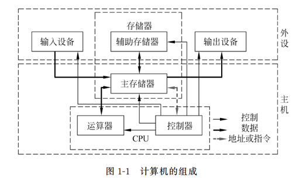
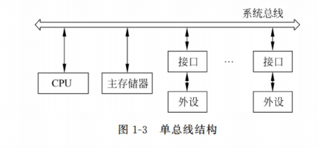
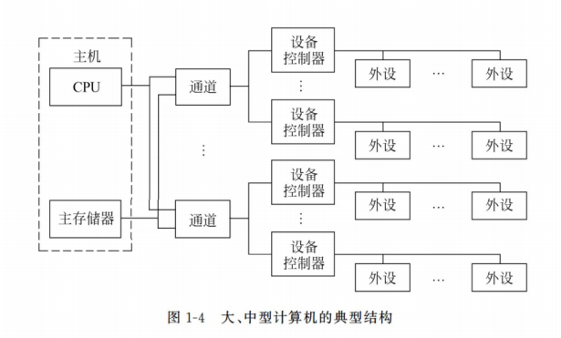

# 01 概论 (1\~2)

## 电子计算机与存储程序控制

### 电子计算机的发展

人们习惯把电子计算机的发展历史分“代”，其实分代并没有统一的标准。最常见的分代方法是根据计算机所采用的电子器件来划分的：

- 第一代，1946 一 1958 年，电子管计算机；
- 第二代，1958 一 1964 年，晶体管计算机：
- 第三代，1964 一 1971 年，小、中规模集成电路(SSI、MSI)计算机；
- 第四代，1971 一至今，大、超大规模集成电路(LSI、VLSI)计算机。

**电子管计算机时代：**第一代计算机没有操作系统

- 非常笨重且运行速度极慢
- 没有程序设计语言（甚至没有汇编），更谈不上操作系统。
- 提前预约时间，通过卡片输入请求计算的任务，再利用控制台开关启动运行。用户干预和独占使用；计算机等待人工操作，资源利用率低。

**晶体管计算机时代：**第二代计算机有了监控系统

- 50 年代晶体管发明，计算机比较可靠，可成批地生产。
- 设计人员、生产人员、操作人员、程序人员和维护人员之间第一次有了明确的分工。
- 第二代计算机主要用于科学和工程计算，程序大多用 FORTRAN 语言书写；主机上用的控制程序称之为监控程序（Monitor），其功能相对比较简单，监控程序是操作系统的雏形。

**小、中规模集成电路计算机时代：**第三代计算机操作系统（集成电路）

- 这一时期的计算机采用小、中规模集成电路为基本器件，因此功耗、体积和价格等进一步下降，而速度及可靠性相应提高，使得计算机的应用范围进一步扩大。
- 厂家和用户要求软件在不同型号的计算机之间兼容。

> **第三代：多道程序设计技术（multi-programming）**
>
> 若当前作业因等待 I/0 而暂停，CPU 只能等待直至该 I/0 完成：
>
> \- 对于 CPU 操作密集科学计算问题，浪费时间少
> \- 对于商业数据处理，I/0 等待时间常占 80%-90%
>
> \*解决办法：
>
> \- 将内存分几个部分，每部分放不同的作业
> \- 当一个作业等待 I/0 时，另一个作业可以使用 CPU 在主存中同时驻留多个作业需要硬件进行保护以避免信息被窃取或攻击

> **第三代：大型分时操作系统 MULTICS**
>
> Multics (MULTiplexed Information and Computing Service）是现代操作系统的雏形，但是长期的研制工作并没有达到预期目标
>
> Multics 的主要贡献:
>
> \- 连续工作，用户使用便利的远程终端操作计算机，同时对于执行进程则采用一套保护环的安全机制
> \- 具有文件保护机制的树型层次结构
> \- 多语言支持能力，EPL、EPLBSA、PL/I、ALM、
> COBOL、FORTRAN、BCPL etc.

**大、超大规模集成电路计算机时代**

- 20 世纪 60 年代后，微电子技术发展迅猛，半导体存储器问世，迅速取代了磁芯存储器，并不断向大容量、高集成度、高速度方向发展。
- 从 1971 年开始出现了包含 CPU 的单片集成电路（微处理器），以微处理器为核心的电子计算机就是微型计算机。微型计算机的出现，形成了计算机发展史上的又一次革命，使计算机进人了几乎所有的行业。

### 存储程序概念

第一台电子数字计算机：ENIAC

- 世界上第一台计算机 ENIAC 不是存储计算机。
- EDVAC：冯·诺依曼设计的存储程序计算机 1951 年诞生。
- EDSAC 事实上的第一台存储程序计算机 1949 年诞生。

冯·诺依曼等人在 1945 年 6 月提出存储程序概念：

1.  计算机（指硬件）应由运算器、存储器、控制器、输入设备和输出设备五大基本部件组成；
2.  计算机内部采用二进制来表示指令和数据；
3.  将编好的程序和原始数据事先存入存储器中，然后再启动计算机工作。

## 计算机的硬件组成

计算机的组成框图：

通常将运算器和控制器合称为中央处理器（Central Processing Unit,CPU）。在由超大规模集成电路构成的微型计算机中，往往将 CPU 制成一块芯片，称为微处理器。

- 中央处理器（CPU）：运算器+控制器
- 主机：中央处理器+主存储器
- 外部设备：除去主机以外的硬件装置（如输入设备、输出设备、辅助存储器等）

### 计算机的主要部件

1.  输入设备：输人设备的任务是把人们编好的程序和原始数据送到计算机中，并且将它们转换成计算机内部所能识别和接受的信息方式。
2.  输出设备：输出设备的任务是将计算机的处理结果以数字、字符（汉字）、图形、图像、声音等形式送出计算机。
3.  存储器：存储器是用来存放程序和数据的部件，它是一个记忆装置，是计算机能够实现“存储程序控制”的基础。
4.  运算器：运算器是对信息进行处理和运算的部件。经常进行的运算是算术运算和逻辑运算，所以运算器又称为算术逻辑运算部件（Arithmetic and Logical Unit,ALU）。
5.  控制器：控制器是整个计算机的指挥中心，它的主要功能是按照人们预先确定的操作步骤，控制整个计算机的各部件有条不紊地自动工作。

### 计算机各大部件之间的连接

#### 总线结构（小、微型机的典型结构）

所谓总线（Bus）是一组能为多个部件服务的公共信息传送线路，它能分时地发送与接收各部件的信息。

总线结构是小、微型计算机的典型结构。这是因为小、微型计算机的设计目标是以较小的硬件代价组成具有较强功能的系统，而总线结构正好能满足这一要求。

#### 大、中型计算机的典型结构

在系统连接上分为四级：主机、通道、设备控制器、外部设备。

通道是承担 I/0 操作管理的主要部件，能使 CPU 的数据处理和与外部设备交换信息这两项操作同时进行。每个通道可以接一台或几台设备控制器，每个设备控制器又可接一或几台外部设备，这样整个系统就可以连接很多的外部设备。

### 不同对象观察到的计算机硬件系统

- **一般用户观察到的计算机硬件系统**：一般用户是指那些仅局限于使用计算机最基本功能的用户。他们观察到的只是计算机 的用户界面，如人机交互使用的键盘、鼠标、显示器，用于存储信息的磁盘、光盘等。
- **专业用户观察到的计算机硬件系统**：专业用户观察到的计算机硬件系统要比一般用户深人得多，他们可能更多地关注计算机机箱内各部分的结构和组成。
- **计算机设计者观察到的计算机硬件系统**：计算机的设计者更多地关心计算机的组成原理和实现方法。
