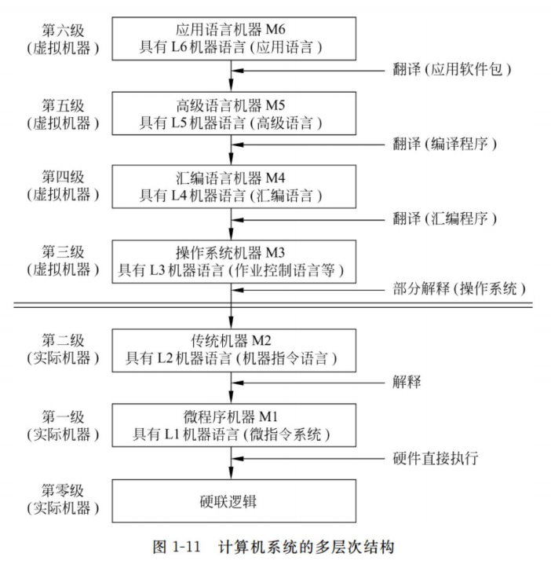
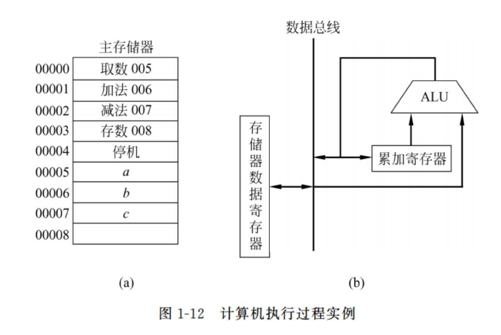
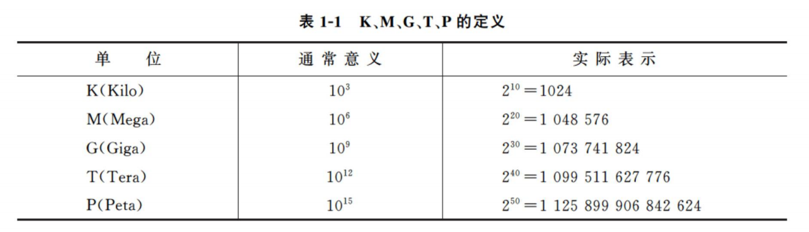

# 01 概论 (3\~4)

## 计算机系统

一个完整的计算机系统包含硬件系统和软件系统两大部分。硬件通常是指一切看得见、摸得到的设备实体；软件通常是泛指各类程序和文件，它们实际上是由一些算法以及其在计算机中的表示所构成的。

### 硬件与软件的关系

硬件是计算机系统的物质基础，软件是计算机系统的灵魂。硬件和软件是相辅相成的，不可分割的整体。当前计算机的硬件和软件正朝着互相渗透，互相融合的方向发展，在计算机系统中没有一条明确的硬件与软件的分界线。硬件和软件之间的界面是浮动的，对于程序设计人员来说，硬件和软件在逻辑上是等价的。

> **固件**
>
> 固件是指那些存储在能永久保存信息的器件（如 ROM）中的程序，是具有软件功能的硬件。固件的性能指标介于硬件与软件之间，吸收了软、硬件各自的优点,其执行速度快于软件，灵活性优于硬件，是软、硬件结合的产物。
>
> 对比理解：RAM、ROM、EPROM

### 系列机和软件养容

系列机是指一个厂家生产的，具有相同的系统结构，但具有不同组成和实现的一系列不同型号的机器。

系列机的软件兼容分为向上兼容、向下兼容、向前兼容和向后兼容 4 种。向上（下）兼容指的是按某档次机器编制的程序，不加修改就能运行在比它更高（低）档的机器上；向前（后）兼容是指按某个时期投入市场的某种型号机器编制的程序，不加修改就能运行在它之前（后）投入市场的机器上。

### 计算机系统的多层次结构

现代计算机系统是一个硬件与软件组成的综合体， 可以把它看作按功能划分的多级层次结构。

- 第零级是硬联逻辑级，这是计算机的内核，由门、触发器等逻辑电路组成。
- 第一级是微程序机器级。这级的机器语言是微指令集，用微指令编写的微程序一般是直接由硬件执行的。
- 第二级是传统机器级。这级的机器语言是该机的指令集，用机器指令编写的程序可以由微程序进行解释。
- 第三级是操作系统机器级。从操作系统的基本功能来看，一方面它要直接管理传统机器中的软硬件资源，另一方面它又是传统机器的延伸。
- 第四级是汇编语言机器级。这级的机器语言是汇编语言，完成汇编语言翻译的程序称为汇编程序。
- 第五级是高级语言机器级。这级的机器语言就是各种高级语言，通常用编译程序来完成高级语言翻译的工作。
- 第六级是应用语言机器级。这一级是为了使计算机满足某种用途而专门设计的，因此这一级语言就是各种面向问题的应用语言。

把计算机系统按功能划分成多级层次结构，有利于正确理解计算机系统的工作过程，明确软件、硬件在计算机系统中的地位和作用。

### 计算机系统的国产化替代

信创项目（工程）：党政机关电子公文系统安全可靠应用。

信创项目（工程） ← 安可工程 ← 国产化替代

信创项目的信息系统虽然不一定是涉密系统，但其敏感性极高，对外均是保密的。

## 计算机的工作过程和主要性能指标

为使计算机按预定要求工作，首先要编制程序。程序是一个特定的指令序列，它告诉计算机要做哪些事，按什么步骤去做。指令是一组二进制信息的代码，用来表示计算机所能完成的基本操作。

### 计算机的工作过程

例如，计算$a+b-c=?$（设 a、b、c 为已知的 3 个数，分别存放在主存的 5〜7 号单元中，结果将存放在主存的 8 号单元）。

计算机的控制器将控制指令逐条地执行，最终得到正确的结果，步骤如下：

1.  执行取数指令，从主存 5 号单元取出数 a，送入累加寄存器中。
2.  执行加法指令，将累加寄存器中的内容 a 与从主存 6 号单元取出的数 b —起送到 ALU 中相加，结果 a+b 保留在累加寄存器中。
3.  执行减法指令，将累加寄存器中的内容 a+b 与从主存 7 号单元取出的数 b 一起送到 ALU 中相减，结果 a+b-c 保留在累加寄存器中。
4.  执行存数指令，把累加寄存器的内容 a+b-c 存至主存 8 号单元。
5.  执行停机指令，计算机停止工作。

### 计算机的主要性能指标

为了进一步了解计算机的特性，全面衡量一台计算机的性能，下面介绍计算机的主要性能指标。

1.  **机器字长**

    机器字长是指参与运算的数的基本位数，它是由加法器、寄存器的位数决定的，所以机器字长一般等于内部寄存器的大小。字长标志着精度，字长越长，计算的精度就越高。

    在计算机中为了更灵活地表达和处理信息，以字节（Byte）为基本单位，字节用大写字母 B 表示。一个字节等于 8 位二进制位（bit），位用小写字母 b 表示。

2.  **数据通路宽度**

    数据总线一次所能并行传送信息的位数，称为数据通路宽度（指外部数据总线的宽度）。

3.  **主存容量**

    一个主存储器所能存储的全部信息量称为主存容量。通常，以字节数来表示存储容量，这样的计算机称为字节编址的计算机。

    

    计算机的主存容量越大，存放的信息就越多，处理问题的能力就越强。

4.  **运算速度**

    计算机的运算速度与许多因素有关，如机器的主频、执行什么样的操作以及主存本身的速度等。

    - 吞吐量和响应时间：吞吐量是指系统在单位时间内处理请求的数量。响应时间是指系统对请求作出响应的时间。
    - 主频和 CPU 时钟周期：CPU 的主频又称为时钟频率，表示在 CPU 内数字脉冲信号振荡的速度。
    - CPI （Cycles per Instruction) ：是指每条指令执行所用的时钟周期数。
    - CPU 执行时间：

      $$
      \mathrm{CPU} 执行时间 =\frac{\mathrm{CPU} \text { 时钟周期数 }}{\text { 时钟频率 }}=\frac{\text { 指令数 } \times \mathrm{CPI}}{\text { 时钟频率 }}
      $$

5.  **MIPS 和 MFLOPS**

    MlPS(Million Instructions per Second) 表示每秒执行多少百万条指令。
