# 02 数据的机器层次表示 (1\~3)

## 数值数据的表示

在计算机中，采用数字化方式来表示数据，数据有无符号数和带符号数之分，其中带符号数根据其编码的不同又有原码、补码和反码 3 种表示形式。

### 计算机中的数值教据

为了避免出现误会，在给出一个数的同时就必须指明这个数的数制。例如&#x20;

$(1010)_2$、$(1010)_8$、$(1010)_{10}$、$(1010)_{16}$。

除了用下标来表示不同的数制以外，在计算机中还常用后缀字母来表示不同的数制：

- 后缀 B 表示这个数是二进制数(Binary)；
- 后缀 Q 表示这个数是八进制数(Octal)，本来八进制数的英文单词的第一个字母应当是 O，因为字符 O 与数字 0 很容易混淆，所以常使用字符 Q 作为八进制数的后缀；
- 后缀 H 表示这个数是十六进制数(Hexadecimal)；
- 而后缀 D 表示这个数是十进制数(Decimal)。

十进制数在书写时后缀 D 可以省略，其他进制在书写时后缀一般不可省略。

### 无符号数和带符号数

所谓无符号数，就是整个机器字长的全部二进制位均表示数值位（没有符号位），相当于数的绝对值。

机器字长为$n+1$位的无符号数的表示范围是$0 \sim (2^{n+1} - 1)$，此时二进制的最高位也是数值位，其权值等于$2^n$。若字长为 8 位，则数的表示范围为 0〜255。

然而，大量用到的数据还是带符号数，即正、负数。在日常生活中用符号+、- 加绝对值来表示数值的大小，用这种形式表示的数值在计算机技术中称为“真值”。通常，约定二进制数的最高位为符号位，0 表示正号，1 表示负号。这种在计算机中使用的表示数的形式称为机器数，常见的机器数有原码、反码、补码等不同的表示形式。

带符号数的最高位被用来表示符号位，而不再表示数值位。

### 原码表示法

原码表示法是一种最简单的机器数表示法，其最高位为符号位，符号位为 0 时表示该数为正，符号位为 1 时表示该数为负，数值部分与真值相同。

设二进制纯小数的原码形式为 Xs.X1X2…Xn，字长 n+1 位，其中 Xs 表示符号位。

> 例 1：
> $X_1=0.0110, [X_1]_原=0.0110$ > $X_2=-0.0110, [X_2]_原=1.0110$

设二进制纯整数的原码形式为 XsX1X2…Xn，其中 Xs 表示符号位。

> 例 2：
> $X_1=1101, [X_1]_原=01101$ > $X_2=-1101, [X_2]_原=11101$

在原码表示中，真值 0 有两种不同的表示形式：

$[+0]_原=00000$

$[-0]_原=10000$

原码表示法的优点是直观易懂，机器数和真值间的相互转换很容易，用原码实现乘、除运算的规则很简单;缺点是实现加、减运算的规则较复杂。

### 补码表示法

#### 模和同余

模(Module)是指一个计量器的容量，可用 M 表示。例如：一个 4 位的二进制计数器，当计数器从 0 计到 15 之后，再加 1，计数值又变为 0。这个计数器的容量$M=2^4=16$，即模为 16。由此可见，纯小数的模为 2，一个字长为$n+1$位的纯整数的模为$2^{n+1}$。

同余是指两整数 A、B 除以同一正整数 M，所得余数相同，则称 A、B 对 M 同余，即 A、B 在以 M 为模时是相等的，可写作：

$$
A=B (mod M)
$$

对钟表而言，模$M=12$。假设：时钟停在 8 点，而现在正确的时间是 6 点，这时拨准时钟的方法有两种：正拨和倒拨。

分针倒着旋转 2 圈，等于分针正着旋转 10 圈。故有：$-2=10 (mod12)$ ，即-2 和 10 同余。同理$8-2=8+10 (mod12)$

#### 补码表示

补码的符号位表示方法与原码相同，其数值部分的表示与数的正负有关：对于正数，数值部分与真值形式相同；对于负数，将真值的数值部分按位取反，且在最低位上加 1。

若真值为纯小数，它的补码形式为 Xs.X1X2…Xn，其中 Xs 表示符号位。

> 例 5：
> $X_1=0.0110, [X_1]_补=0.0110$ > $X_2=-0.0110, [X_2]_补=1.1010$

若真值为纯整数，它的补码形式为 XsX1X2…Xn，其中 Xs 表示符号位。

> 例 6：
> $X_1=1101，[X_1]_补=01101$ > $X_2=-1101，[X_2]_补=10011$

在补码表示中，真值 0 的表示形式是唯一的：

$[+0]_补=[-0]_补=00000$

#### 由真值、原码转换为补码

当 X 为正数时，$[X]_补=[X]_原=X$

当 X 为负数时，由$[X]_原$转换为$[X]_补$的方法：

1.  $[X]_原$除掉符号位外的各位取反加“1” 。
2.  自低位向高位，尾数的第一个“1”及其右部的“0”保持不变，左部的各位取反，符号位保持不变。

> 例 7：
> $[X]_原=1.1110011000$ > $[X]_补 =1.0001101000$

### 反码表示法

反码表示法与补码表示法有许多类似之处，对于正数，数值部分与真值形式相同；对于负数，将真值的数值部分按位取反。

若真值为纯小数，它的反码形式为 Xs.X1X2…Xn，其中 Xs 表示符号位。

> 例 9：
> $X_1=0.0110，[X_1]_反=0.0110$ > $X_2=-0.0110， [X_2]_反=1.1001$

若真值为纯整数，它的反码形式为 XsX1X2…Xn，其中 Xs 表示符号位。

> 例 10：
> $X_1=1101， [X_1]_补=01101$ > $X_2=-1101，[X_2]_补=10010$

在反码表示中，真值 0 也有两种不同的表示形式：

$[+0]_反=00000$

$[-0]_反=11111$

### 三种码制的比较与转换

#### 比较

1.  对于正数它们都等于真值本身，而对于负数各有不同的表示。
2.  最高位都表示符号位，补码和反码的符号位可作为数值位的一部分看待，和数值位一起参加运算；但原码的符号位不允许和数值位同等看待，必须分开进行处理。
3.  对于真值 0，原码和反码各有两种不同的表示形式，而补码只有唯一的一种表示形式（全 0）。
4.  原码、反码表示的正、负数范围相对零来说是对称的；但补码负数表示范围较正数表示范围宽，能多表示一个最负的数（绝对值最大的负数），其值等于$-2^n$（纯整数）或-1（纯小数）。

#### 转换

如果已知机器的字长，则机器数的位数应补够相应的位。例如，设机器字长为 8 位，则：

|      | X1       | X2       | X3        | X4        |
| ---- | -------- | -------- | --------- | --------- |
| 值   | 1011     | -1011    | 0.1011    | -0.1011   |
| 原码 | 00001011 | 10001011 | 0.1011000 | 1.1011000 |
| 补码 | 00001011 | 11110101 | 0.1011000 | 1.0101000 |
| 反码 | 00001011 | 11110100 | 0.1011000 | 1.0100111 |

## 机器数的定点表示与浮点表示

计算机在进行算术运算时，需要指出小数点的位置。根据小数点的位置是否固定，在计算机中有两种数据格式：定点表示和浮点表示。

### 定点表示法

在定点表示法中约定：所有数据的小数点位置固定不变。

#### 定点小数

小数点的位置固定在最高有效数位之前，符号位之后，记作 Xs.X1X2…Xn，这个数是一个纯小数。定点小数的小数点位置是隐含约定的，小数点并不需要真正地占据一个二进制位。

定点小数表示范围：

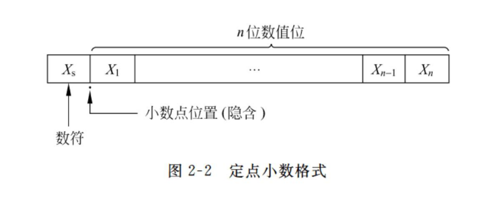

当 Xs=0，X1 ～ Xn=1 时，X 为最大正数。

$$
X_{最大正数} =1-2^{-n}
$$

当 Xn=1，Xs ～ Xn-1=0 时，X 为最小正数。

$$
X_{最小正数} =2^{-n}
$$

当 Xs=1，表示 X 为负数，此时情况要稍微复杂一些，这是因为在计算机中带符号数可用补码表示，也可用原码表示。原码和补码的表示范围有一些差别。

若机器数为原码表示，当 Xs ～ Xn 均等于 1 时，X 为绝对值最大的负数。

$$
X_{绝对值最大负数}=-(1-2^{-n})
$$

若机器数为补码表示，当 Xs=1，X1 ～ Xn 均等于 0 时，X 为绝对值最大的负数。

$$
X_{绝对值最大负数}=-1
$$

若机器字长有 n+1 位，则有：

1.  原码定点小数表示范围：$-(1-2^{-n})～(1-2^{-n})$
2.  补码定点小数表示范围：$-1～(1-2^{-n})$

若机器字长有 8 位，则有：

1.  原码定点小数表示范围：$-\frac{127}{128}\sim\frac{127}{128}$
2.  补码定点整数表示范围：$-1\sim\frac{127}{128}$

#### 定点整数

定点整数即纯整数，小数点位置隐含固定在最低有效数位之后，记作 XsX1X2…Xn。

定点整数表示范围

若机器字长有 n+1 位，则有：

- 原码定点整数的表示范围：$-(2^n-1)～(2^n-1)$
- 补码定点整数的表示范围：$-2^n～(2^n-1)$

若机器字长有 8 位，则有：

- 原码定点整数表示范围：$-127～127$
- 补码定点整数表示范围：$-128～127$

### 浮点表示法

小数点的位置根据需要而浮动，这就是浮点数。例如：

$$
N=M\times r^E
$$

式中：r 为浮点数阶码的底，与尾数的基数相同，通常$r=2$。E 和 M 都是带符号数，E 叫做阶码，M 叫做尾数。在大多数计算机中，尾数为纯小数，常用原码或补码表示；阶码为纯整数，常用移码或补码表示。

浮点数的一般格式：

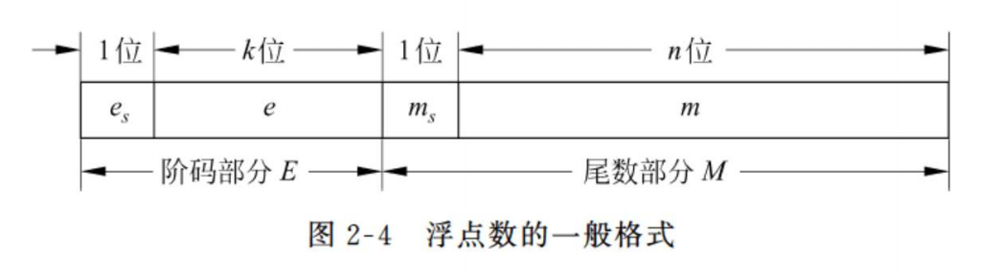

浮点数的底是隐含的，在整个机器数中不出现。阶码的符号位为$e_s$，阶码的大小反映了在数 N 中小数点的实际位置；尾数的符号位为$m_s$，它是整个浮点数的符号位，表示了该浮点数的正负。

#### 浮点数的表示范围

当$e_s=0$，$m_s=0$，阶码和尾数的数值位各位全为 1（即阶码和尾数都为最大正数）时，该浮点数为最大正数：

$$
X_{最大正数}=(1-2^n)\times2^{2^k-1}
$$

当$e_s=1$，$m_s=0$，尾数的最低位$m_n=1$，其余各位为 0（即阶码为绝对值最大的负数，尾数为最小正数）时，该浮点数为最小正数：

$$
X_{是小正数}=2^{-n}\times2^{-2^{k}}
$$

当$e_s=0$，阶码的数值位为全 1；$m_s=1$，尾数的数值位为全 0（即阶码为最大正数，尾数为绝对值最大的负数）时，该浮点数为绝对值最大负数：

$$
X_{绝对值最大负值}=-1\times2^{2^{k}-1}
$$

#### 规格化浮点数

为了提高运算的精度，需要充分地利用尾数的有效数位，通常采取浮点数规格化形式，即规定尾数的最高数位必须是一个有效值。

$$
\frac1r ≤|M|＜ 1
$$

r 一半取 2。后面也默认为 2。在尾数用补码表示时，规格化浮点数应满足**尾数最高数位与符号位不同**（$m_s⊕m_1 =1$），即当 1/2≤M ＜ 1 时，应有 0.1xx…x 形式，当-1≤M ＜-1/2 时，应有 1.0xx…x 形式。

注意：当$M=-\frac12$时，对于原码来说这是一个规格化数，而对于补码来说这不是一个规格化数；当$M=-1$时，对于原码来说这将无法表示，而对于补码来说这是一个规格化数。

当$e_s=1$，$m_s=0$，尾数的最高位$m_1=1$，其余各位为 0 时，该浮点数为规格化的最小正数：

$$
X_{\textbf{规格化的是小正数}} = 2 ^ { - 1 }\times2^{-2^{-2^{k}}}
$$

规格化的最小正数大于非规格化的最小正数。

表 2-2 列出了浮点数的一些典型值，设阶码和尾数均用补码表示，阶码共$k+1$位（含一位阶符），尾数共$n+1$位（含一位尾符）。

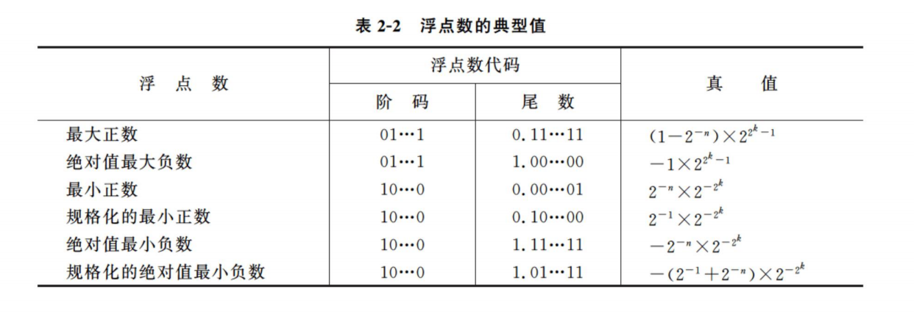

### 浮点数阶码的移码表示法

浮点数的阶码是带符号的定点整数，理论上说它可以用前面提到的任何一种机器数的&#x20;
表示方法来表示，但在多数通用计算机中，它还采用另一种编码方法——移码表示法。

移码就是在真值 X 上加一个常数（偏置值），相当于 X 在数轴上向正方向平移了一段距离，这就是“移码”一词的来由。

$[X]_移=偏置值+X$

n+1 位字长的偏置值一般为 2n，对于字长 8 位的定点整数，偏置值为 27。

> 例 11：X=1011101
>
> $[X]_移=27+X=10000000+1011101=11011101$
>
> $[X]_补=01011101$

> 例 12：X=**-**1011101
> $[X]_移=27+X=10000000-1011101=00100011$ > $[X]_补=$$1$$0100011$

偏置值为$2^7$的移码、补码和真值之间的关系：

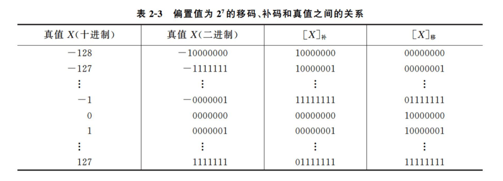

偏置值为$2^n$的移码的特点：

1.  在移码中，最高位为“0”表示负数，最高位为“1”表示正数。
2.  移码为全 0 时，它所对应的真值最小，为全 1 时，它所对应的真值最大。
3.  真值 0 在移码中的表示形式是唯一的，即$[+0]移=[-0]移=$$100…0$。
4.  移码把真值映射到一个正数域，所以可将移码视为无符号数，直接按无符号数规则比较大小。
5.  同一数值的移码和补码除最高位相反外，其他各位相同。

浮点数的阶码采用移码的原因：

1.  便于比较浮点数的大小。阶码大的，其对应的真值就大，阶码小的，对应的真值就小。
2.  简化机器中的判零电路。当阶码全为 0，尾数也全为 0 时，表示机器零。

### 浮点教尾教的基教

#### 尾数基数大小的选择

浮点数尾数基数的选择对浮点数的特性起着主要作用，它既影响浮点运算的精度，也影响数值的表示范围。采用较大的 r 值，在阶码位数相同的情况下，可以扩大浮点数的表示范围。假定某浮点数字长为 32 位，阶码部分（阶符和阶码数值位）共 8 位，尾数部分（尾符与尾数数值位）共 24 位，均用补码表示。

#### 尾数基数 r 对浮点数特性的影响

浮点数尾数基数的选择对浮点数的特性起着主要作用，它既影响浮点运算的精度，也影响数值的表示范围。

改变尾数基数 r，会使浮点数的特性有下列影响：

1.  可表示数的范围。
2.  可表示数的个数。
3.  数在数轴上的分布。
4.  可表示数的精度。
5.  运算中的精度损失。
6.  运算速度。

### IEEE 754 标准浮点數

按 IEEE 754 标准，常用的浮点数的格式如图 2-6 所示。

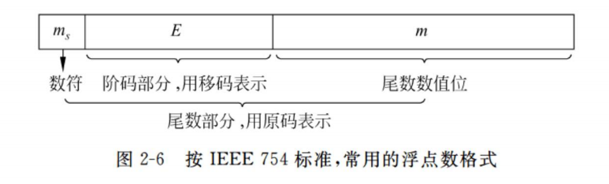

IEEE 754 标准中有 3 种形式的浮点数，它们的具体格式如表 2-4 所示。

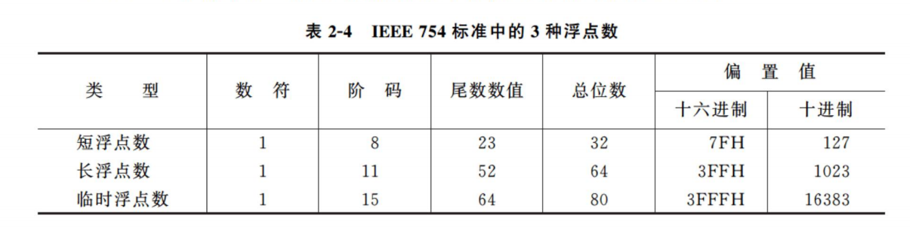

以短浮点数为例讨论浮点代码与其真值之间的关系。最高位为数符位；其后是 8 位阶码，以 2 为底，阶码的偏置值为**127**；其余 23 位是尾数。为了使尾数部分能表示更多一位的有效值，IEEE754 采用隐含尾数最高数位 1（即这一位 1 不表示出来）的方法，因此尾数实际上是**24**位。应注意的是，**隐含的 1 是一位整数**（即位权为$2^0$），在浮点格式中表示出来的 23 位尾数是纯小数，并用原码表示。

### 定点、浮点表示法与定点、浮点计算机

#### 定点、浮点表示法的区别

1.  数值的表示范围：假设定点数和浮点数的字长相同，浮点表示法所能表示的数值范围将远远大于定点数。
2.  精度：对于字长相同的定点数和浮点数来说，浮点数虽然扩大了数的表示范围，但这正是以降低精度为代价的，也就是数轴上各点的排列更稀疏了。
3.  数的运算：浮点运算要比定点运算复杂得多。
4.  溢出处理：在定点运算时，当运算结果超出数的表示范围，就发生溢出。而在浮点运算时，运算结果超出尾数的表示范围却并不一定溢出，只有当阶码超出所能表示的范围时，才发生溢出。

#### 定点机与浮点机

通常可以将计算机分为几档：

1.  定点机：以定点运算为主，浮点运算是通过软件来实现的。
2.  定点机＋浮点运算部件：浮点运算部件是专门用于对浮点数进行运算的部件。
3.  浮点机：具有浮点运算指令和基本的浮点运算器。

## 非数值数据的表示

非数值数据，又称为字符数据，通常是指字符、字符串、图形符号和汉字等各种数据，它们不用来表示数值的大小，一般情况下不对它们进行算术运算。

### 字符和字符串的表示

#### ASCII 字符编码

常见的 ASCII 码用七位二进制表示一个字符，它包括 10 个十进制数字（$0～9$）、52 个英文大写和小写字母（$A～Z$，$a～z$）、34 个专用符号和 32 个控制符号，共计 128 个字符。

在计算机中，通常用一个字节来存放一个字符。

在 ASCII 码表中，数字和英文字母都是按顺序排列的，只要知道其中一个的二进制代码，不要查表就可以推导出其他数字或字母的二进制代码。

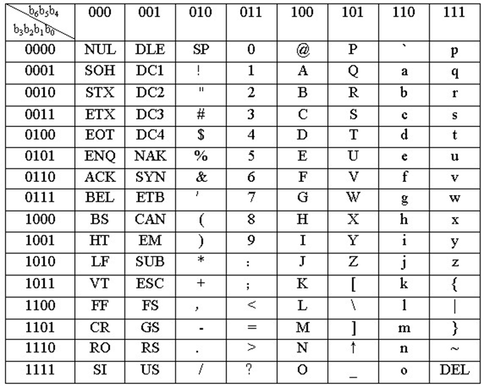

#### 字符串的存放

字符串是指一串连续的字符。例如，字符串`IFX>0 THEN READ (C)`。

向量存放法在存储器中占用一片连续的空间，每个字节存放一个字符代码，字符串的所有元素（字符）在物理上是邻接的。在字长为 32 位的存储器，每一个主存单元可存放 4 个字符，整个字符串需 5 个主存单元。在每个字节中实际存放的是相应字符的 ASCII 码。

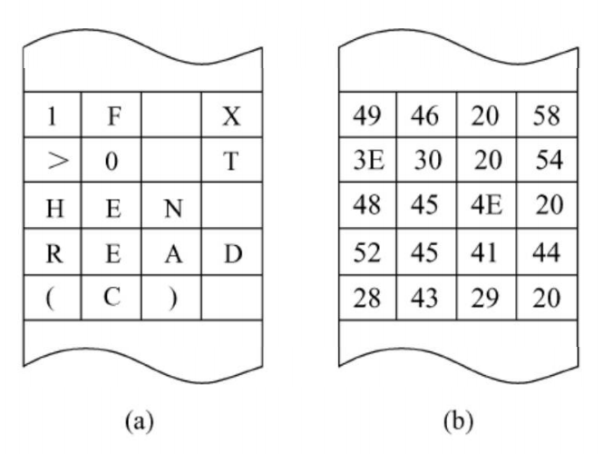

### 汉字的表示

#### 汉字国标码

汉字国标码亦可称为汉字交换码，主要用于汉字信息处理系统之间或者通信系统之间交换信息使用，简称 GB 码。该标准共收集常用汉字 6763 个，另外还有各种图形符号 682 个，共计 7445 个。

GB 码规定每个汉字、图形符号都用两个字节表示，每个字节只使用低七位编码，因此最多能表示出$128×128=16384$个汉字。

#### 汉字区位码

区位码将汉字编码码中的 6763 个汉字分为 94 个区，每个区中包含 94 个汉字（位），区和位组成一个二维数组，每个汉字在数组中对应一个唯一的区位码。汉字的区位码定长 4 位，前 2 位表示区号，后 2 位表示位号，区号和位号用十进制数表示，区号从 01 到 94，位号也从 01 到 94。例如， “中”字在 54 区的 48 位上，其区位码为“54-48” ， “国”字在 25 区的 90 位上，其区位码为“25-90” 。

需要注意的是：汉字区位码并不等于汉字国标码，它们两者之间的关系可用以下公式表示：

$$
国标码＝区位码（十六进制）＋2020H
$$

> 例 15：已知汉字“春”的区位码为“20-26” ，计算它的国标码。
>
> 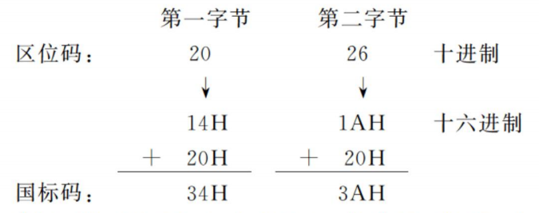

#### 汉字机内码&#x20;

汉字在计算机内部其内码是唯一的。因为汉字处理系统要保证中西文的兼容，当系统中同时存在 ASCII 码和汉字国标码时，将会产生二义性。例如：有两个字节的内容为 30H 和 21H，它既可表示汉字“啊”的国标码，又可表示西文“0”和“!”的 ASCII 码。为此，汉字机内码应对国标码加以适当处理和变换。

GB 码的机内码为二字节长的代码，它是在相应 GB 码的每个字节最高位上加“1” ，即：

$$
汉字机内码＝汉字国标码＋8080H
$$

例如，上述“啊”字的国标码是 3021H，其汉字机内码则是 B0A1H。

#### 汉字字形码

汉字字形码是指确定一个汉字字形点阵的代码，又叫汉字字模码或汉字输出码。在一个汉字点阵中，凡笔画所到之处，记为“1” ，否则记为“0” 。

根据对汉字质量的不同要求，可有 16×16、24×24、32×32 或 48×48 的点阵结构。显然点阵越大，输出汉字的质量越高，每个汉字所占用的字节数也越高。

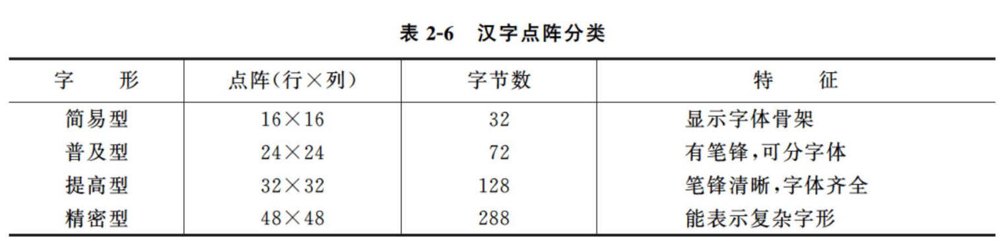

#### 汉字编码的发展

从 ASCII、GB 2312、GBK 到 GB 18030，这些编码方法是向上兼容的，即同一个字符在这些方案中总是有相同的编码，后面的标准支持更多的字符。为了保证中西文兼容，确定中文编码的方法是：高字节的最高位为 1，不用管低字节最高位是什么。

### 统一代码

信息处理应用对字符集提出了多文种、大字量、多用途的要求，解决问题的最佳方案是设计一种全新的编码方法，这就是统一代码（Unicode）。

Unicode 随着通用字符集的标准而发展，至今仍在不断增加和修改。

Unicode 的基本方法是用一个 16 位来表示每个符号，这意味着允许表示 65536 个不同的字符或符号。这种符号集被称为基本多语言平面（BMP），基本多语言平面的字符编码为 U+hhhh，其中每个 h 代表一个十六进制数字，与 UCS-2 编码完全相同。

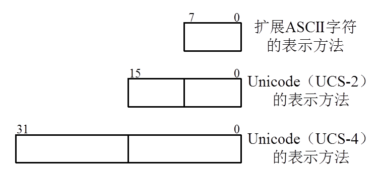

Unicode 的实现方式不同于编码方式。一个字符的 Unicode 编码是确定的，但是在实&#x20;
际传输过程中，由于不同系统平台的设计不一定一致，以及出于节省空间的考虑，Unicode 编码的实现方式会有所不同。

Unicode 的实现方式称为 Unicode 转换格式(Unicode Translation Format, UTF) ，目前存在的 UTF 格式有 UTF-7、UTF-7.5、UTF-8、UTF-16 和 UTF-32。
