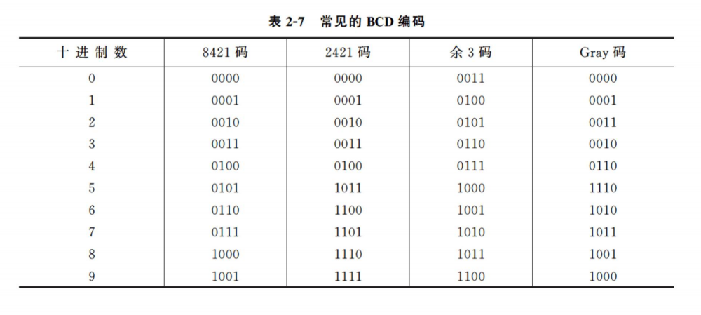
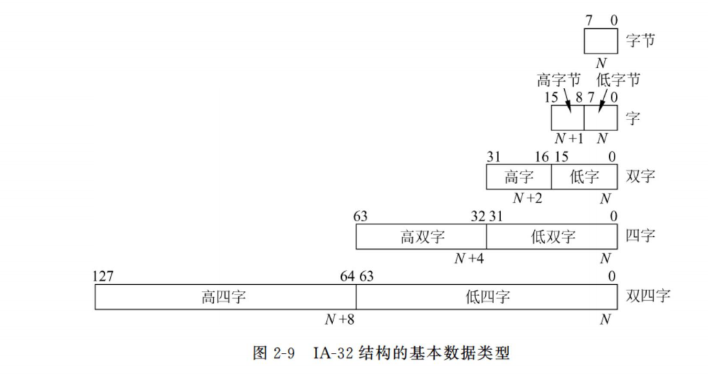
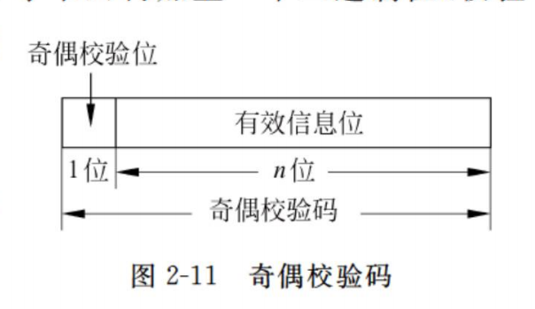
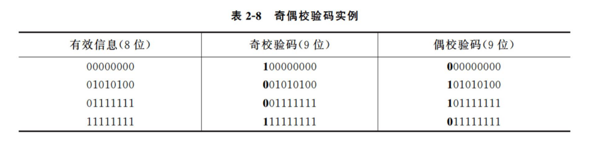
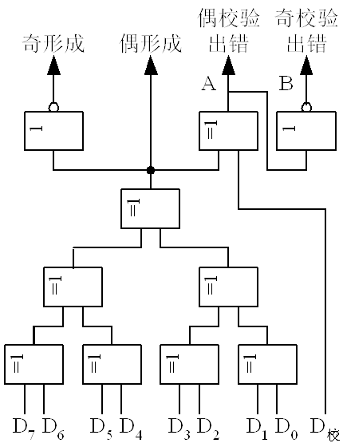
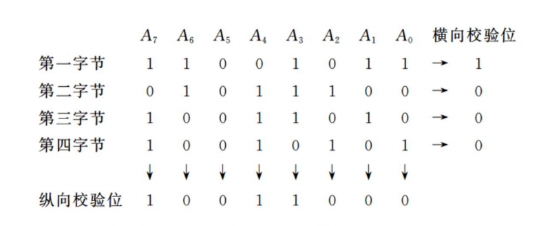

# 02 数据的机器层次表示 (4\~6)

## 十进制数和数串的表示

十进制是人们最常用的数据表示方法，一些通用性较强的计算机上设有十进制数据的表示，可以直接对十进制数进行运算和处理。

### 十进制数的编码

用四位二进制数来表示一位十进制数，称为二进制编码的十进制数，简称 BCD 码**。**

四位二进制数可以组合出 16 种代码，能表示 16 种不同的状态，我们只需要使用其中的 10 种状态，就可以表示十进制数的 0 ～ 9 十个数码，而其他的六种状态为冗余状态。由于可以取任意的 10 种代码来表示十个数码，所以就可能产生多种 BCD 编码。BCD 编码既具有二进制数的形式，又保持了十进制数的特点。

#### 8421 码

8421 码又称为 NBCD 码，其主要特点是：

1.  它是一种有权码，四位二进制代码的位权从高到低分别为 8、4、2、1。
2.  简单直观。每个代码与它所代表的十进制数之间符合二进制数和十进制数相互转换的规则。
3.  不允许出现 1010 ～ 1111。这 6 个代码在 8421 码中是非法码。

#### 2421 码 &#x20;

2421 码的主要特点是：

1.  它也是一种有权码，四位二进制代码的位权从高到低分别为 2、4、2、1。
2.  它又是一种对 9 的自补码。即某数的 2421 码，只要自身按位取反，就能得到该数对 9 之补的 2421 码。例如：

    3 的 2421 码是 0011。3 对 9 之补是 6，而 6 的 2421 码是 1100。

3.  不允许出现 0101 ～ 1010。这 6 个代码在 2421 码中是非法码。

#### 余 3 码 &#x20;

余 3 码的主要特点是：

1.  这是一种无权码，但也可看作是一种特殊的有权码，即在 8421 码的基础上加+3（+0011）形成的，故称余 3 码。在这种编码中各位的“1”不表示一个固定的十进制数值，因而不直观。
2.  它也是一种对 9 的自补码。
3.  不允许出现 0000 ～ 0010、1101 ～ 1111。这 6 个代码在余 3 码中是非法码。

#### 格雷码

Gray 码的主要特点是：

1.  它也是一种无权码。
2.  从一种代码变到相邻的下一种代码时，只有一个二进制位的状态在发生变化。
3.  具有循环特性，即首尾两个数的 Gray 码也只有一个二进制位不同，因此 Gray 码又称为循环码。
4.  十进制 Gray 码也有 6 个代码为非法码，视具体方案而定。

### 十进制数串

#### 非压缩的十进制数串

非压缩的十进制数串中一个字节存放一个十进制数或符号的 ASCII-7 码。

非压缩的十进制数串又分成前分隔式数字串和后嵌入式数字串两种格式。在前分隔式数字串中，符号位占用单独一个字节，放在数值位之前，正号对应的 ASCII 码为 2BH，负号对应的 ASCII 码为 2DH。在后嵌入式数字串中，符号位不单独占用一个字节，而是嵌入到最低一位数字里边去。若数串为正，则最低一位数字 0 ～ 9 的 ASCII 码不变（30H ～ 39H）；若数串为负，把负号变为 40H，并将其与最低数值位相加，此时数字 0 ～ 9 的 ASCII 码变为 70H ～ 79H。

#### 压缩的十进制数串

压缩的十进制数串，一个字节可存放两位 BCD 码表示的十进制数，既节省了存储空间，又便于直接进行十进制算术运算。

在主存中，一个压缩的十进制数串占用连续的多个字节，每位数字仅占半个字节，其值常用 8421 码表示。符号位也占半个字节，并存放在最低数值位之后，通常用 CH 表示正号，DH 表示负号。在这种表示中，规定数字的个数加符号位之和必须为偶数；当和为奇数时，应在最高数值位之前补 0H (即第一个字节的高半字节为"0000") 。

## 不同类型的数据表示举例

前面已经讨论了许多种不同类型的数据表示，这里将以实际应用广泛的 C 语言中的数据类型和现代微机中的数据表示作为实例进行介绍。

### C 语言中的数据表示

- C 语言的基本数据类型有整型数据、实型数据、字符型数据等。
- C 语言中支持多种整数类型，二进制整数分为无符号整数和带符号整数。
- C 语言中有 float 和 double 两种不同浮点数类型，分别对应 IEEE754 单精度浮点数格式（32 位）和双精度浮点数格式（64 位）。

### 现代微机系统中的数据表示举例

现代的微机系统大多采用 Intel 系列的微处理器，近年来，Intel 的微处理器有了极大的发展，形成了 IA-32 结构。

IA-32 结构的基本数据类型是字节、字、双字、四字和双四字。

1. 无符号整数

   无符号整数是包含字节、字、双字和四字的无符号的二进制数。无符号整数的范围，对于字节，从$0～255$；对于字，从$0～65535$；对于双字，从$0～2^{32}-1$；对于四字，从$0～2^{64}-1$。

2. 带符号整数

   带符号整数是包含字节、字、双字和四字的带符号的二进制定点整数。正数的符号位为 0，负数的符号位为 1。对于字节，从$-128～+127$；对于字，从$-32768～+32767$；对于双字，从$-2^{31}～+2^{31}-1$；对于四字，从$-2^{63}～+2^{63}-1$。

3. 浮点数 &#x20;

   与 IEEE 754 标准所规定的格式直接对应。

4. 指针数据

   指针是主存单元的地址，IA-32 结构定义了两种类型的指针：近指针（32 位）和远指针（48 位）。

5. 串数据

   包括位串、字节串、字串和双字串。一个串可以包含从一个字节到 4GB 的内容。

6. BCD 数 &#x20;

   IA-32 结构中所指的 BCD 码实际上是指 8421 码。BCD 数又分成未拼装的 BCD（UBCD）数和拼装的 BCD 数两种。UBCD 数的一个字节仅包含一位十进制数，在 3 ～ 0 位上；而经过拼装的 BCD 数，一个字节包含两位十进制数，其低位在 3 ～ 0 位上，高位在 7 ～ 4 位上。

## 数据校验码

数据校验码是指那些能够发现错误或能够自动纠正错误的数据编码，又称之为“检错纠错编码”。任何一种编码都由许多码字构成，任意两个码字之间最少变化的二进制位数，被称为数据校验码的码距。

例如，用四位二进制表示 16 种状态，则有 16 个不同的码字，此时码距为 1，即两个码字之间最少仅有一个二进制位不同（如 0000 与 0001 之间）。这种编码没有检错能力，因为当某一个合法码字中有一位或几位出错，就变成为另一个合法码字了。

### 奇偶校验码

#### 奇偶校验概念

奇偶校验码是一种最简单的数据校验码，它的码距等于 2，可以检测出一位错误（或奇数位错误），但不能确定出错的位置，也不能检测出偶数位错误。

奇偶校验实现方法是：由若干位有效信息（如一个字节），再加上一个二进制位（校验位）组成校验码。

校验位的取值（0 或 1）将使整个校验码中“1”的个数为奇数或偶数，所以有两种可供选择的校验规律：

- 奇校验 ── 整个校验码（有效信息位和校验位）中“1”的个数为奇数。
- 偶校验 ── 整个校验码中“1”的个数为偶数。

#### 简单奇偶校验

简单奇偶校验仅实现横向的奇偶校验，下表给出几个字节的奇偶校验码的编码结果。

最高一位为校验位，其余 8 位为信息位。在实际应用中，多采用奇校验，因为奇校验中不存在全“0”代码，在某些场合下更便于判别。

下面以奇校验为例，说明对主存信息进行奇偶检验的全过程。

1. 校验位形成

   当要把一个字节的代码 D7 ～ D0 写入主存时，就同时将它们送往奇偶校验逻辑电路，该电路产生的“奇形成”信号就是校验位。它将与 8 位代码一起作为奇校验码写入主存。

   若 D7 ～ D0 中有偶数个“1” ，则“奇形成”=1；若 D7 ～ D0 中有奇数个“1” ，则“奇形成”=0。

   

2. 校验检测

   读出时，将读出的 9 位代码（8 位信息位和 1 位校验位）同时送入奇偶校验电路检测。若读出代码无错，则“奇校验出错”=0；若读出代码中的某一位上出现错误，则“奇校验出错”=1，从而指示这个 9 位代码中一定有某一位出现了错误，但具体的错误位置是不能确定的。

#### 交叉奇偶校验

计算机在进行大量字节（数据块）传送时，不仅每一个字节有一个奇偶校验位做横向校验，而且全部字节的同一位也设置一个奇偶校验位做纵向校验，这种横向、纵向同时校验的方法称为交叉校验。

交叉校验可以发现两位同时出错的情况，假设第二个字节的 A6、A4 两位均出错，第二个字节的横向校验位无法检出错误，但是第 A6、A4 位所在列的纵向校验位会显示出错，这与前述的简单奇偶校验相比要保险多了。

### 汉(海)明校验码\*

汉(海)明码实际上是一种多重奇偶校验，其实现原理是：在有效信息位中加入几个校验位形成海明码，并把海明码的每一个二进制位分配到几个奇偶校验组中。当某一位出错后，就会引起有关的几个校验位的值发生变化，这不但可以发现错误，还能指出错误的位置，为自动纠错提供了依据。

发现两位错，纠正一位错的海明码的校验位数公式：

$$
2k-1≥N+K+1
$$

其中 N 为信息码位数，K 为校验码最少位数。

编码：

- 一个字节由 8 位二进制位组成，故海明码的总位数为 13 位，可表示为：H13 H12…H2 H1
- 五个校验位 P5 ～ P1 对应的海明码位号应分别为：H13、H8、H4、H2、H1，除 P5 外，其余四位都满足 Pi 的位号等于 2i-1 的关系，而 P5 只能放在 H13 上，因为它已经是海明码的最高位了。

### 循环冗余校验码\*

在计算机网络、同步通信以及磁表面存储器中广泛使用循环冗余校验码，简称 CRC 码。

循环冗余校验码是通过除法运算来建立有效信息位和校验位之间的约定关系的。

假设，待编码的有效信息以多项式 M(X)表示，将它左移若干位后，用另一个约定的多项式 G(X)去除，所产生的余数 R(X)就是检验位。有效信息和检验位相拼接就构成了 CRC 码。

当整个 CRC 码被接收后，仍用约定的多项式 G(X)去除，若余数为 0 表明该代码是正确的；若余数不为 0 表明某一位出错，再进一步由余数值确定出错的位置，以便进行纠正。
