# 03 指令系统 (1\~3)

指令、指令系统是计算机中一个最基本的概念。指令是指示计算机执行某些操作的命令，一台计算机的所有指令的集合构成该机的指令系统。指令系统是计算机的主要属性，位于硬件和软件的交界面上。本章将讨论一般计算机的指令系统所涉及的基本问题。

本章要求：

- 理解：指令的基本格式以及不同地址码（3、2、1、0 地址）的双操作数指令的区别
- 理解：规整型指令和非规整型指令的特点
- 掌握：扩展操作码的方法
- 理解：编址单位和指令中地址码的位数与主存容量、最小寻址单位的关系&#x20;
- 掌握：基本的数据寻址方式和有效地址 EA 的计算方法
- 掌握：自底向上的存储器堆栈的概念及堆栈的进、出栈操作
- 理解：常用指令的特点

## 指令格式

一台计算机指令格式的选择和确定要涉及多方面的因素，如指令长度、地址码结构以及操作码结构等，是一个很复杂的问题，它与计算机系统结构、数据表示方法、指令功能设计等都密切相关。

### 机器指令的基本格式

一条指令就是机器语言的一个语句，它是一组有意义的二进制代码。

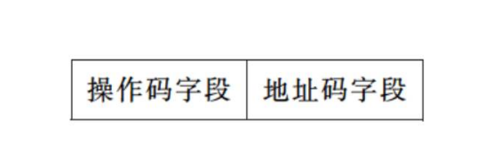

指令的长度是指一条指令中所包含的二进制代码的位数，它取决于操作码字段的长度、操作数地址的个数及长度。

指令长度可以等于机器字长，也可以大于或小于机器字长。

在一个指令系统中，若所有指令的长度都是相等的，称为定长指令字结构；若各种指令的长度随指令功能而异，称为变长指令字结构。

### 地址码结构

一条双操作数指令的除操作码之外，还应包含以下信息：

- 第一操作数地址，用 A1 表示；
- 第二操作数地址，用 A2 表示；
- 操作结果存放地址，用 A3 表示；
- 下条将要执行指令的地址，用 A4 表示。

这些信息可以在指令中明显的给出，称为显地址；也可以依照某种事先的约定，用隐含的方式给出，称为隐地址。

#### 四地址指令

前述的 4 个地址信息都在地址字段中明显地给出，其指令的格式为：

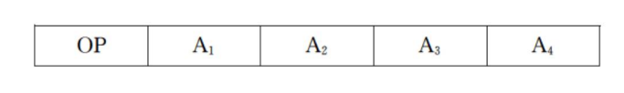

指令的含义：

$$
\begin{array}{l}\left(A_{1}\right) O P\left(A_{2}\right) \rightarrow A_{3} \\ A_{4}=\text { 下一条将要执行指令的地址 }\end{array}
$$

其中：$Ai$表示地址，$(Ai)$表示存放于该地址中的内容。

#### 三地址指令

正常情况下，大多数指令按顺序依次被从主存中取出来执行，只有在遇到转移指令时，程序的执行顺序才会改变。因此，可以用一个程序计数器(Program Counter, PC)来存放指令地址。通常每执行一条指令，PC 就自动加 1（设每条指令只占一个主存单元），直接得到将要执行的下一条指令的地址。这样，指令中就不必再明显地给出下一条指令的地址了。三地址指令格式为：

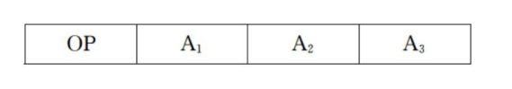

指令的含义：

$$
\begin{array}{l}\left(A_{1}\right) \mathrm{OP}\left(A_{2}\right) \rightarrow A_{3} \\ (P C)+1 \rightarrow P C(\text { 隐含 })\end{array}
$$

执行一条三地址的双操作数运算指令，至少需要访问 4 次主存。第一次取指令本身，第二次取被操作数，第三次取操作数，第四次保存运算结果。

#### 二地址指令

三地址指令执行完后，主存中的两个操作数均不会被破坏。然而，通常并不一定需要完整的保留两个操作数。例如，可让第一操作数地址同时兼作存放结果的地址(目的地址)，这 样即得到了二地址指令，其格式为：

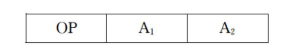

指令的含义：

$$
\left(\mathrm{A}_{1}\right) \mathrm{OP}\left(\mathrm{A}_{2}\right) \rightarrow \mathrm{A}_{1}\\\\(\mathrm{PC})+1 \rightarrow \mathrm{PC} (隐含)
$$

其中：A1 为目的操作数地址，A2 为源操作数地址。

二地址指令执行之后，目的操作数地址中原存的内容已被破坏了。

执行一条二地址的双操作数运算指令，同样至少需要访问 4 次主存。

#### 一地址指令

一地址指令顾名思义只有一个显地址，它的指令格式为：

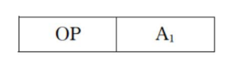

一地址指令只有一个地址，那么另一个操作数来自何方呢？指令中虽未明显给出，但按 事先约定，这个隐含的操作数就放在一个专门的寄存器中。因为这个寄存器在连续运算时， 保存着多条指令连续操作的累计结果，故称为累加寄存器(Accumulator, Acc)。

指令的含义：

$$
(\mathrm{Acc}) \mathrm{OP}\left(\mathrm{A}_{1}\right) \rightarrow \mathrm{Acc}\\(\mathrm{PC})+1 \rightarrow \mathrm{PC} (隐含 )
$$

执行一条一地址的双操作数运算指令，只需要访问两次主存。第一次取指令本身，第二次取操作数。被操作数和运算结果都放在累加寄存器中，所以读取和存入都不需要访问主存。

#### 零地址指令

零地址指令格式中只有操作码字段，没有地址码字段，其格式为：

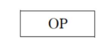

零地址的算逻类指令是用在堆栈计算机中的，堆栈计算机没有一般计算机中必备的通用寄存器，因此堆栈就成为提供操作数和保存运算结果的唯一场所。通常，参加算逻运算的两个操作数隐含地从堆栈顶部弹出，送到运算器中进行运算，运算的结果再隐含地压入堆栈。有关堆栈的概念将在稍后讨论。

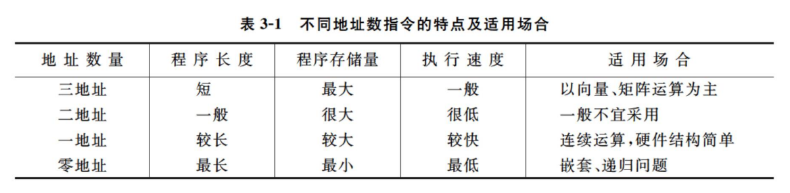

对于同一个问题，用三地址指令编写的程序最短，但指令长度最长，而用二、一、零地址指令来编写程序，程序的长度一个比一个长，但指令的长度一个比一个短。

指令的操作码

指令系统中的每一条指令都有一个唯一确定的操作码，指令不同，其操作码的编码也不同。通常，希望用尽可能短的操作码字段来表达全部的指令。指令操作码的编码可以分为规整型和非规整型两类。

#### 规整型编码（定长编码）

操作码字段的位数和位置是固定的。

假定：指令系统共有$m$条指令，指令中操作码字段的位数为$N$位，则有如下关系式：

$$
m\leq2^N,\\
N≥log2m
$$

规整型编码对于简化硬件设计，减少指令译码的时间是非常有利的。

IBM 370 机（字长 32 位）的指令可分为三种不同的长度,不论指令的长度为多少位，其中操作码字段一律都是 8 位。

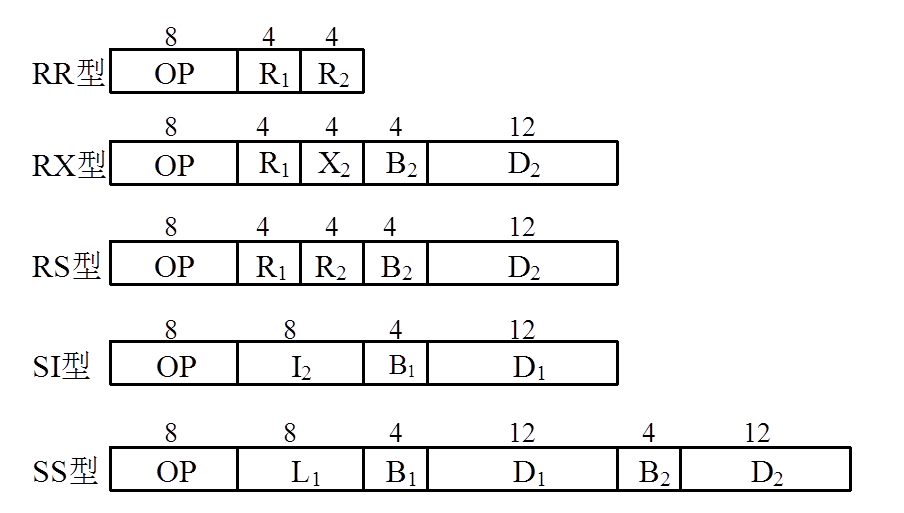

#### 非规整型编码（变长编码）

操作码字段的位数不固定，且分散地放在指令字的不同位置上。

PDP-11 机（字长 16 位）的指令分为单字长、两字长、三字长三种，操作码字段占 4 ～ 16 位不等，可遍及整个指令长度。

显然，操作码字段的位数和位置不固定将增加指令译码和分析的难度，使控制器的设计复杂化。

最常用的非规整型编码方式是扩展操作码法。因为如果指令长度一定，则地址码与操 作码字段的长度是相互制约的。为了解决这一矛盾，让操作数地址个数多的指令（如三地址指令）的操作码字段短些，操作数地址个数少的指令（如一或零地址指令）的操作码字段长些。这样既能充分地利用指令的各个字段，又能在不增加指令长度的情况下扩展操作码的位数，使它能表示更多的指令。

例如：设某机的指令长度为 16 位，操作码字段为 4 位，有三个 4 位的地址码字段，其格式为：

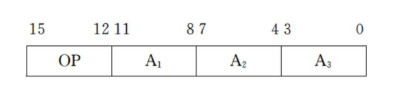

如果按照定长编码的方法，4 位操作码字段最多只能表示 16 条不同的三地址指令。

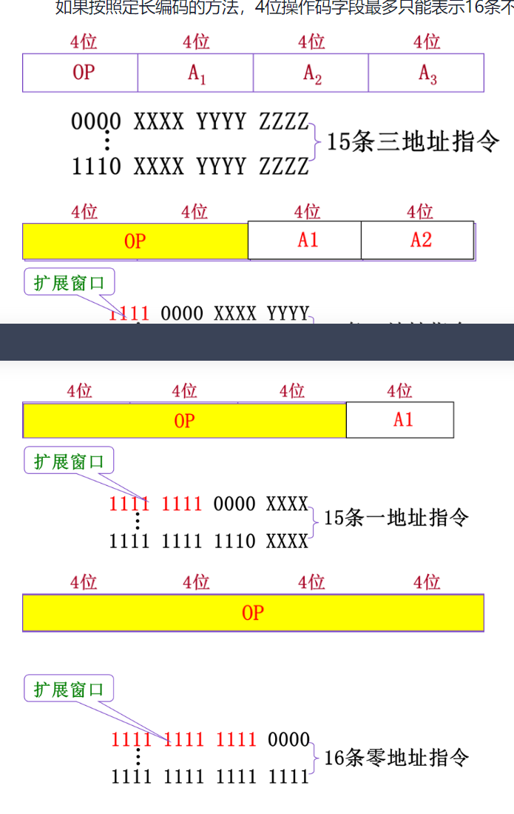

## 寻址技术

所谓寻址，指的是寻找操作数的地址或下一条将要执行的指令地址。寻址技术包括编址方式和寻址方式。

編址方式

在计算机巾，编址方式是指对各种存储设备进行编码的方式。

#### 编址

要对寄存器、主存储器和输入输出设备等进行访问，首先必须对它们进行编址。就像一个大楼有许多房间，首先必须给每一个房间编上一个唯一的号码，人们才能据此找到需要的房间一样。

#### 编址单位

目前常用的编址单位有字编址、字节编址和位编址。

1.  字编址

    字编址是实现起来最容易的一种编址方式，这是因为每个编址单位与访问单位相一致。

    编址单位=访问单位

    每个编址单位所包含的信息量（二进制位数）与读或写一次寄存器、主存所获得的信息量是相同的。早期的大多数机器都采用这种编址方式。

2.  字节编址

    目前使用最普遍的编址方式是字节编址，这是为了适应非数值计算的需要。字节编址方式使编址单位与信息的基本单位（一个字节）相一致，这是它的最大优点。然而，如果主存的访问单位也是一个字节的话，那么主存的频带就太窄了。

    编址单位＜访问单位

    通常主存的访问单位是编址单位的若干倍。

3.  位编址

    有部分计算机系统采用位编址方式。

#### 指令中地址码的位数

指令格式中每个地址码的位数是与主存容量和最小寻址单位（即编址单位）有关联的。主存容量越大，所需的地址码位数就越长。对于相同容量来说，如果以字节为最小寻址单位，地址码的位数就需要长些；如果以字为最小寻址单位（假定字长为 16 位或更长），地址码的位数可以减少。

例如：设某机主存容量为$2^{20}$ 个字节，机器字长 32 位。若最小寻址单位为字节（按字节编址），其地址码应为 20 位；若最小寻址单位为字（按字编址），其地址码只需 18 位。

- 位、字节、字，这三个概念你还在搞混吗？

  <https://zhuanlan.zhihu.com/p/615169362>

  位

  位是最基本的概念，在计算机中，由于只有逻辑 0 和逻辑 1 的存在，因此很多东西、动作、数字都要表示为一串二进制的字码例如： 1001 0000 1101 等等。其中每一个逻辑 0 或者 1 便是一个位。例如这个例子里的 1000 1110 共有八个位，它的英文名字叫（bit），是计算机中最基本的单位。

  字节

  Byte，是由八个位组成的一个单元，也就是 8 个 bit 组成 1 个 Byte。字节有什么用呢？ 在计算机科学中，用于表示 ASCII 字符，便是运用字节来记录表示字母和一些符号\~例如字符 A 便用 “0100 0001”来表示。

  字

  字（Word）代表计算机处理指令或数据的二进制数位数，是计算机进行数据存储和数据处理的运算的单位。

  对于 32 位计算机与 64 位计算机，字的大小往往不同。

  32 位计算机：1 字=32 位=4 字节，64 位计算机：1 字=64 位=8 字节

### 指令寻址和数据寻址

寻址可以分为数据寻址和指令寻址。

- 寻找操作数的地址称为数据寻址，数据寻址方式较多，其最终目的都是寻找所需要的操作数。
- 寻找下一条将要执行的指令地址称为指令寻址，指令寻址比较简单，它又可以细分为顺序寻址和跳跃寻址。
  - 顺序寻址可通过程序计数器 PC 加 1，自动形成下一条指令的地址；
  - 跳跃寻址则需要通过程序转移类指令实现。
    跳跃寻址的转移地址形成方式有三种：直接（绝对）、相对和间接寻址，它与下面介绍的数据寻址方式中的直接、相对和间接寻址是相同的，只不过寻找到的不是操作数的有效地址而是转移的有效地址而已。

### 基本的数据寻址方式

数据寻址方式是根据指令中给出的地址码字段寻找真实操作数地址的方式。

$$
指令中的形式地址 \stackrel{\text { 寻址方式 }}{\longrightarrow} 有效地址
$$

每种计算机的指令系统都有自己的一套数据寻址方式，不同计算机的寻址方式的名称和含义并不统一，下面介绍大多数计算机常用的几种基本寻址方式。

#### 立即寻址

立即寻址是一种特殊的寻址方式，指令中在操作码字段后面的部分不是通常意义上的 操作数地址，而是操作数本身。也就是说，数据就包含在指令中，只要取出指令，也就取出了 可以立即使用的操作数，这样的数称为立即数，其指令格式为：

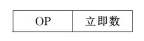

在取指令时，操作码和操作数被同时取出，不必再次访问主存，从而提高了指令的执行速度。但是，因为操作数是指令的一部分，不能被修改，而且立即数的大小受到指令长度的限制，所以这种寻址方式灵活性最差，通常用于给某一寄存器或主存单元赋初值或提供一个常数。

#### 寄存器寻址&#xA;

指令中地址码部分给出某一通用寄存器的编号，所指定的寄存器中存放着操作数。

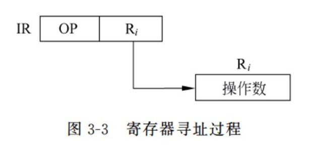

两个明显的优点：

- 从寄存器存取数据比主存快得多；
- 由于寄存器的数量较少，其地址码字段比主存单元地址字段短得多。

这种方式可以缩短指令长度，提高指令的执行速度，几乎所有的计算机都使用了寄存器寻址方式。

#### 直接寻址

指令中地址码字段给出的地址 A 就是操作数的有效地址，即形式地址等于有效地址： $EA = A$。

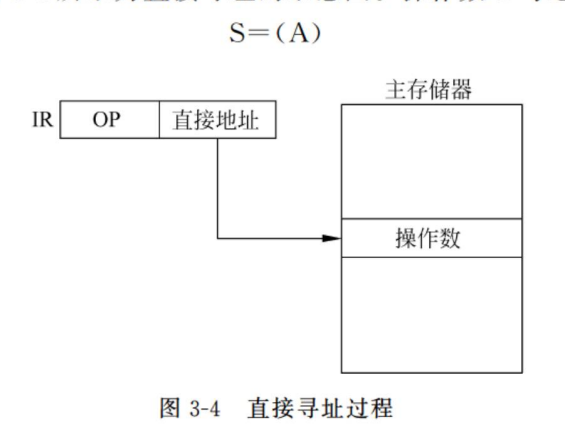

- 指令中地址码字段给出的地址 A 就是操作数的有效地址，即形式地址等于有效地址：$EA=A$。
- 由于这样给出的操作数地址是不能修改的，与程序本身所在的位置无关，所以又叫做绝对寻址方式。
- 作数$S=(A)$

这种寻址方式不需作任何寻址运算，简单直观，也便于硬件实现，但地址空间受到指令中地址码字段位数的限制。

#### 间接寻址

- 间接寻址意味着指令中给出的地址 A 不是操作数的地址；而是存放操作数地址的主存单元的地址，简称操作数地址的地址。
- 通常在指令格式中划出一位作为直接或间接寻址的标志位，间接寻址时标志位$＠=1$。
- 一级间接寻址中，$EA=(A)$，$S=((A))$

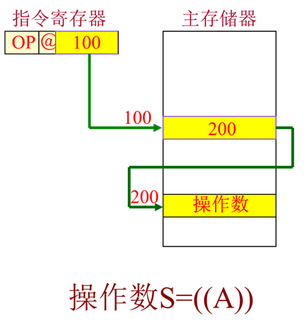

间接寻址过程：

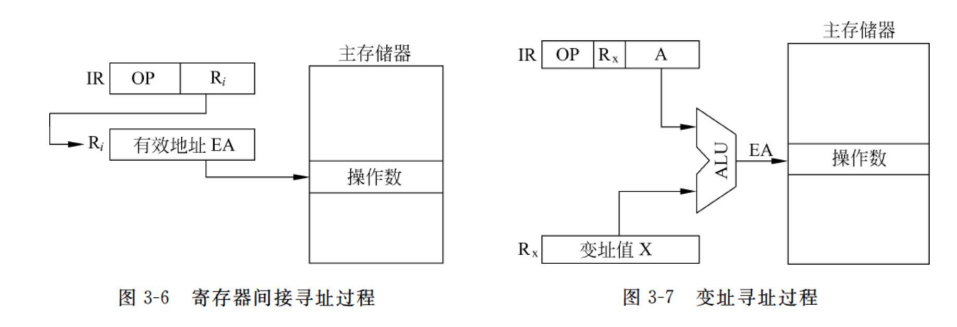

除去一级间接寻址外，还有多级间接寻址。多级间接寻址为取得操作数需要多次访问主存，即使在找到操作数有效地址后，还需再访问一次主存才可得到真正的操作数。

多级间接标志：

- 0：找到有效地址
- 1：继续间接寻址

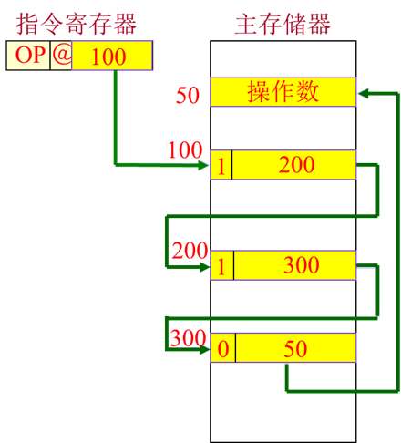

间接寻址要比直接寻址灵活得多，它的主要优点为：

1.  扩大了寻址范围，可用指令的短地址访问大的主存空间。
2.  可将主存单元作为程序的地址指针，用以指示操作数在主存中的位置。当操作数的地址需要改变时，不必修改指令，只需修改存放有效地址的那个主存单元（间接地址单元）的内容就可以了。

#### 寄存器间接寻址

- 指令中的地址码给出某一通用寄存器的编号，被指定的寄存器中存放操作数的有效地址，而操作数则存放在主存单元中。
- 这种寻址方式的指令较短，并且在取指后只需一次访存便可得到操作数。

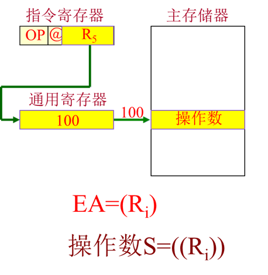

#### 变址寻址

把变址寄存器 Rx 的内容与指令中给出的形式地址 A 相加，形成操作数有效地址，即$EA=(R_x)+A$。$R_x$的内容称为变址值。操作数$S=(A+(R_X))$

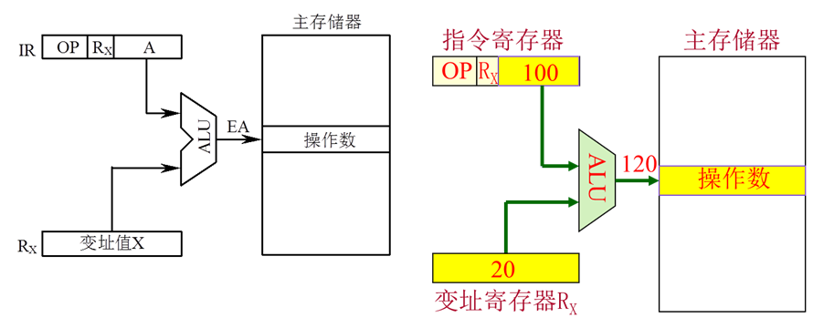

变址寻址是一种广泛采用的寻址方式，通常指令中的形式地址作为基准地址，而 RX 的内容作为修改量。在遇到需要频繁修改地址时，无须修改指令，只要修改变址值就可以了。

例如：要把一组连续存放在主存单元中的数据（首地址是 A）依次传送到另一存储区（首地址为 B）中去，则只需在指令中指明两个存储区的首地址 A 和 B（形式地址），用同一变址寄存器提供修改量 K，即可实现$(A+K)→B+K$。变址寄存器的内容在每次传送之后自动地修改。

#### 基址寻址

基址寄存器 Rb 的内容与指令中给出的位移量 D 相加，形成操作数有效地址，即$EA=(R_b)+D$。基址寄存器的内容称为基址值。l 指令的地址码字段是一个位移量，位移量可正、可负。

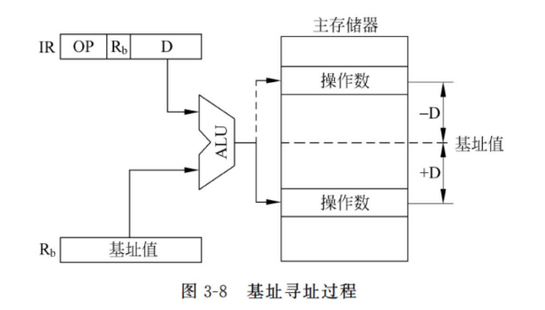

基址寻址和变址寻址在形成有效地址时所用的算法是相同的，而且在一些计算机中，这两种寻址方式都是由同样的硬件来实现的。

但它们应用的场合不同，变址寻址是面向用户的，用于访问字符串、向量和数组等成批数据；而基址寻址面向系统，主要用于逻辑地址和物理地址的变换，用以解决程序在主存中的再定位和扩大寻址空间等问题。

在某些大型机中，基址寄存器只能由特权指令来管理，用户指令无权操作和修改。

#### 相对寻址

相对寻址是基址寻址的一种变通，由程序计数器 PC 提供基准地址，指令中的地址码字段作为位移量 D，两者相加后得到操作数的有效地址，即$EA=(PC)+D$。位移量指出的是操作数和现行指令之间的相对位置。

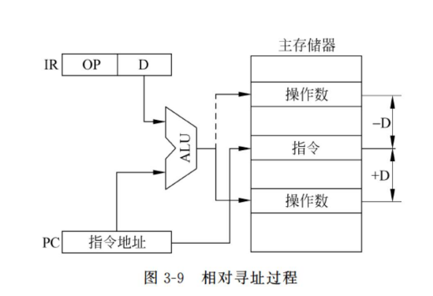

相对寻址方式的特点：

1.  操作数的地址不是固定的，它随着 PC 值的变化而变化，并且与指令地址之间总是相差一个固定值$±D$。当指令地址改变时，由于其位移量不变，使得操作数与指令在可用的存储区内一起移动，所以仍能保证程序的正确执行。采用 PC 相对寻址方式编写的程序可在主存中任意浮动，它放在主存的任何地方，所执行的效果都是一样的。
2.  由于指令中给出的位移量可正、可负，所以对于指令地址而言，操作数地址可能在指令地址之前或之后，通常用补码表示。如果位移量为〃位，则相对寻址的寻址范围为：

    $$
    (\mathrm{PC})-2^{(n-1)} \sim(\mathrm{PC})+2^{(n-1)}-1
    $$

#### 页面寻址

页面寻址相当于将整个主存空间分成若干个大小相同的区，每个区称为一页，每页有若干个主存单元。

每页都有自己的编号，称为页面地址；页面内的每个主存单元也有自己的编号，称为页内地址。

操作数/存储器的有效地址就被分为两部分：前部为页面地址(在此例中占 8 位)，后部为页内地址(也占 8 位)。

页内地址由指令的地址码部分自动直接提供，它与页面地址通过简单的拼装连接就可得到有效地址，无须进行计算，因此寻址迅速。根据页面地址的来源不同，页面寻址又可以分成三种不同的方式：

1.  基页寻址。基页地址又称零页寻址。由于页面地址全等于 0，所以有效地址$EA=0//A$（$//$在这里表示简单拼接），操作数 S 在零页面中。基页寻址实际上就是直接寻址。
2.  当前页寻址，$EA=(PC)H//A$，操作数 S 与指令本身处于同一页面中。
3.  页寄存器寻址。页面地址取自页寄存器，与形式地址相拼接形成有效地址。

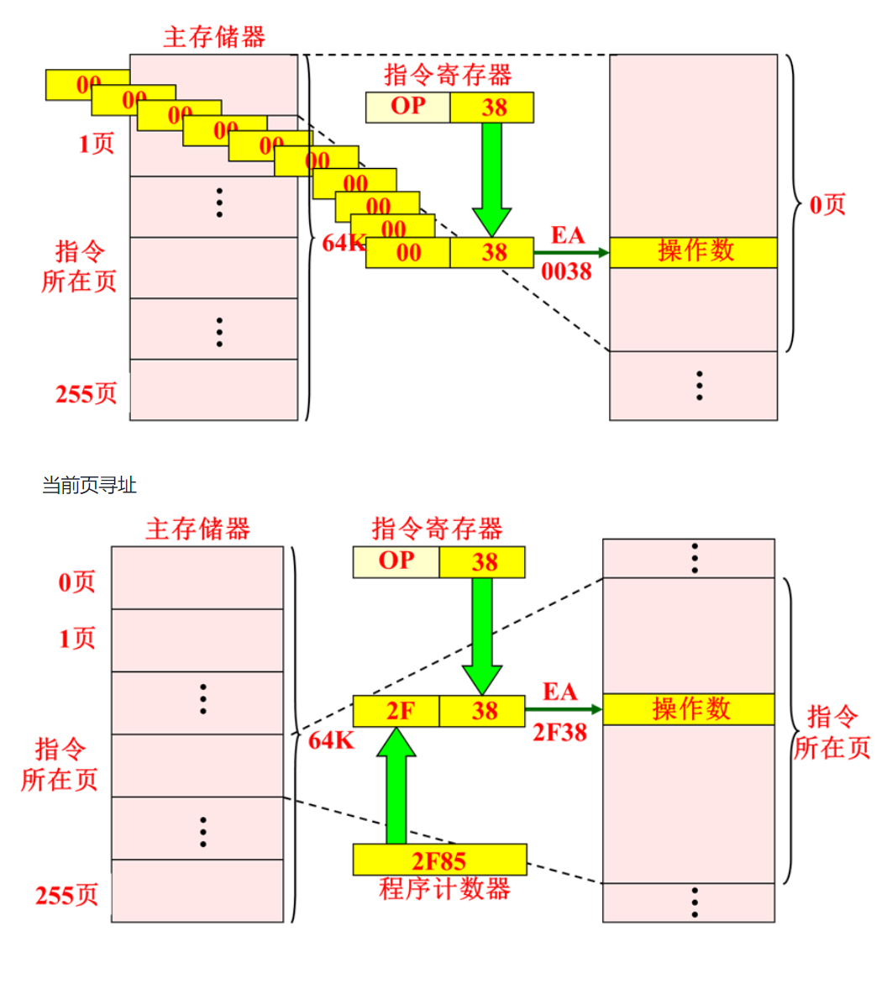

区分不同的寻址方式：为了能区分出各种不同寻址方式，必须在指令中给出标识。标识的方式通常有两种：显式和隐式。显式的方法就是在指令中设置专门的寻址方式字段，用二进制代码来表明寻址方式类型。隐式的方式是由指令的操作码字段说明指令格式并隐含约定寻址方式。

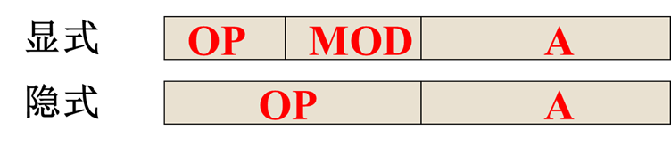

注意，一条指令若有两个或两个以上的地址码时，各地址码可采用不同的寻址方式。例如，源地址采用一种寻址方式，而目的地址采用另一种寻址方式：

$$
MOV   AX,(BX)  
$$

(注：目的地址：寄存器直接寻址；源地址：寄存器间接寻址)

### 基本的数据寻址速度比较

各种数据寻址方式获得数据的速度（由快到慢）：

- 立即寻址
- 寄存器寻址
- 直接寻址
- 寄存器间接寻址
- 页面寻址
- 变址寻址（基址寻址、相对寻址）
- 一级间接寻址
- 多级间接寻址

### 变型或组合寻址方式

前面介绍了 9 种常用的基本寻址方式，其他的寻址方式则是这 9 种寻址方式的变型或
组合。

#### 自增型寄存器间址和自减型寄存器间址

这两种寻址方式实际上都是寄存器间接寻址方式的变型，通用寄存器在这里作为自动 变址寄存器。

1.  自增寻址

    寄存器 Ri 的内容是有效地址，按照这个有效地址从主存中取数以后，寄存器的内容自动增量修改。在字节编址的计算机中，若指向下一个字节，寄存器的内容+1；若指向下一个字（设字长 16 位），寄存器的内容+2。

    自增寻址操作的含义为：$EA=(R_i), R_i←(R_i)+d$。

    其中：EA 为有效地址，d 为修改量，通常记作$(R_i)+$，加号在括号之后，形象地表示先操作后修改。

2.  自减寻址

    自减寻址是先对寄存器$R_i$的内容自动减量修改（-1 或-2），修改之后的内容才是操作数的有效地址，据此可到主存中取出操作数。

自减寻址操作的含义为：$R_i←(R_i)-d, EA=(Ri)$。

通常记作$-(R_i)$，减号在括号之前，形象地表示先修改后操作。

#### 扩展变址方式

把变址和间址两种寻址方式结合起来，就成为扩展变址方式，按寻址方式操作的先后顺序，有前变址和后变址两种形式。

1.  先变址后间址（前变址方式）

    先进行变址运算，其运算结果作为间接地址，间接地址指出的单元的内容才是有效地址。所以，有效地址$EA=(A+(R_x))$，操作数$S=((A+(R_x)))$。

2.  先间址后变址（后变址方式）

    将指令中的地址码先进行一次间接寻址，然后再与变址值进行运算，从而得到一个有效地址。所以，有效地址 EA=(A)+(Rx)，操作数$S=((A)+(R_x))$。

3.  基址变址寻址

    基址变址寻址是最灵活的一种寻址方式，此时有效地址是由基址寄存器中的值、变址寄存器中的值和位移量三者相加求得的。

    在这三项中，除位移量在指令一旦确定后就不能再修改以外，基址和变址寄存器中的内容都可以改变。

    $$
    EA=(R_b)+(R_x)+D
    $$

其中：$R_b$为基址寄存器，$R_x$为变址寄存器，$D$为位移量。

## 堆栈与堆栈操作

堆栈是一种按特定顺序进行存取的存储区，这种特定顺序可归结为“后进先出”（LIFO）或“先进后出”（FILO）。&#x20;

### 堆栈结构

#### 寄存器堆栈

有些计算机中用一组专门的寄存器构成寄存器堆栈，又称为硬堆栈。这种堆栈的栈顶是固定的，寄存器组中各寄存器是相互连接的，它们之间具有对应位自动推移的功能，即可将一个寄存器的内容推移到相邻的另一个寄存器中去。

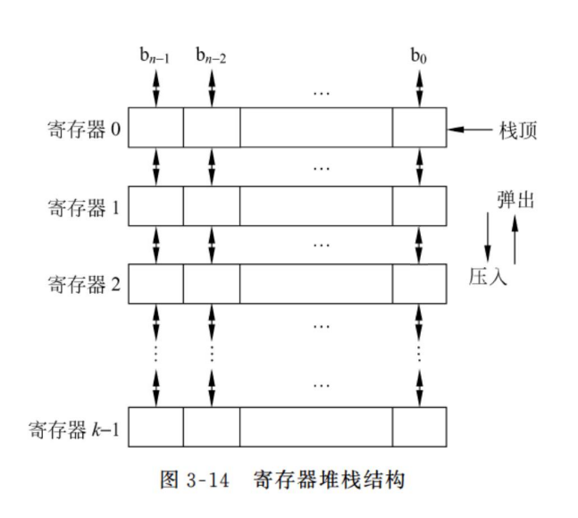

#### 存储器堆栈

从主存中划出一段区域来作堆栈，这种堆栈又称为软堆栈，堆栈的大小可变，栈底固定，栈顶浮动，故需要一个专门的硬件寄存器作为堆栈栈顶指针，简称栈指针（SP）。栈指针所指定的主存单元，就是堆栈的栈顶。

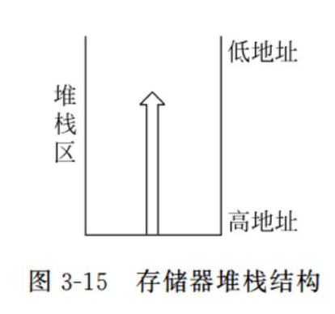

1.  自底向上生成（向低地址方向生成）堆栈的进栈

    - 堆栈的栈底地址大于栈顶地址，通常栈指针始终指向栈顶的满单元。
    - 进栈时，SP 的内容需要先自动减 1（80X86 是减 2），然后再将数据压入堆栈。
      进、出栈的过程可描述如下。
    - 进栈：

      $(SP)-1\rightarrow SP$：修改栈指针
      $(A)\rightarrow(SP)$：将 A 中的内容压人栈顶单元

    - 出栈:

          $((SP))\rightarrow A$：将栈顶单元内容弹出送入A中

          $(SP) + 1\rightarrow SP$：修改栈指针

      其中，$A$为寄存器或主存单元地址；$(SP)$表示堆栈指针的内容，即栈顶单元地址；$((SP))$表示栈顶单元的内容。

    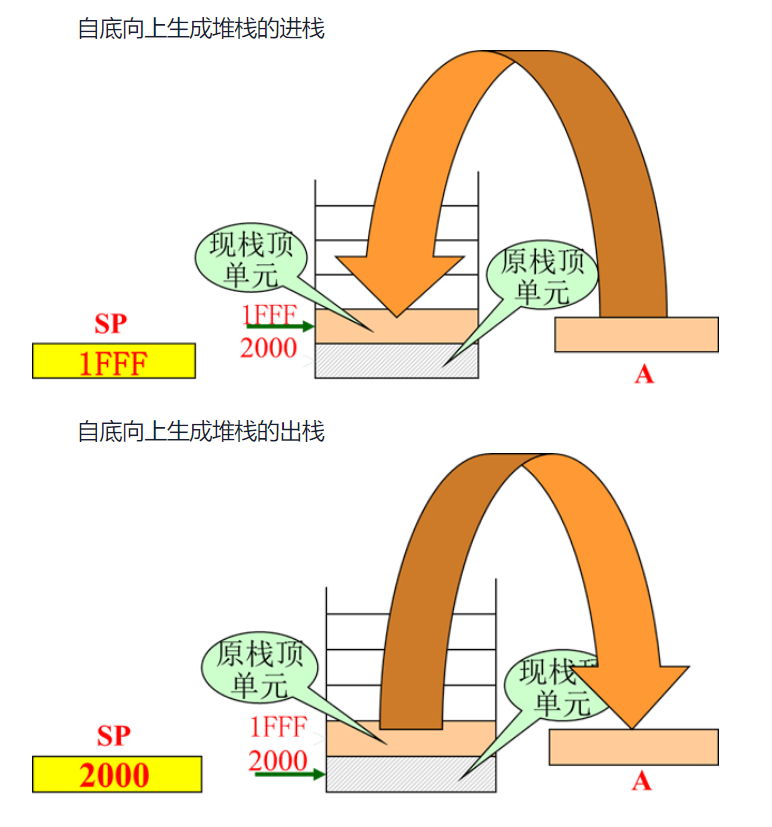

2.  自顶向下生成（向高地址方向生成）堆栈

    这种堆栈与自底向上堆栈正好相反，它的栈底地址小于栈顶地址。

    进栈时，先令$(SP) + 1 \rightarrow SP$，然后再压人数据;出栈时，先将数据弹出，然后$(SP)-l\rightarrow SP$。

### 堆栈操作

堆栈操作既不是在堆栈中移动它所存储的内容，也不是把已存储在栈中的内容从栈中抹掉，而是通过调整堆栈指针而给出新的栈顶位置，以便对位于栈顶位置的数据进行操作。

在一般计算机中，堆栈主要用来暂存中断断点、子程序调用时的返回地址、状态标志及现场信息等，也可用于子程序调用时参数的传递，所以用于访问堆栈的指令只有进栈（压入）和出栈（弹出）两种。

在堆栈计算机（如 HP-3000、B5000 等）中，没有一般计算机中必备的通用寄存器，因此堆栈就成为提供操作数和保存运算结果的唯一场所。此时的算术逻辑类指令中没有地址码字段，故称为零地址指令。

参加运算的两个操作数隐含地从堆栈顶部弹出，送到运算器中进行运算，运算的结果再隐含地压入堆栈。如果将算术表达式改写为逆波兰表达式[^1]，用零地址指令进行运算是十分方便的。

例如：有算术表达式$a×b+c÷d$，运算结果送$X$，这个算术表达式可以用逆波兰法表示成为$ab×cd÷+$。

其程序段为：

- `PUSH A` ：数据$a$压入堆栈
- `PUSH B`：数据$b$压入堆栈
- `MUL`：完成$a×b$
- `PUSH C`：数据$c$压入堆栈
- `PUSH D`：数据$d$压入堆栈
- `DIV`：完成$c÷d$
- `ADD`：完成$a×b+c÷d$
- `POP X`：结果存入$X$单元

> 执行一条零地址的双操作数运算指令，如果是软堆栈，则需要访问 4 次主存；如果是硬堆栈，则只需要访问一次主存。

[^1]:
    后缀表达式，也被称为逆波兰表达式，是一种将数学表达式中的操作符放在操作数之后的表示方法。 与传统的中缀表达式相比，后缀表达式具有以下优点：消除了操作符优先级和括号的问题，使表达式的计算更加简洁和直观；同时后缀表达式也更适合计算机进行解析和计算。&#x20;
    [https://blog.csdn.net/DsJustintime/article/details/133283323](<https://blog.csdn.net/DsJustintime/article/details/133283323#:~:text=后缀表达式，也被称为逆波兰表达式，是一种将数学表达式中的操作符放在操作数之后的表示方法。,与传统的中缀表达式相比，后缀表达式具有以下优点：消除了操作符优先级和括号的问题，使表达式的计算更加简洁和直观；同时后缀表达式也更适合计算机进行解析和计算。 在这篇文章中，我们将介绍后缀表达式的原理，并给出相应的源代码实现。> "https://blog.csdn.net/DsJustintime/article/details/133283323")
