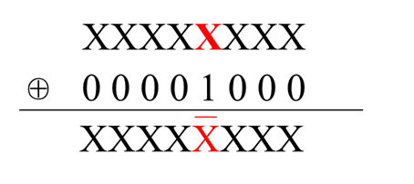
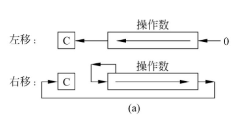
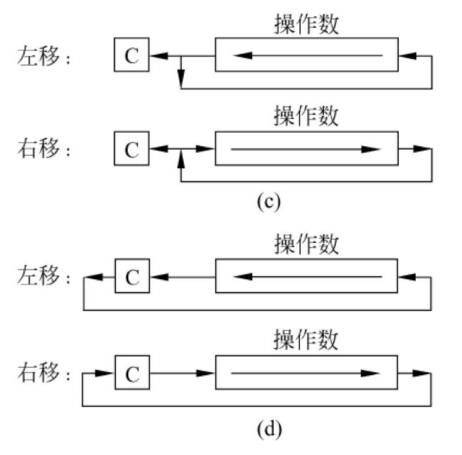
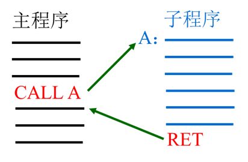
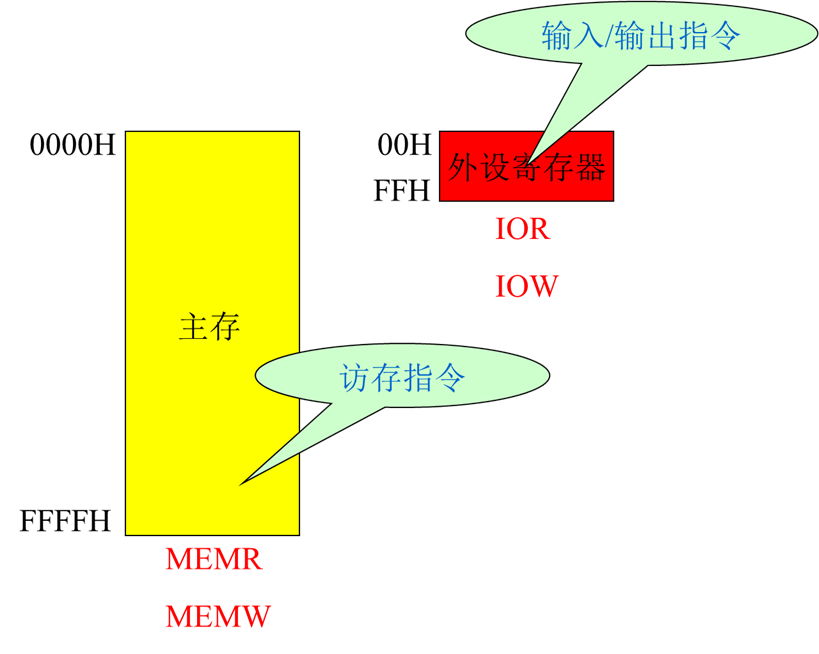
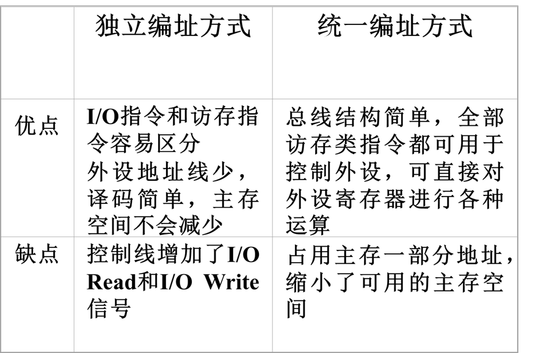

# 03 指令系统 (4\~5)

## 指令类型

一台计算机的指令系统可以有上百条指令，这些指令按其功能可以分成几种类型。

### 数据传送类指令

#### 一般传送指令

一般传送指令具有数据复制的性质，即数据从源地址传送到目的地址，而源地址中的内容保持不变。一般传送类指令常用助记符 MOV 表示，根据数据传送的源和目的的不同，又可分为：

1.  主存单元之间的传送。

    MOV mem2,mem1，其含义为 (mem1)→mem2

2.  从主存单元传送到寄存器。在有些计算机中，该指令用助记符 LOAD 表示。

    MOV reg,mem，其含义为(mem)→reg

3.  从寄存器传送到主存单元。在有些计算机里，该指令用助记符 STORE 表示。

    MOV mem,reg，其含义为(reg)→mem

4.  寄存器之间的传送。

    MOV reg2,reg1，其含义为 (reg1)→reg2

#### 堆栈操作指令

堆栈指令实际上是一种特殊的数据传送指令，分为进栈（PUSH）和出栈（POP）两种，在程序中它们往往是成对出现的。

如果堆栈是主存的一个特定区域，那么对堆栈的操作也就是对存储器的操作。

#### 数据交换指令

前述的传送都是单方向的。然而，数据传送也可以是双方向的，即将源操作数与目的操作数（一个字节或一个字）相互交换位置。

### 运算类指令

#### 算术运算类指令

算术运算指令主要用于定点和浮点运算。这类运算包括定点加、减、乘、除指令，浮点加、减、乘、除指令以及加 1、减 1、比较等，有些机器还有十进制算术运算指令。

绝大多数算术运算指令都会影响到状态标志位，通常的标志位有进位、溢出、全零、正负和奇偶等。

#### 逻辑运算类指令

计算机都具有与、或、非、异或等逻辑运算指令。这类指令在没有设置专门的位操作指令的计算机中常用于对数据字（字节）中某些位（一位或多位）进行操作，常见的应用有：

1.  按位测（位检查）

    利用“与”指令可以屏蔽掉数据字（字节）中的某些位。通常让被检查数作为目的操作数，屏蔽字作为源操作数，要检测某些位，可使屏蔽字的相应位为“1” ，其余位为“0” ，然后执行“与”指令，则可取出所要检查的位来。

    

2.  按位清（位清除）

    利用“与”指令还可以使目的操作数的某些位置“0” 。只要源操作数的相应位为“0” ，其余位为“1” ，然后执行“与”指令即可。

    

3.  按位置（位设置）

    利用“或”指令可以使目的操作数的某些位置“1” 。只要源操作数的相应位为“1” ，其余位为“0” ，然后执行“或”指令即可。

    

4.  按位修改

    利用“异或”指令可以修改目的操作数的某些位，只要源操作数的相应位为“1” ，其余位为“0” ，异或之后就达到了修改这些位的目的（因为$A⊕1=\bar{x} ，A⊕0=A$）。

    

5.  判符合

    若两数相符合，其异或之后的结果必定为“0” 。

6.  清 0：`XOR AL,AL`

#### 移位类指令

移位指令分为算术移位、逻辑移位和循环移位三类，它们又可分为左移和右移两种。

1.  算术移位

    算术移位的对象是带符号数，在移位过程中必须保持操作数的符号不变。当左移一位时，如不产生溢出，则数值 ×2；而右移一位时，如不考虑因移出舍去的末位尾数，则数值 ÷2。

    

2.  逻辑移位

    逻辑移位的对象是无符号数，因此移位时不必考虑符号问题。

    

3.  循环移位

    循环移位按是否与进位位一起循环又分为两种：

    - 小循环（不带进位循环）
    - 大循环（带进位循环）
      

### 程序控制类指令

#### 转移指令

在程序执行过程中，通常采用转移指令来改变程序的执行顺序。转移指令又分无条件转移和条件转移两种：

1.  无条件转移又称必转，它在执行时将改变程序的常规执行顺序，不受任何条件的约束，直接把程序转向该指令指出的新的位置执行，其助记符一般为 JMP。
2.  条件转移必须受到条件的约束，若条件满足时才执行转移，否则程序仍顺序执行。条件转移指令主要用于程序的分支，当程序执行到某处时，要在两个分支中选择一支，这就需要根据某些测试条件作出判断。

注：

- 无论是条件转移还是无条件转移都需要给出转移地址。
- 若采用相对寻址方式，转移地址为当前指令地址（即 PC 的值）和指令中给出的位移量之和，即(PC)+位移量 →PC；
- 若采用绝对寻址方式，转移地址由指令的地址码字段直接给出，即 A→PC。

#### 子程序调用指令

子程序是一组可以公用的指令序列，只要知道子程序的入口地址就能调用它。通常把一些需要重复使用并能独立完成某种特定功能的程序单独编成子程序，在需要时由主程序调用它们，这样做既简化了程序设计，又节省了存储空间。

主程序和子程序是相对的概念，调用其他程序的程序是主程序；被其他程序调用的程序是子程序。

子程序调用指令，简称转子指令，其助记符一般为 CALL。而从子程序转向主程序的指令称为返回指令（RET）。转子指令安排在主程序中需要调用子程序的地方，转子指令是一地址指令。

转子指令和转移指令都可以改变程序的执行顺序，但事实上两者存在着很大的差别：

1.  转移指令使程序转移到新的地址后继续执行指令，不存在返回的问题，所以没有返回地址；而转子指令要考虑返回问题，所以必须以某种方式保存返回地址，以便返回时能找到原来的位置。
2.  转移指令用于实现同一程序内的转移；而转子指令转去执行一段子程序，实现的是不同程序之间的转移。

返回地址是转子指令的下一条指令的地址，保存返回地址的方法有多种：

1.  用子程序的第一个字单元存放返回地址。返回时将第一个字单元地址作为间接地址，采用间址方式返回主程序。这种方法可以实现多重转子，但不能实现递归循环。
2.  用寄存器存放返回地址。转子指令先把返回地址放到某一个寄存器中，再由子程序将寄存器中的内容转移到另一个安全的地方，可以实现子程序的递归循环。
3.  用堆栈保存返回地址。不管是多重转子还是子程序递归，最后存放的返回地址总是最先被使用的，堆栈的后进先出存取原则正好支持实现多重转子和递归循环。

80X86 则采用堆栈来保存返回地址！

#### 返回指令 &#x20;

从子程序转向主程序的指令称为返回指令，其助记符一般为 RET，子程序的最后一条指令一定是返回指令。返回地址存放的位置决定了返回指令的格式，通常返回地址保存在堆栈中，所以返回指令常是零地址指令。

转子和返回指令也可以是带条件的，条件转子和条件返回与前述条件转移的条件是相同的。

### 输入输出类指令

#### 独立编址的 I/O 指令

独立编址方式使用专门的输入/输出指令（IN/OUT）。以主机为基准，信息由外设传送给主机称为输入，反之称为输出。指令中应给出外部设备编号（端口地址）。这些端口地址与主存地址无关，是另一个独立的地址空间。80x86 采用的就是独立编址方式。

#### 统一编址的 I/O 指令

所谓统一编址就是把外设寄存器和主存单元统一编址。在这种方式下，不需要专门的 I/O 指令，就用一般的数据传送类指令来实现 I/O 操作。

一个外部设备通常至少有两个寄存器：数据寄存器和命令与状态寄存器。

每个外设寄存器都可以由分配给它们的唯一的主存地址来识别，主机可以像访问主存一样去访问外部设备的寄存器。

#### 两种编址方式比较

另一张图：

### 80x86 指令系统举例\*

- MOV 指令
- PUSH/POP 指令
- 加、减和比较指令
- 乘法、除法指令
- BCD 运算和 ASCII 运算
- 基本逻辑指令
- 位测试指令
- 移位与循环指令
- 转移控制指令
- 子程序调用和返回指令
- 输入输出指令

## 指令系统的发展

不同类型的计算机有各具特色的指令系统，由于计算机的性能、机器结构和使用环境不同，指令系统的差异也是很大的。

### x86 架构的扩展指令集\*

目前主流微机使用的指令系统都基于 x86 架构，为了提升处理器各方面的性能，Intel 和 AMD 公司又各自开发了一些新的扩展指令集。扩展指令集中包含了处理器对多媒体、3D 处理等方面的支持，能够提高处理器对这些方面处理的能力。

### 从复杂指令系统到精简指令系统

从指令系统的完备性和有效性的角度来看，当然希望指令系统更丰富、功能更强。特别是系列机问世之后，为了能做到软件兼容，新设计的机型或高档机除了要继承老机器的指令系统中的全部指令外，还要增加若干新的指令，从而导致同一系列计算机的指令系统越来越复杂，机器结构也越来越复杂。这体现了计算机性能越强，其指令系统应越复杂的传统设计思想。我们称这些计算机为复杂指令系统计算机，简称 CISC（ComplexInstruction Set Computer）。

通过对传统的 CISC 指令系统进行测试表明，各种指令的使用频度相差很悬殊。最常使用的是一些比较简单的指令，这类指令的数量仅占指令总数的 20％，但在各种程序中出现的频度却占 80％；其余大多数指令是功能复杂的指令，这类指令的数量占指令总数的 80％，但其使用频度很低，仅占 20％。因此，人们把这种情况称为“20％-80％律”。1975 年 IBM 公司的 John Cocke 提出了精简指令系统的想法，各种精简指令系统计算机 RISC（ReducedInstruction Set Computer）随之诞生。

### VLIW 和 EPIC

#### VLIW 和 EPIC 概念

VLIW 中文含义是“超长指令字”，即一种非常长的指令组合，它把许多条指令连在一起，增加了运算的速度。在这种指令系统中，编译器把许多简单、独立的指令组合到一条指令字中。当这些指令字从主存中取出放到处理器中时，它们被容易地分解成几条简单的指令，这些简单的指令被分派到一些独立的执行单元去执行。

EPIC 中文含义是“显式并行指令代码”。 EPIC 是从 VLIW 中衍生出来的，通过将多条指令放入一个指令字，有效的提高了 CPU 各个计算功能部件的利用效率，提高了程序的性能。

#### Intel 的 IA-64

IA-64 彻底突破 IA-32 的架构，最大限度地开发了指令级并行操作。

Intel 公司反对将 IA-64 划归到 RISC 或 CISC 的类别中，因为他们认为这是 EPIC 架构，是一种基于超长指令字的设计，它合并了 RISC 和 VLIW 技术方面的优势。最早采用这种技术的处理器是 Itanium。
