# 04 数值的机器运算 (1\~3)

运算器是计算机进行算术运算和逻辑运算的主要部件，运算器的逻辑结构取决于机器的指令系统、数据表示方法和运算方法等。本章主要讨论数值数据在计算机中实现算术运算和逻辑运算的方法，以及运算部件的基本结构和工作原理。

### 本章学习内容

- 4.1 基本算术运算的实现
- 4.2 定点加减运算
- 4.3 带符号数的移位和舍入操作
- 4.4 定点乘法运算
- 4.5 定点除法运算
- 4.6 规格化浮点运算
- 4.7 十进制整数的加法运算
- 4.8 逻辑运算与实现
- 4.9 运算器的基本组成与实例

本章学习要求：

- 掌握：定点补码加法和减法运算方法
- 理解：3 种溢出检测方法
- 理解：补码移位运算和常见的舍入操作方法
- 了解：串行加法器与并行加法器
- 理解：进位产生和进位传递
- 掌握：定点原码、补码乘法运算方法
- 掌握：定点原码、补码加减交替除法运算方法
- 理解：浮点加减乘除运算
- 理解：逻辑运算
- 了解：运算器的基本结构及浮点协处理器

## 基本算术运算的实现

计算机中最基本的算术运算是加法运算，不论加、减、乘、除运算最终都可以归结为加法运算。所以在此讨论最基本的运算部件——加法器，以及并行加法器的进位问题。

### 加法器

#### 全加器

全加器（FA）是最基本的加法单元，它有三个输入量：操作数 Ai 和 Bi、低位传来的进位 Ci-1，两个输出量：本位和 Si、向高位的进位 Ci。

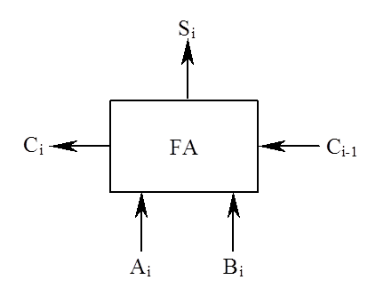

全加器真值表：

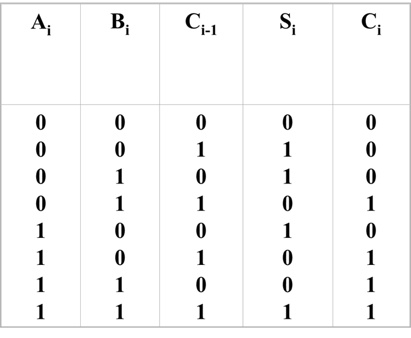

全加器的逻辑表达式

根据真值表，可得到全加器的逻辑表达式为：

$$
\begin{array}{l}\mathrm{S}_{i}=\mathrm{A}_{i} \oplus \mathrm{B}_{i} \oplus \mathrm{C}_{i-1} \\ \mathrm{C}_{i}=\mathrm{A}_{i} \mathrm{~B}_{i}+\left(\mathrm{A}_{i} \oplus \mathrm{B}_{i}\right) \mathrm{C}_{i-1}\end{array}
$$

#### 串行加法器与并行加法器

串行加法器：

- 在串行加法器中，只有一个全加器，数据逐位串行送入加法器进行运算。
- 如果操作数长 n 位，加法就要分 n 次进行，每次只能产生一位和。
- 特点：器件少，成本低；但速度慢。

并行加法器：

- 并行加法器由多个全加器组成，其位数的多少取决于机器的字长，数据的各位同时运算。
- 并行加法器可同时对数据的各位相加，但存在着一个加法的最长运算时间问题。这是因为虽然操作数的各位是同时提供的，但低位运算所产生的进位会影响高位的运算结果。例如：11…11 和 00…01 相加，最低位产生的进位将逐位影响至最高位。
- 因此，并行加法器的最长运算时间主要是由进位信号的传递时间决定的，而每个全加器本身的求和延迟只是次要因素。很明显，提高并行加法器速度的关键是尽量加快进位产生和传递的速度。

### 进位的产生和传递

并行加法器中的每一个全加器都有一个从低位送来的进位输入和一个传送给高位的进位输出。我们将传递进位信号的逻辑线路连接起来构成的进位网络称为进位链。每一位的进位表达式为：

$$
\mathrm{C}_{i}=\mathrm{A}_{i} \mathrm{~B}_{i}+\left(\mathrm{A}_{i} \oplus \mathrm{B}_{i}\right) \mathrm{C}_{i-1}
$$

其中：

- $G_i=A_iB_i$为进位产生函数
- $P_i=A_i⊕B_i$为进位传递函数

故进位表达式$C_i=G_i+P_iC_i-1$

$C_i$对应的逻辑链路称为进位链。

把 n 个全加器串接起来，就可进行两个 n 位数的相加。串行进位又称行波进位，每一级进位直接依赖于前一级的进位，即进位信号是逐级形成的。

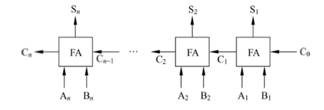

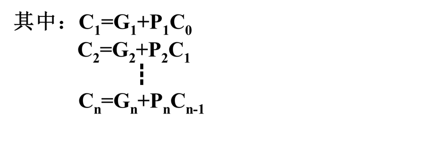

- 串行进位的并行加法器的总延迟时间与字长成正比，字长越长，总延迟时间就越长。
- 假定，将一级“与门”、“或门”的延迟时间定为 ty，从上述公式中可看出，每一级全加器的进位延迟时间为 2ty。
- 在字长为 n 位的情况下，若不考虑 Gi、Pi 的形成时间，从 C0→Cn 的最长延迟时间为 2nty（设 C0 为加法器最低位的进位输入，Cn 为加法器最高位的进位输出）。

### 并行加法器的快速进位

#### 并行进位方式

并行进位又叫先行进位、同时进位，其特点是各级进位信号同时形成。

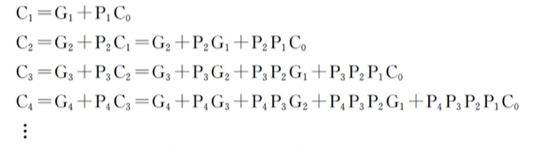

这种进位方式是快速的，若不考虑 Gi、Pi 的形成时间，从 C0→Cn 的最长延迟时间仅为 2ty，而与字长无关。但是随着加法器位数的增加，Ci 的逻辑表达式会变得越来越长，输入变量会越来越多，这会使电路结构变得很复杂，所以完全采用并行进位是不现实的。

#### 分组并行进位方式

单级先行进位方式（组内并行、组间串行）

以 16 位加法器为例，可分为 4 组，每组 4 位。第一小组组内的进位逻辑函数 C1、C2、C3、C4 的表达式与前述相同，它们是同时产生的，实现上述进位逻辑函数的电路称之为 4 位先行进位电路 CLA，其延迟时间是 2ty。

利用这种 4 位的 CLA 电路以及进位产生/传递电路和求和电路可以构成 4 位的 CLA 加法器。用 4 个这样的 CLA 加法器，很容易构成 16 位的单级先行进位加法器。

16 位单级先行进位加法器

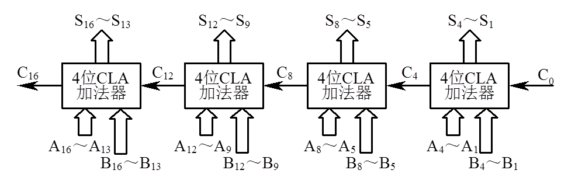

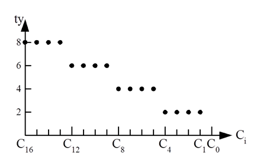

多级先行进位方式（组内并行、组间并行）

仍以字长为 16 位的加法器作为例子，分析两级先行进位加法器的设计方法。第一小组的进位输出 C4 可以变成两个与项相或

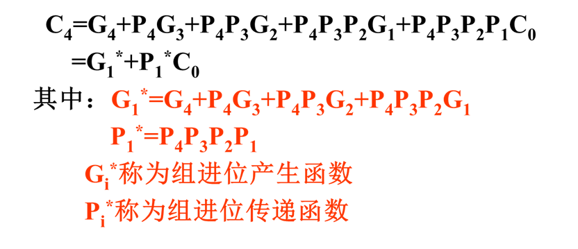

依次类推，可以得到：

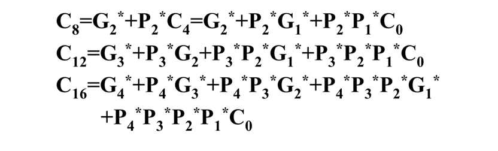

成组先行进位电路 BCLA，其延迟时间是 2ty。

利用这种 4 位的 BCLA 电路以及进位产生/传递电路和求和电路可以构成 4 位的 BCLA 加法器。

16 位的两级先行进位加法器可由 4 个 BCLA 加法器和 1 个 CLA 电路组成。

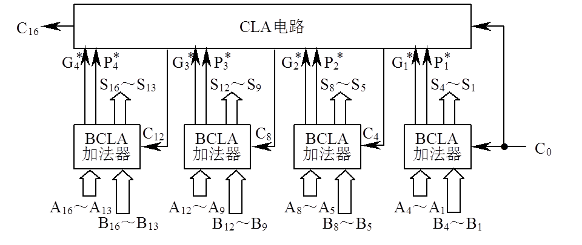

若不考虑 Gi、Pi 的形成时间，C0 经过 2ty 产生第一小组的 C1、C2、C3 及所有组进位产生函数 Gi*和组进位传递函数 Pi*；再经过 2ty，由 CLA 电路产生 C4、C8、C12、C16；再经过 2ty 后，才能产生第二、三、四小组内的 C5 ～ C7、C9 ～ C11、C13 ～ C15。此时加法器的最长进位延迟时间是 6ty。

## 定点加减运算

定点数的加减运算包括原码、补码和反码 3 种带符号数的加减运算，其中补码加减运算实现起来最方便。

### 原码加减运算

原码加减运算规则：

1.  参加运算的操作数取其绝对值；
2.  若做加法，则两数直接相加，若做减法，则将减数先变一次补，再进行加法运算；
3.  运算之后，可能有两种情况：
    1.  有进位，结果为正，即得到正确的结果。
    2.  无进位，结果为负，则应再变一次补，才能得到正确的结果。
4.  结果加上符号位。

通常，把运算之前的变补称为前变补，运算之后的变补称为后变补。

### 补码加减运算

#### 补码加法

两个补码表示的数相加，符号位参加运算，且两数和的补码等于两数补码之和，即：

$$
[X+Y]补=[X]补+[Y]补
$$

#### 补码减法

根据补码加法公式可推出：

$$
[X-Y]补=[X+(-Y)]补=[X]补+[-Y]补
$$

从补码减法公式可以看出，只要求得\[-Y]补，就可以变减法为加法。不管 Y 的真值为正或为负，已知\[Y]补求\[-Y]补的方法是：将\[Y]补连同符号位一起求反，末尾加“1”。\[-Y]补被称为\[Y]补的机器负数，由\[Y]补求\[-Y]补的过程称为对\[Y]补变补（求补），表示为:

$$
[-Y]补=[[Y]补]变补
$$

> 求证：\[-Y]补=-\[Y]补
>
> 证明：因为\[X+Y]补=\[X]补+\[Y]补
>
> 令 X=-Y，带入，得到\[-Y+Y]补=\[-Y]补+\[Y]补
>
> 即： \[-Y]补+\[Y]补=\[0]补=0
>
> \[-Y]补+\[Y]补=0
>
> 则：\[-Y]补=-\[Y]补

“某数的补码表示”与“变补”是两个不同的概念。一个负数由原码转换成补码时，符号位是不变的，仅对数值位各位变反，末位加“1”。而变补则不论这个数的真值是正是负，一律连同符号位一起变反，末位加“1”。\[Y]补表示的真值如果是正数，则变补后\[-Y]补所表示的真值变为负数，反之亦然。

> 例 1：Y=-0.0110， \[Y]原=1.0110，&#x20;
>
> \[Y]补=1.1010， \[-Y]补=0.0110
>
> 例 2：Y=0.0110，      \[Y]原=0.0110，
>
> \[Y]补=0.0110， \[-Y]补=1.1010

#### 补码加减运算规则

1.  参加运算的两个操作数均用补码表示；
2.  符号位作为数的一部分参加运算；
3.  若做加法，则两数直接相加，若做减法，则将被减数与减数的机器负数相加；
4.  运算结果仍用补码表示。

补码加法示例

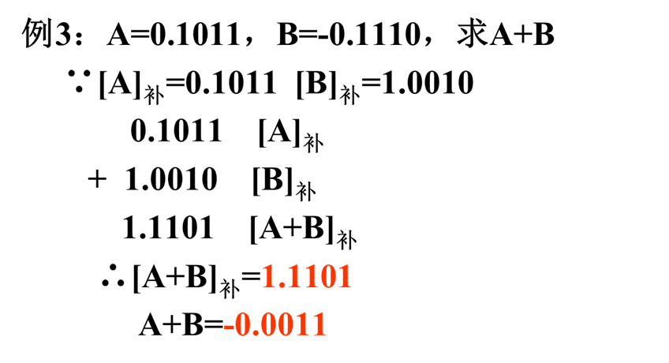

补码减法示例

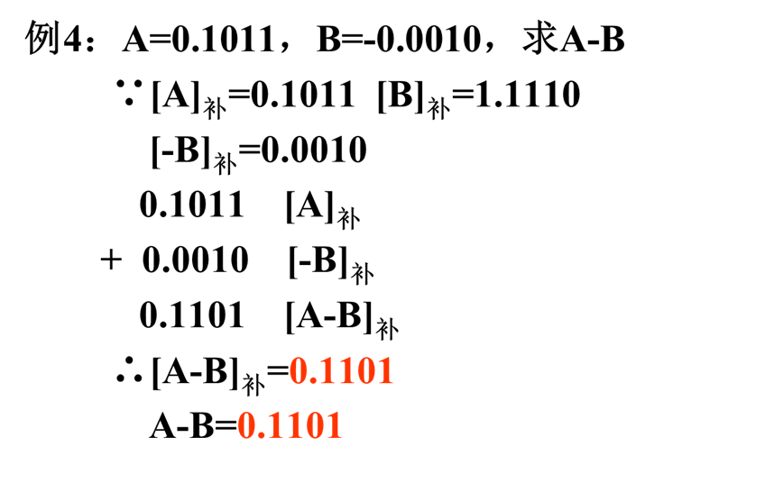

#### 符号扩展

在计算机算术运算中，有时必须将采用给定位数表示的数转换成具有更多位数的某种表示形式，这被称为“符号扩展”。

实际上补码的符号扩展非常简单，所有附加位均用符号位填充，即正数用 0 进行填充，负数用 1 填充。

### 补码的溢出判断与检测方法

#### 溢出的产生

在补码运算中，若两个正数相加，而结果为负；两个负数相加，而结果为正，则结果出错。

字长为$n+1$位的定点整数（其中一位为符号位），采用补码表示，当运算结果大于$2n-1$或小于$-2n$时，就产生溢出。

设参加运算的两数为 X、Y，做加法运算。

- 若 X、Y 异号，实际上是做两数相减，所以不会溢出。
- 若 X、Y 同号，运算结果为正且大于所能表示的最大正数或运算结果为负且小于所能表示的最小负数（绝对值最大的负数）时，产生溢出。将两正数相加产生的溢出称为正溢；反之，两负数相加产生的溢出称为负溢。

#### 溢出检测方法

设：

- 被操作数为： $[X]_补=X_s,X_1X_2...X_n$
- 操作数为： $[Y]_补=\mathbf{Y}_s,\mathbf{Y}_1\mathbf{Y}_2...\mathbf{Y}_n$
- 其和(差)为：$[S]_补=S_s,S_1S_2...S_n$

方法：

1.  采用一个符号位采用一个符号位检测溢出

    当$\mathbf{X}_{s}=\mathbf{Y}_{s}=\mathbf{1},\quad\mathbf{S}_{s}=\mathbf{0}$时，产生负溢。

    $$
    \text{溢出=}\overline{X_s}\overline{Y_s}S_s+X_sY_s\overline{S_s}
    $$

2.  采用进位位判断

    两数运算时，产生的进位为$\mathcal{C}_s,\mathcal{C}_1\mathcal{C}_2....\mathcal{C}_n$,

    其中： $\mathbb{C}_s$为符号位产生的进位，$\mathbb{C}_1$为最高数值位产生的进位。

    两正数相加，当最高有效位产生进位$(C_1{=}1)$ 而符号位不产生进位($C_s=0$)时，发生正溢； 两负数相加，当最高有效位不产生进位($C_1{=}0$)而符号位产生进位($C_s{=}1$)时，发生负溢。故溢出条件为：

    溢出=$\overline{\mathcal{C}_s}C_1+\mathbf{C}_s\overline{\mathcal{C}_1}=\mathbf{C}_s\oplus\mathbf{C}_1$

3.  采用变形补码 (双符号位补码)

4.  在双符号位的情况下，把左边的符号位$\mathcal{S}_{s1}$ 叫做真符，两个符号位都作为数的一部分参加运算。这种编码又称为变形补码。

    双符号位的含义如下：

    - $S_{s1}S_{s2}=00$ 结果为正数，无溢出
    - $S_{s1}S_{s2}=01$ 结果正溢
    - $S_{s1}S_{s2}=10$ 结果负溢
    - $S_{s1}S_{s2}=11$ 结果为负数，无溢出
      当两位符号位的值不一致时，表明产生溢出，溢出条件为

    $$
    \text{溢出}=S_{s1}\oplus S_{s2}
    $$

### 补码定点加减运算的实现

实现补码加法，则需给出$X→F$、$Y→F$和$F→X$三个控制信号，同时打开门 A、门 B 和门 C，把寄存器 X 和寄存器 Y 的内容送入加法器的两个输入端进行加法运算，并把结果送回，最后由打入脉冲 CPX 打入寄存器 X。

减法与加法的不同之处在于，加法使用$Y→F$控制信号，减法使用 $\bar{Y}→F$和$1→F$控制信号，其余控制信号相同。

补码加减运算的逻辑电路：

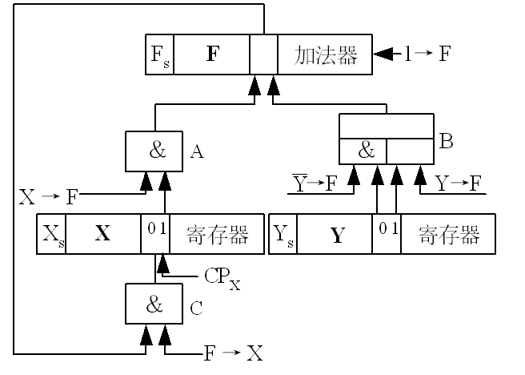

## 带符号数的移位和舍入操作

在计算机中，实现乘除运算的方案通常有 3 种：

1.  软件实现。在低档微机中无乘除运算指令，只能用乘法和除法子程序来实现乘除运算。
2.  在原有实现加减运算的运算器基础上增加一些逻辑线路，使乘除运算变换成加减和移位操作。在机器中设有乘除指令。
3.  设置专用的乘、除法器，机器中设有相应的乘除指令。

不管采用什么方案实现乘除法，基本原理是相同的。如果采用第 ⑵ 种方案，则必然会涉及到移位操作。

### 带符号数的移位操作

#### 原码的移位规则

不论正数还是负数，在左移或右移时，符号位均不变，空出位一律以“0”补入。

负数的原码移位前后结果为：

- 左移：

  移位前有：1 X1 X2… Xn-1Xn

  移位后有：1 X2 X3…Xn 0

- 右移：

  移位前有：1 X1 X2… Xn-1Xn

  移位后有：1 0X1… Xn-2 Xn-1

#### 补码的移位规则

1.  正数：符号位不变，不论左移或右移，空出位一律以“0”补入。
2.  负数：符号位不变，左移后的空出位补“0”，右移后的空出位补“1”。

    左移：

    - 移位前有：$1\ X_1\ X_2\ … X_{n-1}\ X_n$
    - 移位后有：$1\ X_2\ X_3…\ X_n\ 0$
      右移：
    - 移位前有：$1\ X_1\ X_2\ …\ X_{n-1}\ X_n$
    - 移位后有：$1\ 1\ X_1\ …\ X_{n-2}\ X_{n-1}$

#### 移位功能的实现

在计算机中，通常移位操作由移位寄存器来实现，但也有一些计算机不设置专门的移位寄存器，而在加法器的输出端加一个移位器。移位器是由与门和或门组成的逻辑电路（实际是一个多路选择器），可以实现直传（不移位）、左斜一位送（左移一位）和右斜一位送（右移一位）的功能。

移位器逻辑电路：

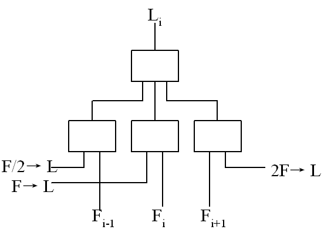

### 带符号数的舍入操作

在算术右移时，由于受到硬件的限制，运算结果有可能需要舍去一定的尾数，这会造成一些误差。为了缩小误差，就要进行舍入处理。假定经过运算后的数共有 p+q 位，现仅允许保留前 p 位。常见的舍入方法有：

1.  恒舍（切断）

    无论多余部分 q 位为何代码，一律舍去，保留部分的 p 位不作任何改变。

2.  冯·诺依曼舍入法

    这种舍入法又称为恒置 1 法，即不论多余部分 q 位为何代码，都把保留部分 p 位的最低位置 1。

3.  下舍上入法

    下舍上入就是 0 舍 1 入。用将要舍去的 q 位的最高位作为判断标志，以决定保留部分是否加 1。如该位为 0，则舍去整个 q 位（相当于恒舍）；如该位为 1，则在保留的 p 位的最低位上加 1。

4.  查表舍入法

    查表舍入法又称 ROM 舍入法，因为它用 ROM 来存放舍入处理表，每次经查表来读得相应的处理结果。通常，ROM 表的容量为$2^K$个单元，每个单元字长为$K-1$位。舍入处理表的内容设置一般采用的方法是：当 K 位数据的高$K-1$位为全“1”时，让那些单元按恒舍法填入$K-1$位全“1”，其余单元都按下舍上入法来填其内容。
