# 04 数值的机器运算 (4\~6)

## 定点乘法运算

在计算机中，乘法运算大多数由累加与移位来实现，也有些机器中具有由大规模集成电路制造的阵列乘法模块。

### 原码一位乘法

#### 原码一位乘法算法

原码一位乘法是从手算演变而来的，即用两个操作数的绝对值相乘，乘积的符号为两操作数符号的异或值（同号为正，异号为负）。即：

- 乘积：$P=|X|×|Y|$
- 符：$Ps=Xs⊕Ys$

式中：$Ps$为乘积的符号，$Xs$和$Ys$为被乘数和乘数的符号。

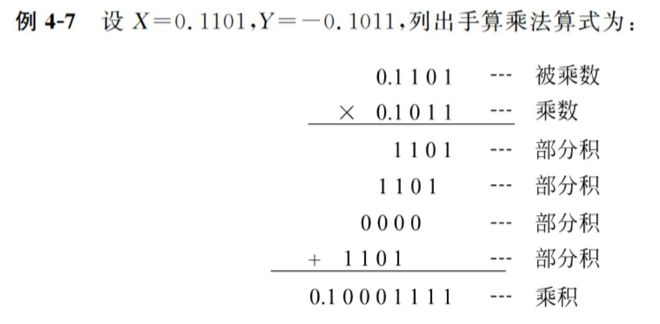

原码一位乘法的规则：

1.  参加运算的操作数取其绝对值；
2.  令乘数的最低位为判断位，若为“1”，加被乘数，若为“0”，不加被乘数（加 0）；
3.  累加后的部分积以及乘数右移一位；
4.  重复 n 次 ⑵ 和 ⑶ ；
5.  符号位单独处理，同号为正，异号为负。

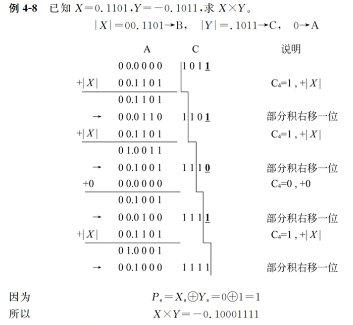

通常，乘法运算需要 3 个寄存器。

- 被乘数存放在 B 寄存器中；
- 乘数存放在 C 寄存器中；A 寄存器用来存放部分积与最后乘积的高位部分，它的初值为 0。
- 运算结束后寄存器 C 中不再保留乘数，改为存放乘积的低位部分。

原码一位乘法流程图：

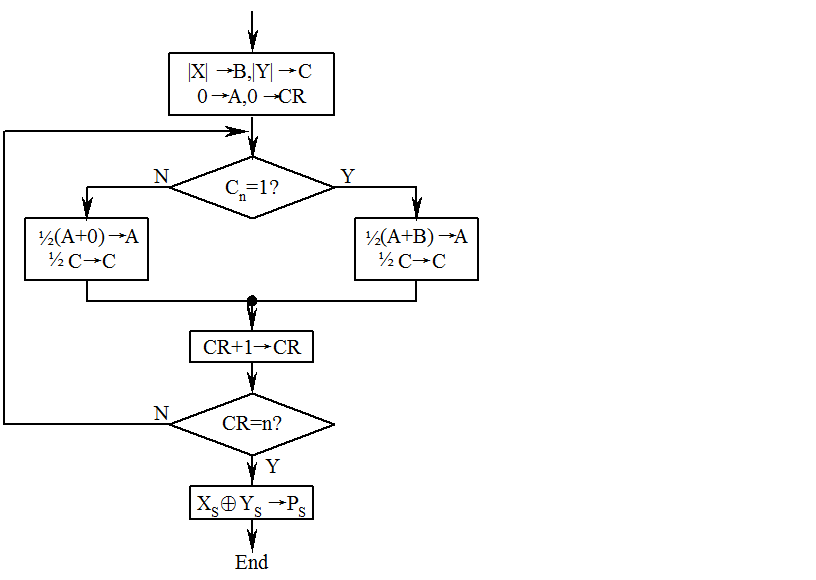

#### 原码一位乘法运算的实现

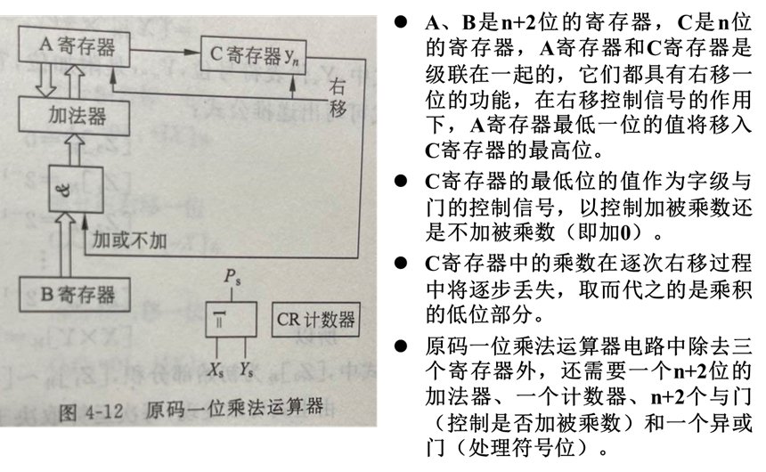

### 补码一位乘法

虽然原码乘法比补码乘法容易实现，但因为补码加减法简单，在以加减运算为主的通用机中操作数都用补码表示，所以这类计算机在做乘法时常使用补码乘法。

#### 校正法

校正法是将\[X]补和\[Y]补按原码规则运算，所得结果根据情况再加以校正，从而得到正确的\[X×Y]补。补码乘法的统一表达式：

$[X×Y]_补=[X]_补×(0.Y1Y2…Yn)+[-X]_补×Ys$

#### 比较法——Booth 乘法

递推公式：

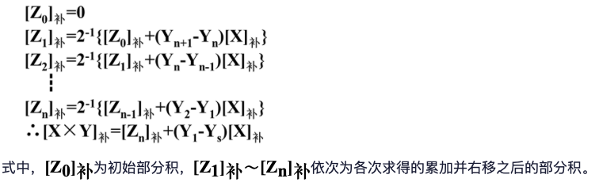

Booth 乘法规则：

1.  参加运算的数用补码表示；
2.  符号位参加运算；
3.  乘数最低位后面增加一位附加位$Y_{n+1}$，其初值为 0；
4.  由于每求一次部分积要右移一位，所以乘数的最低两位$Y_n$、$Y_{n+1}$的值决定了每次应执行的操作；
5.  移位按补码右移规则进行；
6.  共需做 n+1 次累加，n 次移位，第 n+1 次不移位。

Booth 乘法运算操作：

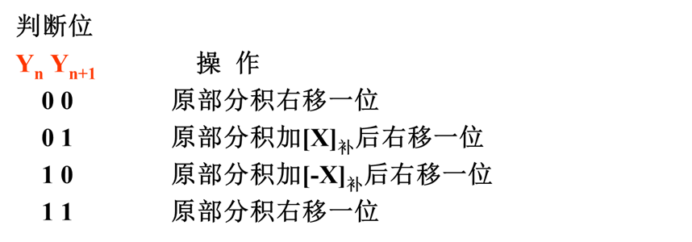

由于符号位要参加运算，部分积累加时最高有效位产生的进位可能会侵占符号位，故被乘数和部分积应取双符号位，而乘数只需要一位符号位。运算时仍需要有 3 个寄存器，各自的作用与原码时相同，只不过存放的内容均为补码表示而已。

Booth 乘法流程图：

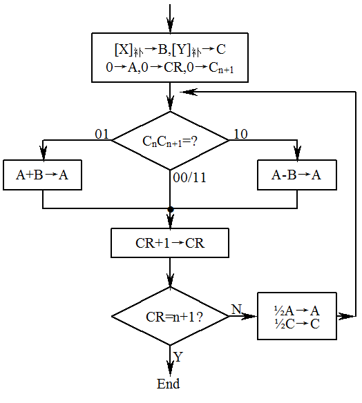

Booth 乘法运算的实现

各器件的作用与原码一位乘法相同，A、B 寄存器长 n+2 位，C 寄存器长 n+1 位，还需一个 n+2 位的加法器、n+2 个与或门和一个计数器。由 C 寄存器的最低两位 CnCn+1 来控制是加/减被乘数还是加 0，当 CnCn+1=01 时，加被乘数，即加 B 寄存器的内容；CnCn+1=10 时，减被乘数，即加上 B 寄存器中内容的反，并在加法器的最低位加 1；CnCn+1=00 或 11 时，不加也不减（加 0）。由于符号位参与运算，所以不需要专门处理符号位的异或门。

### 补码两位乘法

为了提高乘法的执行速度，可以选用两位乘法的方案。所谓两位乘法，就是每次处理乘数中的两位，从而使乘法的速度提高了一倍。

根据 Booth 乘法方便地推导出补码两位乘法，即把补码两位乘理解为将 Booth 乘法的两次合并为一次来做。

补码两位乘法操作：

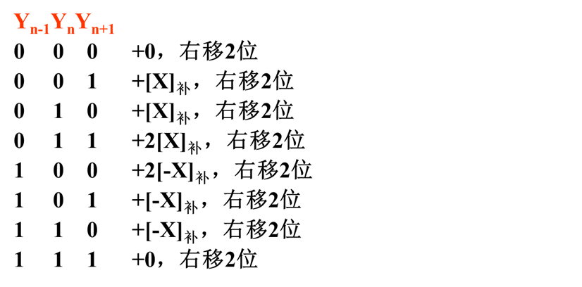

被乘数和部分积取 3 符号位，当乘数的数值位 n 为偶数时，乘数取两符号位，共需作 n/2 +1 次累加，n/2 次移位（最后一次不移位）；当 n 为奇数时，乘数只需一个符号位，共需 (n+1)/2 次累加和移位，但最后一次仅移一位。

> 例 10：已知：X=0.0110011，Y=-0.0110010，求：X×Y。
>
> \[X]补=000.0110011→B，
>
> \[Y]补=1.1001110→C，0→A
>
> 2\[X]补=000.1100110，
>
> \[-X]补=111.1001101，2\[-X]补=111.0011010

补码两位乘法示例：

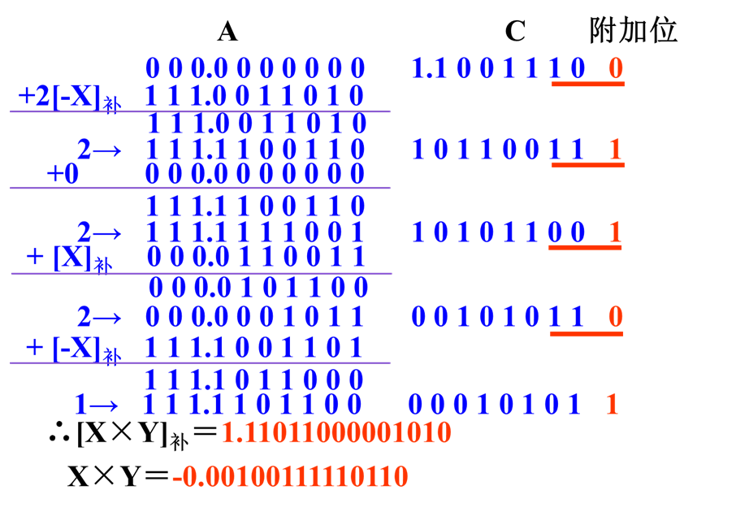

## 定点除法运算

除法是乘法的逆运算，与乘法运算的处理思想相似，可以将 n 位除转化成若干次“减法－移位”，也有些计算机具有由大规模集成电路制造的阵列除法模块。

### 原码除法运算

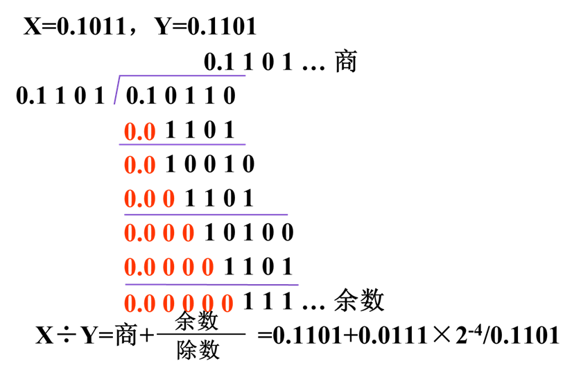

#### 原码比较法和恢复余数法

1.  比较法

    比较法类似于手工运算，只是为了便于机器操作，将除数右移改为部分余数左移，每一位的上商直接写到寄存器的最低位。l 设 A 寄存器中存放被除数（或部分余数），B 寄存器中存放除数，C 寄存器用来存放商 Q，l 若 A≥B，则上商 1，并减除数；l 若 A\<B，则上商 0。比较法需要设置比较线路，从而增加了硬件的代价。

    比较过程的流程图：

    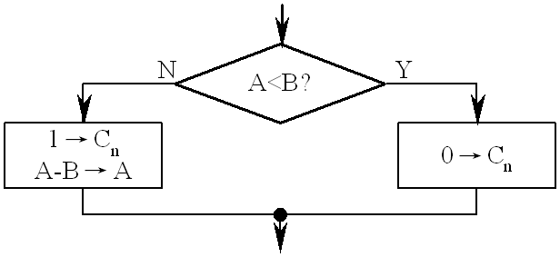

2.  恢复余数法

    - 恢复余数法是直接作减法试探方法，不管被除数（或部分余数）减除数是否够减，都一律先做减法。
    - 若部分余数为正，表示够减，该位商上“1”；
    - 若部分余数为负，表示不够减，该位商上“0”，并要恢复余数。
      恢复余数过程的流程图

    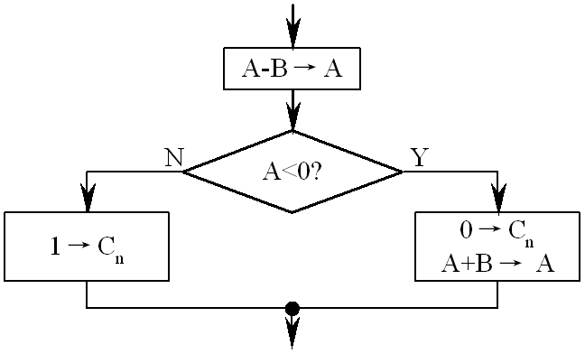

    - 由于部分余数的正、负是根据不同的操作数组合随机出现的，恢复除数法会使得除法运算的实际操作次数不固定，从而导致控制电路比较复杂。
    - 而且在恢复余数时，要多作一次加法，降低了除法的执行速度。
    - 因此，原码恢复余数法在计算机中一般很少采用。

#### 原码不恢复余数法（原码加减交替法）

- 原码不恢复余数法是对恢复余数法的一种改进，它减少了浪费的加法时间，且运算的次数固定，故被广泛采用。l 在恢复余数法中，若第 i-1 次求商的部分余数为 ri-1，则第 i 次求商操作为：$r_i=2r_{i-1}-Y$，
- 若够减，部分余数$r_i=2r_{i-1}-Y＞0$，商 1。
- 若不够减，部分余数$r_i=2r_{i-1}-Y＜0$，商 0，恢复余数后，$r_i=r_i+Y=2r_{i-1}$，然后再左移一位，进行第$i+1$次操作：

  $$
  r_{i+1}=2 r_{i}^{\prime}-Y=2\left(r_{i}+Y\right)-Y=2 r_{i}+2 Y-Y=2 r_{i}+Y
  $$

原码不恢复余数除法由下面的通式表示：

$$
r_{i+1}=2 r_{i}+\left(1-2 Q_{j}\right) Y
$$

式中 Qi 为第 i 次所得的商，若部分余数为正，则 Qi=1，部分余数左移一位，下一次继续减除数；若部分余数为负，则 Qi=0，部分余数左移一位，下一次加除数。由于加减运算交替地进行，故称为原码加减交替法。

> 例 12：已知：X=-0.10101，Y=0.11110，求：X÷Y。
>
> |X|=00.10101→A，|Y|=00.11110→B，0→C
>
> \[|Y|]变补=11.00010

原码不恢复余数除法示例：

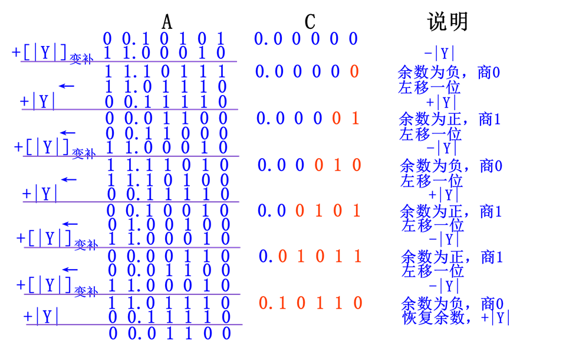

经过原码不恢复余数除法，有：
商=$0.10110$
余数=$0.01100x2^{-5}$

$$
X \div Y=-\left(0.10110+\frac{0.01100 \times 2^{-5}}{0.11110}\right)
$$

除法运算需要 3 个寄存器。A 和 B 寄存器分别用来存放被除数和除数，C 寄存器用来存放商，它的初值为 0。运算过程中 A 寄存器的内容为部分余数，它将不断地变化，最后剩下的是扩大了若干倍的余数，只有将它乘上 2-n 才是真正的余数。

原码加减交替除法流程图：

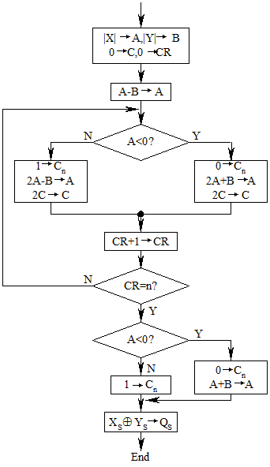

- 在定点除法运算时，为了防止溢出，要求被除数的绝对值小于除数的绝对值，$|X|＜|Y|$（$|X|=|Y|$除外），且除数不能为 0。
- 因此第一次减除数肯定是不够减的，如果我们采用先移位后减除数的方法，得到的结果也是相同的。
- 另外，在原码加减交替法中，当最终余数为负数时，必须恢复一次余数，使之变为正余数，注意此时不需要再左移了。

#### 原码加减交替除法的实现

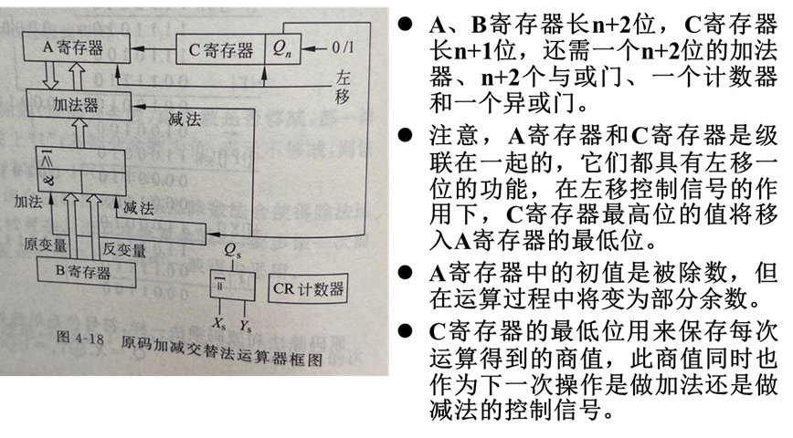

### 补码除法运算

#### 够减的判断

参加运算的两个数符号任意，当被除数（或部分余数）的绝对值大于或等于除数的绝对值时，称为够减；反之称为不够减。当两数同号时，实际应作减法；两数异号时，实际应作加法。

判断的方法和结果如下：当被除数（或部分余数）与除数同号时，如果得到的新部分余数与除数同号，表示够减，否则为不够减；当被除数（或部分余数）与除数异号时，如果得到的新部分余数与除数异号，表示够减，否则为不够减。

#### 上商规则

补码除法运算的商也是用补码表示的，上商的规则是：如果\[X]补和\[Y]补同号，则商为正数，够减时上商“1”，不够减时上商“0”；如果\[X]补和\[Y]补异号，则商为负数，够减时上商“0”，不够减时上商“1”。

补码的上商规则可归结为：

部分余数\[ri]补和除数\[Y]补同号，商上“1”，反之，商上“0”。

#### 商符的确定

商符是在求商的过程中自动形成的，按补码上商规则，第一次得出的商，就是实际应得的商符。为了防止溢出，必须有|X|＜|Y|，所以第一次肯定不够减。当被除数与除数同号时，部分余数与除数必然异号，商上“0”，恰好与商符一致；当被除数与除数异号，部分余数与除数必然同号，商上“1”，也恰好就是商的符号。

#### 求新部分余数

求新部分余数\[ri+1]补的通式如下：

\[ri+1]补=2\[ri]补+(1-2Qi)×\[Y]补

Qi 表示第 i 步的商。若商上“1”，下一步操作为部分余数左移一位，减去除数；若商上“0”，下一步操作为部分余数左移一位，加上除数。

#### 末位恒置 1

商的最末一位恒置为“1”，运算的最大误差为 2-n。此法操作简单，易于实现。

补码加减交替除法规则

补码加减交替除法示例

例 13：已知 X=0.1000，Y=-0.1010；求 X÷Y。

\[X]补=00.1000→A，

\[Y]补=11.0110→B，0→C

\[-Y]补=00.1010

补码加减交替除法流程图

图 4-19 补码加减交替除法流程图

## 规格化浮点运算

### 浮点加减运算

第 2 章中已经讨论了浮点数的表示方法，这里将进一步讨论规格化浮点数的四则运算问题，其中尾数的基值 r=2。

设两个非 0 的规格化浮点数分别为：

$$
\begin{array}{l}\mathbf{A}=\mathbf{M}_{\mathbf{A}} \times 2^{\mathrm{E}_{\mathrm{A}}} \\ \mathbf{B}=\mathbf{M}_{\mathbf{B}} \times 2^{\mathrm{E}_{\mathrm{B}}}\end{array}
$$

规格化浮点数 A、B 加减运算通式为：

$$
\begin{array}{l}\mathbf{A} \pm \mathbf{B}=\left(\mathbf{M}_{\mathbf{A}}, \mathbf{E}_{\mathbf{A}}\right) \pm\left(\mathbf{M}_{\mathbf{B}}, \mathbf{E}_{\mathbf{B}}\right) \\ =\left\{\begin{array}{lll}\left.\mathrm{M}_{\mathrm{A}} \pm \mathrm{M}_{\mathrm{B}} \times 2^{-\left(\mathrm{E}_{\mathrm{A}}-\mathrm{E}_{\mathrm{B}}\right)}, \mathrm{E}_{\mathrm{A}}\right) & \mathrm{E}_{\mathrm{A}} \succ \mathrm{E}_{\mathrm{B}} \\ \left(\mathrm{M}_{\mathrm{A}} \times 2^{-\left(\mathrm{E}_{\mathrm{B}}-\mathrm{E}_{\mathrm{A}}\right)} \pm \mathrm{M}_{\mathrm{B}}, \mathrm{E}_{\mathrm{B}}\right) & \mathrm{E}_{\mathrm{A}} \prec \mathrm{E}_{\mathrm{B}}\end{array}\right. \\\end{array}
$$

#### 浮点数加减运算步骤

1.  对阶

    两个浮点数相加或相减，首先要把小数点的位置对齐，而浮点数的小数点的实际位置取决于阶码的大小，因此，对齐两数的小数点，就是使两数的阶码相等，这个过程称为对阶。

    要对阶，首先应求出两数阶码 EA 和 EB 之差$ΔE=E_A-E_B$

    - 若 ΔE=0，表示两数阶码相等，即$E_A=E_B$；
    - 若 ΔE ＞ 0，表示 EA ＞ EB；
    - 若 ΔE ＜ 0，表示 EA ＜ EB。
      当 EA≠EB 时，要通过尾数的移位来改变 EA 或 EB。对阶的规则是：小阶向大阶看齐。要使小阶的阶码增大，则相应的尾数右移，直到两数的阶码相等为止。每右移一位，阶码加 1。
    - EA ＞ EB，则 MB 右移。每右移一位，$E_B+1→E_B$，直至 EA=EB 为止。
    - EA ＜ EB，则 MA 右移。每右移一位，$E_A+1→E_A$，直至 EA=EB 为止。l 尾数右移后，应对尾数进行舍入。

2.  尾数加/减

    对阶之后，就可以进行尾数加/减，即：$M_A±M_B→M_C$

    其算法与定点加/减法相同。

3.  尾数结果规格化

    尾数加/减运算之后得到的数可能不是规格化数，为了增加有效数字的位数，提高运算精度，必须进行结果规格化操作。

    尾数结果规格化：

    $$
    1/2 ≤|M|＜1
    $$

    设尾数用双符号位补码表示，经过加/减运算之后，可能出现以下 6 种情况，即：

    ① 00.1 xx…x

    ② 11.0 x x…x

    ③ 00.0 x x…x

    ④ 11.1 x x…x

    ⑤ 01.x x x…x

    ⑥ 10.x x x…x

    第 ① 和 ② 种情况，已是规格化数。

    第 ③ 和 ④ 种情况需要使尾数左移以实现规格化，这个过程称为左规。尾数每左移一位，阶码相应减 1（$E_C-1→E_C$），直至成为规格化数为止。

    $$
    左规 =\overline{\mathrm{C}_{\mathrm{s} 1}} \overline{\mathrm{C}_{\mathrm{s} 2}} \overline{\mathrm{C}_{1}}+\mathbf{C}_{\mathrm{s} 1} \mathbf{C}_{\mathrm{s} 2} \mathbf{C}_{\mathbf{1}}
    $$

    左规可以进行多次。式中 Cs1、Cs2 表示尾数 MC 的两个符号位，C1 为 MC 的最高数值位。

    第 ⑤ 和 ⑥ 种情况在在定点加减运算中称为溢出；但浮点加减运算中，只表明此时尾数的绝对值大于 1，而并非真正的溢出。这种情况应将尾数右移以实现规格化。这个过程称为右规。尾数每右移一位，阶码相应加 1（$E_C+1→E_C$）。

    $$
    右规 =\mathbf{C}_{\mathbf{s} 1} \oplus \mathbf{C}_{\mathbf{s} 2}
    $$

    右规最多只有一次。

4.  舍入

    最简单的舍入方法是恒舍法，即无条件的丢掉正常尾数最低位之后的全部数值。

5.  溢出判断

    当尾数右规后，根据阶码来判断浮点运算结果是否溢出。

    $[EC]_补=01, x xx… x$，表示上溢。此时，浮点数真正溢出，机器需停止运算，做溢出中断处理。

    $[EC]_补=10, x xx … x$，表示下溢。浮点数值趋于零，机器不做溢出处理，而是按机器零处理。

#### 浮点数加减运算举例 &#x20;

有两浮点数为

$$
\begin{array}{l}A=0.101110 \times 2^{-01} \\ B=-(0.101011) \times 2^{-10}\end{array}
$$

假设这两数的格式：阶码 4 位，用移码（偏置值为$2^3$）表示；尾数 8 位，用补码表示，包含一位符号位，即

阶码         尾数

\[A]浮=0111；0.1011100

\[B]浮=0110；1.0101010

1.  对阶

    求阶差：$ΔE=E_A-E_B=-1-(-2)=1$

    ΔE=1，表示 EA ＞ EB。按对阶规则，将 MB 右移一位，EB+1→EB，得：

    $$
    [B]_{\text {浮 }}{ }^{\prime}=0111 ; 1.1010101
    $$

2.  尾数求和

    $$
    \begin{array}{r}00.1011100 \\ +\quad 11.1010101 \\ \hline 00.0110001\end{array}
    $$

3.  尾数结果规格化

    由于结果的尾数是非规格化的数，故应左规。尾数每左移一位，阶码减 1，直至尾数成为规格化数为止。最后结果为

    \[A+B]浮=0110；0.110001

    即 $A+B=(0.110001)×2^{-10}$

    未发生溢出

### 浮点乘除运算

设两个非 0 的规格化浮点数分别为

$$
\begin{array}{l}A=M_{A} \times 2^{E_{A}} \\ B=M_{B} \times 2^{E_{B}}\end{array}
$$

规格化浮点数 A、B 乘除运算通式为：

$$
\begin{array}{l}\left(M_{A}, E_{A}\right) \times\left(M_{B}, E_{B}\right)=\left(M_{A} \times M_{B}, E_{A}+E_{B}\right) \\ \left(M_{A}, E_{A}\right) \div\left(M_{B}, E_{B}\right)=\left(M_{A} \div M_{B}, E_{A}-E_{B}\right)\end{array}
$$

#### 乘法步骤

两浮点数相乘，其乘积的阶码应为相乘两数的阶码之和，其乘积的尾数应为相乘两数的尾数之积。即：

$$
A \times B=\left(M_{A} \times M_{B}\right) \times 2^{\left(E_{A}+E_{B}\right)}
$$

1.  阶码相加

    两个浮点数的阶码相加，如果阶码用补码表示，无须校正；当阶码用偏置值为 2n 的移码表示时，阶码相加后要减去一个偏移量 2n。

2.  尾数相乘

    若 MA、MB 都不为 0，则可进行尾数乘法，算法与定点数乘法算法相同。

3.  尾数结果规格化

    由于 A、B 均是规格化数，所以尾数相乘后的结果一定落在下列范围内：

    $$
    1/4≤|M_A×M_B|＜1
    $$

    当$1/2≤|M_A×M_B|＜1$时，乘积已是规格化数，无须再进行规格化操作；当$1/4≤|M_A×M_B|＜1/2$ 时，则需要左规一次。左规时调整阶码后如果发生阶码下溢，则做机器零处理。

#### 除法步骤

两浮点数相除，其商的阶码应为相除两数的阶码之差，其商的尾数应为相除两数的尾数之商。即：

$$
A \div B=\left(M_{A} \div M_{B}\right) \times 2^{\left(E_{A}-E_{B}\right)}
$$

1.  尾数调整

    为了保证商的尾数是一个定点小数，首先需要检测$|M_A|＜|M_B|$。如果不小于，则 MA 右移一位，$E_A+1→E_A$，称为尾数调整。因为 A、B 都是规格化数，所以最多调整一次。

2.  阶码相减

    两浮点数的阶码相减，如果阶码用补码表示，阶码相减之后无须校正；当阶码用偏置值为 2n 的移码表示时，阶码相减后要加上一个偏移量 2n。阶码相减后，如有溢出，应另作处理。

3.  尾数相除

    若 MA、MB 都不为 0，则可进行尾数除法。尾数除法的算法与前述定点数除法算法相同。因为开始时已进行了尾数调整，所以运算结果一定落在规格化范围内，即

    $$
    1 / 2 \leq\left|M_{A} \div M_{B}\right|<1
    $$

### 浮点运算器的实现

浮点运算的阶码只有加减运算，尾数则有加、减、乘、除四种运算。可见浮点运算器主要由两个定点运算部件组成，一个是阶码运算部件，用来完成阶码加、减，以及控制对阶时小阶的尾数右移次数和规格化时对阶码的调整；另一个是尾数运算部件，用来完成尾数的四则运算以及判断尾数是否已规格化。此外，还需要有溢出判断电路等。

现代计算机可把浮点运算部件做成任选件，或称为协处理器。所谓协处理器是因为它只能协助主处理器工作，不能单独工作。
