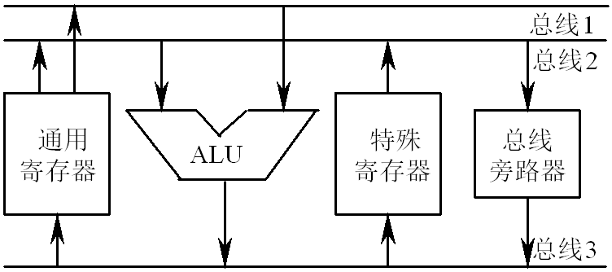

# 04 数值的机器运算 (7\~9)

## 十进制整数的加法运算

一些通用计算机中设有十进制数据表示，可以直接对十进制整数进行算术运算。下面讨论十进制整数的加法运算和十进制加法器。

### 一位十进制加法运算

#### 8421 码加法运算

8421 码的加法规则：

1.  两个十进制数的 8421 码相加时，按“逢二进一”的原则进行；
2.  当和 ≤9，无需校正；
3.  当和＞ 9，则+6 校正；
4.  在做+6 校正的同时，将产生向上一位的进位。

8421 码的校正关系：

$$
+6校正函数=C4’+S4’S3’+S4’S2’
$$

校正举例：

#### 余 3 码加法运算

余 3 码的加法规则：

1.  两个十进制数的余 3 码相加，按“逢二进一”的原则进行；
2.  若其和没有进位，则减 3（即+1101）校正；
3.  若其和有进位，则加 3（即+0011）校正。

余 3 码的校正关系：

$$
-3校正函数=\bar{C4'}，+3校正函数=C4'
$$

校正举例：

### 十进制加法器

#### 一位 8421 码加法器

$$
校正函数=C4’+S4’S3’+S4’S2’
$$

向上一位的进位$C4=校正函数$

一位 8421 码加法器：

#### 一位余 3 码加法器

$$
C4’=0，-3校正；C4’=1，+3校正。
$$

向上一位的进位$C4=C4’$

一位余 3 码加法器：

### 多位十进制加法

对于多位十进制数加法可采用多个 BCD 码加法器，每个 BCD 码加法器就是前述的一个一位十进制加法器，可执行两个一位 BCD 数的加法。若 n 位 BCD 数相加，由从低位至高位采用行波式串行进位的 n 位十进制加法器完成。

## 逻辑运算与实现

计算机在解题过程中，除了要做大量的算术运算外，还需做许多逻辑操作，如：与、或、非、异或等。逻辑运算比算术运算要简单得多，这是因为逻辑运算是按位进行的，位与位之间没有进位与借位的关系。

### 逻辑非

逻辑非又称求反操作，它对某个寄存器或主存单元中各位代码按位取反。

设：X=X0X1…Xn，Z=Z0Z1…Zn

则：Zi=   （i=0，1，…，n）

### 逻辑乘

逻辑乘就是将两个寄存器或主存单元中的每一相应位的代码进行按位与操作。

设：X=X0X1…Xn，Y=Y0Y1…Yn， Z=Z0Z1…Zn

则：Zi=Xi∧Yi（i=0，1，…，n）

### 逻辑加 &#x20;

逻辑加就是将两个寄存器或主存单元中的每一相应位的代码进行或操作。

设：X=X0X1…Xn，Y=Y0Y1…Yn， Z=Z0Z1…Zn

则：Zi=Xi∨Yi（i=0，1，…，n）

### 逻辑异或

逻辑异或又称按位加，它对两个寄存器或主存单元中各位的代码求模 2 和。

设：X=X0X1…Xn，Y=Y0Y1…Yn， Z=Z0Z1…Zn

则：Zi=Xi⊕Yi（i=0，1，…，n）

## 运算器的基本组成与实例

运算器是在控制器的控制下实现其功能的。运算器不仅可以完成数据信息的算逻运算，还可以作为数据信息的传送通路。

### 运算器结构

#### 运算器的基本组成

基本的运算器包含以下几个部分：实现基本算术、逻辑运算功能的 ALU，提供操作数与暂存结果的寄存器组，有关的判别逻辑和控制电路等。

运算器内的各功能模块之间的连接也广泛采用总线结构，这个总线称为运算器的内部总线，ALU 和各寄存器都挂在上面。运算器的内部总线是 CPU 的内部数据通路，因此只有数据线。

1.  带多路选择器的运算器

    - 各寄存器可以独立、多路地将数据送至 ALU 的多路选择器，使 ALU 有选择地同时获得两路输入数据。
    - 运算器的内部总线是一组单向传送的数据线，它将运算结果送往各寄存器，由寄存器的同步打入脉冲 CPi 将内部总线上的数据送入 Ri。
    - 如果同时发出几个打入脉冲，则可将总线上的同一数据同时送入几个相关的寄存器中。
      带多路选择器的运算器：

    

2.  带输入锁存器的运算器
    - 运算器的内部总线是一组双向传送的数据线。为了进行双操作数之间的运算操作，ALU 输入端前设置了一级锁存器，可暂存操作数。
    - 例如，要实现(R0)+(R1)→R2，可通过内部总线先将 R0 中的数据送入锁存器 1，再通过内部总线将 R1 中的数据送入锁存器 2，然后相加，并将结果经总线送入 R2。
      

#### 运算器的内部总线结构

1.  单总线结构运算器

    图 4-25 就是单总线结构运算器。这种结构的运算器实现一次双操作数的运算需要分成三步，它的主要缺点是操作速度慢。

2.  双总线结构运算器

    - 两个操作数可以分别通过总线 1 和总线 2 同时送到 ALU 去进行运算，并且立即可以得到运算的结果。
    - 但是 ALU 的输出不能直接送到总线上去，这是因为此时两条总线都被操作数所占据着，所以必须在 ALU 的输出端设置一个缓冲器，先将运算结果送入缓冲器，第二步再把结果送至目的寄存器。
    - 显然，它的执行速度比单总线要快，每次操作比单总线少一步。
      双总线结构运算器：

    

3.  三总线结构运算器
    - ALU 的两个输入端分别由两条总线供给，输出与第三条总线相连，这样算逻操作就可以在一步控制之内完成。
    - 如果某一个数不需要运算和修改，而需要直接由总线 2 传到总线 3，可通过总线旁路器把数据送出，而不必借助于 ALU。
    - 三总线结构的特点是操作速度快，但控制较前两种复杂。
      

### ALU 举例

#### ALU 电路

ALU 即算术逻辑单元，它是既能完成算术运算又能完成逻辑运算的部件。前面已经讨论过，无论是加、减、乘、除运算，最终都能归结为加法运算。因此，ALU 的核心首先应当是一个并行加法器，同时也能执行像“与”、“或”、“非”、“异或”这样的逻辑运算。

#### 4 位 ALU 芯片

以典型的 4 位 ALU 芯片（74181）为例介绍 ALU 的结构及应用。74181 能执行 16 种算术运算和 16 种逻辑运算。

#### ALU 的应用

74181 的 4 位作为一个小组，小组间既可以采用串行进位，也可以采用并行进位。当采用串行进位时，只要把低一片的$C_{n+4}$与高一片的$C_n$相连即可。当采用组间并行进位时，需要增加一片 74182，这是一个先行进位部件。74182 可以产生 3 个进位信号$C_{n+x}$、$C_{n+y}$、$C_{n+z}$，并且还产生大组进位产生函数和进位传递函数。

74182 芯片方框图

各片 74181 输出的组进位产生函数和组进位传递函数作为 74182 的输入，而 74182 输出的进位信号号$C_{n+x}$、$C_{n+y}$、$C_{n+z}$作为 74181 的输入，74182 输出的大组进位产生函数和大组进位传递函数可作为更高一级 74182 的输入。

### 浮点运算器举例

#### 80x87 的数据格式

80x87 可处理 7 种不同的数据类型。对整数来说，最高位为符号位，用补码表示，有 16、32 和 64 位三种格式。压缩的十进制数串是用特殊形式表示的整数。十进制数的一位用 4 位二进制表示，80 位的低 72 位表示 18 位十进制数，最高位为符号位，正数和负数都是以原码形式存储的。浮点数有 32、64 和 80 位三种格式，阶码的底为 2，用移码表示，尾数用原码表示。

#### 80x87 的内部结构

80x87 的内部结构由总线控制逻辑部件、数据接口与控制部件、浮点运算部件 3 个主要功能模块组成。

在 80x87 的浮点运算部件中，分别设置了阶码（指数）运算部件与尾数运算部件，并设有加速移位操作的移位器。

80x87 与主微处理器协同工作，微处理器执行所有的常规指令，而 80x87 只执行专门的算术协处理器指令，称为换码（ESC）指令。微处理器和协处理器可以同时或并行执行各自的指令。
