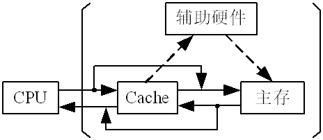

# 05 存储系统和结构 (1\~3)

存储系统是由几个容量、速度和价格各不相同的存储器构成的系统，设计一个容量大、速度快、成本低的存储系统是计算机发展的一个重要课题。本章重点讨论主存储器的工作原理、组成方式以及运用半导体存储芯片组成主存储器的一般原则和方法，此外还介绍了高速缓冲存储器和虚拟存储器的基本原理。

本章学习内容

- 5.1 存储系统的组成

- 5.2 主存储器的组织

- 5.3 半导体随机存储器和只读存储器

- 5.4 主存储器的连接与控制

- 5.5 提高主存读写速度的技术

- 5.6 多体交叉存储技术

- 5.7 高速缓冲存储器

- 5.8 虚拟存储器

本章学习要求

- 了解：存储器的分类方法和存储系统的层次

- 理解：主存储器的基本结构、存储单元和主存储器的主要技术指标
- 掌握：数据在主存中的存放方法

- 了解：半导体随机存储器（静态 RAM 和动态 RAM）的基本存储原理

- 理解：动态 RAM 的刷新

- 了解：RAM 芯片的基本结构

- 理解：各种不同类型的 ROM

- 掌握：主存储器容量的各种扩展方法

- 理解：主存储器和 CPU 的软连接

- 了解：Cache 存储系统和虚拟存储器的概念

## 存储系统的组成

存储系统和存储器是两个不同的概念，下面首先介绍各种不同用途的存储器，然后讨论它们是如何构成一个存储系统的。

### 存储器分类

#### 按存储器在计算机系统中的作用分类

1.  高速缓冲存储器

    高速缓冲存储器用来存放正在执行的程序段和数据。高速缓冲存储器的存取速度可以与 CPU 的速度相匹配，但存储容量较小，价格较高。

2.  主存储器

    主存用来存放计算机运行期间所需要的程序和数据，CPU 可直接随机地进行读/写访问。

3.  辅助存储器

    辅助存储器用来存放当前暂不参与运行的程序和数据以及一些需要永久性保存的信息。辅存设在主机外部，CPU 不能直接访问它。辅存中的信息必须通过专门的程序调入主存后，CPU 才能使用。

#### 按存取方式分类

1.  随机存取存储器 RAM

    CPU 可以对存储器中的内容随机地存取，CPU 对任何一个存储单元的写入和读出时间是一样的，即存取时间相同，与其所处的物理位置无关。

2.  只读存储器 ROM

    ROM 可以看作 RAM 的一种特殊形式，其特点是：存储器的内容只能随机读出而不能写入。这类存储器常用来存放那些不需要改变的信息。

3.  顺序存取存储器 SAM

    SAM 的内容只能按某种顺序存取，存取时间的长短与信息在存储体上的物理位置有关，所以 SAM 只能用平均存取时间作为衡量存取速度的指标。

4.  直接存取存储器 DAM

    DAM 既不像 RAM 那样能随机地访问任一个存储单元，也不像 SAM 那样完全按顺序存取，而是介于两者之间。当要存取所需的信息时，第一步直接指向整个存储器中的某个小区域；第二步在小区域内顺序检索或等待，直至找到目的地后再进行读/写操作。

#### 按存储介质分类

1.  磁芯存储器

    采用具有矩形磁滞回线的磁性材料，利用两种不同的剩磁状态表示“1”或“0”。磁芯存储器的特点是信息可以长期存储，不会因断电而丢失；但磁芯存储器的读出是破坏性读出，即不论磁芯原存的内容为“0”还是“1”，读出之后磁芯的内容一律变为“0”。

2.  半导体存储器

    采用半导体器件制造的存储器，主要有 MOS 型存储器和双极型存储器两大类。MOS 型存储器集成度高、功耗低、价格便宜、存取速度较慢；双极型存储器存取速度快、集成度较低、功耗较大、成本较高。半导体 RAM 存储的信息会因为断电而丢失。

3.  磁表面存储器

    在金属或塑料基体上，涂复一层磁性材料，用磁层存储信息，常见的有磁盘、磁带等。由于它的容量大、价格低、存取速度慢，故多用作辅助存储器。

4.  光存储器

    采用激光技术控制访问的存储器，一般分为只读式、一次写入式、可读写式 3 种，它们的存储容量都很大，是目前使用非常广泛的辅助存储器。

#### 按信息的可保存性分类

断电后，存储信息即消失的存储器，称易失性存储器。断电后信息仍然保存的存储器，称非易失性存储器。

如果某个存储单元所存储的信息被读出时，原存信息将被破坏，则称破坏性读出；如果读出时，被读单元原存信息不被破坏，则称非破坏性读出。具有破坏性读出的存储器，每当一次读出操作之后，必须紧接一个重写（再生）的操作，以便恢复被破坏的信息。

### 存储系统层次结构

为了解决存储容量、存取速度和价格之间的矛盾，通常把各种不同存储容量、不同存取速度的存储器，按一定的体系结构组织起来，形成一个统一整体的存储系统。

多级存储层次从 CPU 的角度来看，n 种不同的存储器（M1 ～ Mn）在逻辑上是一个整体。

- M1 速度最快、容量最小、位价格最高；
- Mn 速度最慢、容量最大、位价格最低。

整个存储系统具有接近于 M1 的速度，相等或接近 Mn 的容量，接近于 Mn 的位价格。在多级存储层次中，最常用的数据在 M1 中，次常用的在 M2 中，最少使用的在 Mn 中。 &#x20;

多级存储层次：

现代计算机的三级存储层次：

对于由 M1 和 M2 构成的两级存储层次结构，假设 M1、M2 访问时间分别为 TA1、TA2。

命中率 H 定义为 CPU 产生的逻辑地址能在 M1 中访问到的概率。在一个程序执行期间，设 N1 为访问 M1 的命中次数，N2 为访问 M2 的次数。则有：

$$
H=\frac{N_{1}}{N_{1}+N_{2}}
$$

不命中率（失效率）是指 CPU 产生的逻辑地址在 M1 中访问不到的概率，对于两级存储系统：失效率=1-H

两级存储层次的等效访问时间$T_A$：

- 访问 M1 和 M2 同时启动：$T_{\mathrm{A}}=H \times T_{\mathrm{A} 1}+(1-H) \times T_{\mathrm{A} 2}$
- M1 不中时才启动 M2，$T_{\mathrm{A}}=H \times T_{\mathrm{A} 1}+(1-H) \times\left(T_{\mathrm{A} 1}+T_{\mathrm{A} 2}\right)=T_{\mathrm{A} 1}+(1-H) \times T_{\mathrm{A} 2}$

存储系统的访问效率：

$$
e=\frac{T_{\mathrm{A} 1}}{T_{\mathrm{A}}}
$$

\=TA1/(H×TA1+(1−H)×TA2)=f(H, TA1/TA2)

访问效率越高，说明存储系统的速度接近于较快那个存储器的速度；

要提高访问效率：

- 提高命中率 H；
- 缩小两级存储系统的速度差。

> 例：CPU 执行一段程序时，cache 完成存取的次数为 5000 次，主存完成存取的次数为 200 次。已知 cache 的存储周期 Tc 为 40ns，主存的存储周期 TM 为 160ns。分别求（当 cache 不命中时才启动主存）：
>
> （1）cache 的命中率；
>
> （2）等效访问时间 TA；
>
> （3）cache-主存系统的访问效率 e。
>
> 解：
>
> （1）H=5000/(5000+200)≈96%
>
> （2）TA=TA1+(1-H)×TA2=40ns+(1-96%)×160ns=46.4ns
>
> （3） e =TA1/TA=40/46.4=86.2%

#### Cache－主存存储层次（Cache 存储系统） &#x20;

Cache 存储系统是为解决主存速度不足而提出来的。从 CPU 看，速度接近 Cache 的速度，容量是主存的容量，每位价格接近于主存的价格。由于 Cache 存储系统全部用硬件来调度，因此它对系统程序员和系统程序员都是透明的。

#### 主存 − 辅存存储层次（虚拟存储系统） 

虚拟存储系统是为解决主存容量不足而提出来的。从 CPU 看，速度接近主存的速度，容量是虚拟的地址空间，每位价格是接近于辅存的价格。由于虚拟存储系统需要通过操作系统来调度，因此对系统程序员是不透明的，但对应用程序员是透明的。

## 主存储器的组织

主存储器是整个存储系统的核心，它用来存放计算机运行期间所需要的程序和数据，CPU 可直接随机地对它进行访问。

### 主存储器的基本结构

主存通常由存储体、地址译码驱动电路、I/O 和读写电路组成。

存储体是主存储器的核心，程序和数据都存放在存储体中。

地址译码驱动电路实际上包含译码器和驱动器两部分。译码器将地址总线输入的地址码转换成与之对应的译码输出线上的有效电平，以表示选中了某一存储单元，然后由驱动器提供驱动电流去驱动相应的读写电路，完成对被选中存储单元的读写操作。

I/O 和读写电路包括读出放大器、写入电路和读写控制电路，用以完成被选中存储单元中各位的读出和写入操作。

### 主存储器的存储单元

- 位是二进制数的最基本单位，也是存储器存储信息的最小单位。
- 一个二进制数由若干位组成，当这个二进制数作为一个整体存入或取出时，这个数称为存储字。
- 存放存储字或存储字节的主存空间称为存储单元或主存单元，大量存储单元的集合构成一个存储体，为了区别存储体中的各个存储单元，必须将它们逐一编号。
- 存储单元的编号称为地址，地址和存储单元之间有一对一的对应关系。
- IBM370 机是字长为 32 位的计算机，主存按字节编址，每一个存储字包含 4 个单独编址的存储字节，它被称为大端方案，即字地址等于最高有效字节地址，且字地址总是等于 4 的整数倍，正好用地址码的最末两位来区分同一个字的 4 个字节。

lPDP-11 机是字长为 16 位的计算机，主存也按字节编址，每一个存储字包含 2 个单独编址的存储字节，它被称为小端方案，即字地址等于最低有效字节地址，且字地址总是等于 2 的整数倍，正好用地址码的最末 1 位来区分同一个字的两个字节。

### 主存储器的主要技术指标

#### 存储容量

- 对于字节编址的计算机，以字节数来表示存储容量；l 对于字编址的计算机，以字数与其字长的乘积来表示存储容量。
- 如某机的主存容量为 64K×16，表示它有 64K 个存储单元，每个存储单元的字长为 16 位，若改用字节数表示，则可记为 128K 字节（128KB）。

#### 存取速度

1.  存取时间 Ta
    - 存取时间又称为访问时间或读写时间，它是指从启动一次存储器操作到完成该操作所经历的时间。
    - 例如：读出时间是指从 CPU 向主存发出有效地址和读命令开始，直到将被选单元的内容读出为止所用的时间；
    - 写入时间是指从 CPU 向主存发出有效地址和写命令开始，直到信息写入被选中单元为止所用的时间。
    - 显然 Ta 越小，存取速度越快。
2.  存取周期 Tm
    - 存取周期又可称作读写周期、访内周期，是指主存进行一次完整的读写操作所需的全部时间，即连续两次访问存储器操作之间所需要的最短时间。
    - 显然，一般情况下，Tm ＞ Ta。这是因为对于任何一种存储器，在读写操作之后，总要有一段恢复内部状态的复原时间。
    - 对于破坏性读出的 RAM，存取周期往往比存取时间要大得多，甚至可以达到 Tm=2Ta，这是因为存储器中的信息读出后需要马上进行重写（再生）。
3.  主存带宽 Bm
    - 与存取周期密切相关的指标是主存的带宽，它又称为数据传输率，表示每秒从主存进出信息的最大数量，单位为字每秒或字节每秒或位每秒。
    - 主存带宽与主存的等效工作频率及主存位宽有关系，若单位为字节每秒，则有：
      $$
      Bm=主存等效工作频率×主存位宽÷8
      $$

#### 可靠性

可靠性是指在规定的时间内，存储器无故障读写的概率。通常，用平均无故障时间 MTBF 来衡量可靠性。

#### 功耗

- 功耗是一个不可忽视的问题，它反映了存储器件耗电的多少，同时也反映了其发热的程度。
- 通常希望功耗要小，这对存储器件的工作稳定性有好处。
- 大多数半导体存储器的工作功耗与维持功耗是不同的，后者大大地小于前者。

### 数据在主存中的存放

在采用字节编址的情况下，数据在主存储器中的 3 种不同存放方法。l 设存储字长为 64 位（8 个字节），即一个存取周期最多能够从主存读或写 64 位数据。l 读写的数据有 4 种不同长度，它们分别是字节（8 位）、半字（16 位）、单字（32 位）和双字（64 位）。请注意：此例中数据字长（32 位）不等于存储字长（64 位）。

#### 不浪费存储器资源的存放方法

- 现有一批数据，它们依次为：字节、半字、双字、单字、半字、单字、字节、单字。4 种不同长度的数据一个紧接着一个存放。
- 优点是不浪费宝贵的主存资源，但存在的问题是：当访问的一个双字、单字或半字跨越两个存储单元时，存储器的工作速度降低了一半，而且读写控制比较复杂。

#### 从存储字的起始位置开始存放的方法

- 无论要存放的是字节、半字、单字或双字，都必须从存储字的起始位置开始存放，而空余部分浪费不用。
- 优点是：无论访问一个字节、半字、单字或双字都可以在一个存储周期内完成，读写数据的控制比较简单。
- 缺点是：浪费了宝贵的存储器资源。

#### 边界对齐的数据存放方法  

- 此方法规定，双字地址的最末 3 个二进制位必须为 000，单字地址的最末两位必须为 00，半字地址的最末一位必须为 0。
- 它能够保证无论访问双字、单字、半字或字节，都在一个存取周期内完成，尽管存储器资源仍然有浪费。

## 半导体随机存储器和只读存储器

主存储器通常分为 RAM 和 ROM 两大部分。RAM 可读可写，ROM 只能读不能写。

### RAM 记忆单元电路

- 存放一个二进制位的物理器件称为记忆单元，它是存储器的最基本构件，地址码相同的多个记忆单元构成一个存储单元。
- 记忆单元可以由各种材料制成，但最常见的由 MOS（金属-氧化物半导体场效应晶体管）电路组成。
- RAM 又可分为静态 RAM，即 SRAM（Static RAM）和动态 RAM，即 DRAM（Dynamic RAM）两种。

#### 6 管 SRAM 记忆单元电路

- 信息存储：存“0”: $T_1$导通，$T_2$截止；存“1”: $T_1$截止，$T_2$导通。
- 写“1”操作：字线高电平，$T_3$、$T_4$导通，I/O 位线高电平，I/O 位线低电平，此时 A 点高电平，B 点低电平，使得$T_1$截止，$T_2$导通。
- 写“0”操作： 字线高电平，$T_3$、$T_4$导通，I/O 位线低电平，I/O 位线高电平，此时 A 点低电平，B 点高电平，使得$T_1$导通，$T_2$截止。
- 读操作：字线高电平，此时$T_3$，$T_4$导通，此时 A 点与 I/O 线，B 点与 I/O 线连通。若 A 高，B 低，则表示读出 1，反之，则读出 0
- SRAM 的存取速度快，但集成度低，功耗也较大，所以一般用来组成高速缓冲存储器和小容量主存系统。

#### 4 管 DRAM 记忆单元电路

- 信息存储：存“0”：$C_1$有电荷(高电平)，$C_2$无电荷(低电平)；存“1”：$C_1$无电荷(低电平)，$C_2$有电荷(高电平)。
- 写“1”操作：字线高电平，$T_3$, $T_4$导通，VO 位线高电平，I/O 位线低电平，此时 A 点高电平，B 点低电平， 使得$C_2$充电，$C_1$放电。
- 写“0”操作：字线高电平，$T_3$, $T_4$导通，I/O 位线低电平，I/O 位线高电平，此时 A 点低电平，B 点高电平， 使得$C_{1}$充电，$C_2$放电。
- 读操作： 预充信号打开预充管，使得两边位线为高，字线高电平，此时$\mathrm{T}_3,\mathrm{T}_4$导通，若原存 1(C_2 有电荷，$^{3}C_{1}$无电荷), T$_{2}$导通，$\tilde{\mathcal{T}}_{1}$截止,则 I/O 线为负脉冲，表示读出 1； 若原存 0(C_1 有电荷，C_2 无电荷) , T_1 导通，T_2 截止，则 I/O 线为负脉冲，表示读出 0。

  DRAM 集成度高，功耗小，但存取速度慢，一般用来组成大容量主存系统。

  读出过程中，会对$\mathbb{C}_{1}$或$\mathbb{C}_{2}$补充电荷。

  $C_{1}$或$C_{2}$电荷也会流失，需要刷新。

#### 单管 DRAM 记忆单元

### 动态 RAM 的刷新

#### 刷新间隔

- 由于 DRAM 上的电容电荷会随时间缓慢泄漏，泄漏到一定程度后，再读出时，位线将不会或有很小的读出电流，影响到读出内容的可靠性；
- 为了维持 DRAM 记忆单元的存储信息，每隔一定时间必须刷新（补充电荷）。一般选定的最大刷新间隔为 2ms 或 4ms 甚至更大，也就是说，应在规定的时间内，将全部存储体刷新一遍。
- 刷新和重写（再生）是两个完全不同的概念，不要混淆。
- 重写是随机的，某个存储单元只有在破坏性读出之后才需要重写。
- 刷新则是定时的，即使许多记忆单元长期未被访问，若不及时补充电荷的话，信息也会丢失。
- 重写一般是按存储单元进行的，而刷新通常以存储体矩阵中的一行为单位进行的。

#### 刷新方式

1.  集中刷新方式

    - 在允许的最大刷新间隔（如 2ms）内，按照存储芯片容量的大小集中安排若干个刷新周期，刷新时停止读写操作。
    - 通常集中刷新是按存储体的行进行刷新的；

      刷新时间=存储矩阵行数 × 刷新周期

    - 这里刷新周期是指刷新一行所需要的时间，由于刷新过程就是“假读”的过程，所以刷新周期就等于存取周期。
      如：对 1024 个记忆单元（32×32 的存储矩阵）进行刷新，每刷新一行占用一个存取周期，则共需 32 个刷新周期（存取周期）以完成全部记忆单元的刷新。

    假设存取周期为 500ns（0.5ms），2ms 可有 4000 个存取周期，也就是说每 4000 个存取周期中要留出 32 个存取周期，用于刷新。即可以在 0 ～ 3967 个周期内进行存储单元的读写操作或保持，而从 3968 ～ 3999 的最后 32 个周期集中安排刷新操作。

    

    - 集中刷新方式的优点是读写操作时不受刷新工作的影响，因此系统的存取速度比较高。
    - 主要缺点是在集中刷新期间必须停止读写，这一段时间称为“死区”，而且存储容量越大，死区就越长。 &#x20;

2.  分散刷新方式

    分散刷新是指把刷新操作分散到每个存取周期内进行，此时系统的存取周期被分为两部分，前一部分时间进行读写操作或保持，后一部分时间进行刷新操作。在一个系统存取周期内刷新存储矩阵中的一行。

    这种刷新方式增加了系统的存取周期，如存储芯片的存取周期为 0.5ms，则系统的存取周期应为 1ms。我们仍以前述的 32×32 矩阵为例，整个存储芯片刷新一遍需要 32ms。

    

    分散刷新方式没有死区，但是，它也有很明显的缺点，第一是加长了系统的存取周期，降低了整机的速度；第二是刷新过于频繁（本例中每 32ms 就重复刷新一遍），尤其是当存储容量比较小的情况下，没有充分利用所允许的最大刷新间隔（2ms）。

    若长时间不存取存储单元？那存储单元就得不到刷新。

3.  异步刷新方式

    这种刷新方式是前两种方式的结合，它充分利用了最大刷新间隔时间，把刷新操作平均分配到整个最大刷新间隔时间内进行，故有：

    $$
    相邻两行的刷新间隔=最大刷新间隔时间÷行数
    $$

    对于 32×32 矩阵，在 2ms 内需要将 32 行刷新一遍，所以相邻两行的刷新时间间隔=2ms÷32=62.5ms，即每隔 62.5ms 安排一个刷新周期。在刷新时封锁读写。

    

    异步刷新方式虽然也有死区，但比集中刷新方式的死区小得多，仅为 0.5ms。这样可以避免 CPU 连续等待过长时间，而且减少了刷新次数，是比较实用的一种刷新方式。

#### 刷新控制

- 为了控制刷新，往往需要增加刷新控制电路。
- 刷新控制电路的主要任务是解决刷新和 CPU 访问存储器之间的矛盾。通常，当刷新请求和访存请求同时发生时，应优先进行刷新操作。
- 也有些 DRAM 芯片本身具有自动刷新功能，即刷新控制电路在芯片内部。

DRAM 的刷新要注意的问题

1.  刷新对 CPU 是透明的。
2.  每一行中各记忆单元同时被刷新，故刷新操作时仅需要行地址，不需要列地址。
3.  刷新操作类似于读出操作，但不需要信息输出。另外，刷新时不需要加片选信号，即整个存储器中的所有芯片同时被刷新。
4.  因为所有芯片同时被刷新，所以在考虑刷新问题时，应当从单个芯片的存储容量着手，而不是从整个存储器的容量着手。

### RAM 芯片分析

#### RAM 芯片

- RAM 芯片通过地址线、数据线和若干控制线与外部连接。
- 地址线 Ai 是单向输入的，其数目与芯片容量有关。
- 如容量为 1024×4 时，地址线有 log21024 =10 根；
- 容量为 64K×1 时，地址线有 log264K =16 根。
- 数据线 Di 是双向的，既可输入，也可输出，其数目与数据位数有关。
- 如 1024×4 的芯片，数据线有 4 根；
- 64K×1 的芯片，数据线只有 1 根。
- 控制线主要有读写控制线 OE,WE 和片选线两种，读写控制线用来控制芯片是进行读操作还是写操作的，片选线用来决定该芯片是否被选中。
- 由于 DRAM 芯片集成度高，容量大，为了减少芯片引脚数量，DRAM 芯片把地址线分成相等的两部分，分两次从相同的引脚送入。
- 两次输入的地址分别称为行地址和列地址，行地址由行地址选通信号 RAS 送入存储芯片，列地址由列地址选通信号 CAS 送入存储芯片。
- 由于采用了地址复用技术，因此，DRAM 芯片每增加一条地址线，实际上是增加了两位地址，也即增加了 4 倍的容量。

#### 地址译码方式\*

1.  单译码方式

    u 单译码方式又称字选法，所对应的存储器是字结构的。容量为 m 个字的存储器（m 个字，每字 b 位），排列成 m 行 ×b 列的矩阵，矩阵的每一行对应一个字，有一条公用的选择线 wi，称为字线。u 地址译码器集中在水平方向，K 位地址线可译码变成 2K 条字线，m=2K。字线选中某个字长为 b 位的存储单元，经过 b 根位线（数据线）可读出或写入 b 位存储信息。

    字结构、单译码方式 RAM：

    

    图 5-12 中有 25×8=256 个记忆单元，排列成 32 个字，每个字长 8 位。有 5 条地址线，经过译码产生 32 条字线 w0 ～ w31。某一字线被选中时，同一行中的各位 b0 ～ b7 就都被选中，由读写电路对各位实施读出或写入操作。字结构的优点是结构简单；缺点是使用的外围电路多，成本昂贵。更严重的是，当字数大大超过位数时，存储体会形成纵向很长而横向很窄的不合理结构，所以这种方式只适用于容量不大的存储器。

2.  双译码方式

    双译码方式又称为重合法。通常是把 K 位地址线分成接近相等的两段，一段用于水平方向作 X 地址线，供 X 地址译码器译码；一段用于垂直方向作 Y 地址线，供 Y 地址译码器译码。X 和 Y 两个方向的选择线在存储体内部的每个记忆单元上交叉，以选中相应的记忆单元。双译码方式对应的存储芯片结构可以是位结构的，也可以是字结构的。对于位结构的存储芯片，容量为 m×1，把 m 个记忆单元排列成存储矩阵（尽可能排列成方阵）。

    位结构、双译码方式 RAM：

    

    图 5-13 结构是 4096×1，排列成 64×64 的矩阵。地址码共 12 位，X 方向和 Y 方向各 6 位。若要组成一个 m 字 ×b 位的存储器，就需要把 b 片 m×1 的存储芯片并列连接起来，即在 Z 方向上重叠 b 个芯片。典型的 RAM 芯片通常使得存储体为一个方阵，如 1K×1，1K×4，4K×1，。。。u 双译码与单译码比较，减少了选择线数量和驱动器数量。

    

#### RAM 的读写时序

1.  SRAM 读写时序

    读周期表示对该芯片进行两次连续读操作的最小间隔时间。在此期间，地址输入信息不允许改变，片选信号$\bar{CS}$在地址有效之后变为有效，使芯片被选中，最后在数据线上得到读出的信号。写允许信号$\bar{WE}$在读周期中保持高电平。

    

    写周期与读周期相似，但除了要加地址和片选信号外，还要加一个低电平有效的写入脉冲 WE，并提供写入数据。

    

2.  DRAM 读写时序

    在读周期中，行地址必须在$\bar{RAS}$有效之前有效，列地址也必须在$\bar{CAS}$有效之前有效，且在$\bar{CAS}$到来之前，$\bar{WE}$必须为高电平，并保持到 $\bar{CAS}$脉冲结束之后。

    

    DRAM 的写时序：在写周期中，当$\bar{WE}$有效之后，输入的数据必须保持到$\bar{CAS}$变为低电平之后。在$\bar{RAS}$、$\bar{CAS}$和 $\bar{WE}$全部有效时，数据被写入存储器。

    

DRAM 与 SRAM 的比较：

- DRAM 使用简单的单管单元作为存储单元，每片存储容量较大，约是 SRAM 的 4 倍；
- 由于 DRAM 的地址是分行、列进入的，它的引脚数比 SRAM 要少很多，它的封装尺寸也可以比较小；
- DRAM 的价格比较便宜，大约只有 SRAM 的 1/4；
- DRAM 由于使用动态元件，DRAM 所需功率大约只有 SRAM 的 1/6，但速度比 SRAM 要低；
- DRAM 需要时间进行刷新，且还需要有配套的刷新电路；
- DRAM 通常作为主存，而 SRAM 则作为 cache。

### 半导体只读存储器（ROM）

#### ROM 的类型

1.  掩膜式 ROM（MROM）
    - 它的内容是由半导体制造厂按用户提出的要求在芯片的生产过程中直接写入的，写入之后任何人都无法改变其内容。
    - MROM 的优点是：可靠性高，集成度高，形成批量之后价格便宜。
    - 缺点是：用户对制造厂的依赖性过大，灵活性差。
2.  一次可编程 ROM（PROM）
    - PROM 允许用户利用专门的设备（编程器）写入自己的程序，但一旦写入后，其内容将无法改变。
    - PROM 产品出厂时，所有记忆单元均制成“0”（或制成“1”），用户根据需要可自行将其中某些记忆单元改为“1”（或改为“0”）。
    - 双极型 PROM 有两种结构，一种是熔丝烧断型，另一种是 PN 结击穿型，由于它们的写入都是不可逆的，所以只能进行一次性写入。
3.  可擦除可编程 ROM（EPROM）
    - EPROM 不仅可以由用户利用编程器写入信息，而且可以对其内容进行多次改写。
    - EPROM 出厂时，存储内容为全“1”，用户可以根据需要将其中某些记忆单元改为“0”。当需要更新存储内容时可以将原存储内容擦除（恢复全“1”），以便再写入新的内容。
    - EPROM 又可分为两种：紫外线擦除（UVEPROM）和电擦除（EEPROM）。
    - UVEPROM 需用紫外线灯制作的擦 UVEPROM 需用紫外线灯制作的擦抹器照射存储器芯片上的透明窗口，使芯片中原存内容被擦除。由于是用紫外线灯进行擦除，所以只能对整个芯片擦除，而不能对芯片中个别需要改写的存储单元单独擦除。&#x20;
    - EEPROM 是采用电气方法来进行擦除的，在联机条件下既可以用字擦除方式擦除，也可以用数据块擦除方式擦除。以字擦除方式操作时，能够只擦除被选中的那个存储单元的内容；以数据块擦除方式操作时，可擦除数据块内所有单元的内容。
4.  闪速存储器
    - 闪速存储器（flashmemory）的主要特点是：既可在不加电的情况下长期保存信息，又能在线进行快速擦除与重写，兼备了 EEPROM 和 RAM 的优点。
    - 闪存有 NOR（或非）型和 NAND（与非）型两种，NOR Flash 需要很长的时间进行擦写，允许随机存取存储器上的任何区域，读取数据的方式与从 RAM 读取数据很相近。主要用作计算机的 BIOS 存储介质。
    - NANDFlash 具有较快的擦写时间，但必须以区块为单位进行读取。 存储卡、U 盘等的存储介质。

#### ROM 芯片

ROM 中使用最多的是可擦除可编程 ROM（EPROM）。各种 EPROM 芯片的外引脚主要有：

- 地址线：$A_i$
- 数据线：$D_i$
- 片选线：$\overline{\mathrm{CS}}$（或$\overline{\mathrm{CE}}$）
- 编程线：$\overline{\mathrm{PGM}}$
- 电源线： $Vcc$——+5V，工作电源；$V_{pp}$一一编程电源；$GND$一地。

  $V_{pp}$平时接+5V，编程写入时，需接高于$V_{cc}$若干倍的编程电压。

### 半导体存储器的封装

#### DIP 存储芯片

- 一般存储芯片都是双列直插封装的，简称 DIP。
- DIP 芯片的容量一般不可能很大，如 64K×1 或 256K×1 的芯片，表示每个芯片具有 64K 或 256K 个记忆单元，若要存储 256K 字节的信息，则需要 8 个 256K×1 的芯片（非奇偶校验）或 9 个这样的芯片（奇偶校验）。

#### 内存条

- 内存条实际上是一条焊有多片存储芯片的印刷电路板，插在主板内存插槽中，有 SIMM，DIMM，RIMMuSIMM（单列直插）有 30 线和 72 线两种。
- 30 线的 SIMM 数据线的宽度只有 8 位（部分另加有 1 位校验位），需要用四条 SIMM 组成一组，来构成具有某种容量和 32 位数据宽度的主存储器。
- 72 线的 SIMM，数据线的宽度有 32 位（非奇偶校验）或 36 位（奇偶校验），每一个就可以构成具有某种容量和 32 位数据宽度的主存储器。
- DIMM（双列直插）也有两种类型：标准的 DIMM 和 DDR DIMM、DDR2、DDR3、DDR4。
- 标准的 DIMM 每面 84 线，双面共有 84×2=168 线，故而常称为 168 线内存条。DDRDIMM 每面 92 线，双面共有 184 线。DDR2、DDR3 共 240 线，DDR4 共有 284 线
- 所有 DIMM 的数据线宽度都是 64 位（非奇偶校验）或 72 位（奇偶校验），所以在 Pentium 机中，只需一个 DIMM 就可构成具有某种容量和 64 位数据宽度的主存储器。
- RIMM（Rambus 直插）也是双面的，目前只有一种 RIMM，它有 184 线。一个通道通常有 3 个 RIMM 插槽，所有 RIMM 插槽必须全部插满，如有空余则要用专用的 Rambus 终结器填满。
