# 05 存储系统和结构 (4\~6)

## 主存储器的连接与控制

- 由于存储芯片的容量有限的，主存储器往往要由一定数量的芯片构成。
- 而由若干芯片构成的主存必须与 CPU 连接，才能在 CPU 的正确控制下完成读写操作。

### 主存容量的扩展\*

不赘述。

### 存储芯片的地址分配和片选

- CPU 要实现对存储单元的访问，首先要选择存储芯片，即进行片选；
- 然后再从选中的芯片中依地址码选择出相应的存储单元，以进行数据的存取，这称为字选。
- 片内的字选是由 CPU 送出的 N 条低位地址线完成的，地址线直接接到所有存储芯片的地址输入端（N 由片内存储容量$2^N$决定）。
- 而存储芯片的片选信号则大多是通过高位地址译码后产生的。
- 片选信号的译码方法又可细分为线选法、全译码法和部分译码法。

#### 线选法

- 线选法就是用除片内寻址外的高位地址线直接（或经反相器）分别接至各个存储芯片的片选端，当某地址线信息为“0”时，就选中与之对应的存储芯片。
- 注意，这些片选地址线每次寻址时只能有一位有效，不允许同时有多位有效，这样才能保证每次只选中一个芯片（或组）。

假设 4 片 2K×8 的存储芯片，用线选法构成 8K×8 存储器，各芯片的地点范围如下：

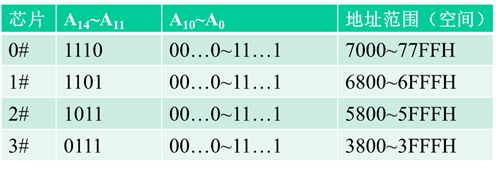

- u 优点：不需要地址译码器，线路简单，选择芯片无须外加逻辑电路，但仅适用于连接存储芯片较少的场合。
- 缺点：不能充分利用系统的存储器空间，且把地址空间分成了相互隔离的区域，给编程带来了一定的困难。

#### 全译码法

- u 全译码法将除片内寻址外的全部高位地址线都作为地址译码器的输入，译码器的输出作为各芯片的片选信号，将它们分别接到存储芯片的片选端，以实现对存储芯片的选择。
- 优点：每片（或组）芯片的地址范围是唯一确定的，而且是连续的，也便于扩展，不会产生地址重叠的存储区；
- 缺点：对译码电路要求较高。

CPU 地址线有 20 位，现用 4 片 2K×8 的存储芯片组成一个 8K×8 的存储器。全译码法要求除去芯片内寻址的 11 位地址线外，其余高 9 位用作译码，各芯片的地点范围如下：

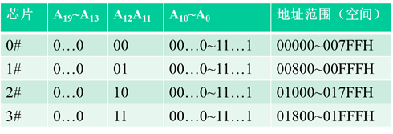

#### 部分译码

u 部分译码即用除片内寻址外的高位地址的一部分来译码产生片选信号。

如用 4 片 2K×8 的存储芯片组成 8K×8 存储器，需要 4 个片选信号，因此只需要用两位地址线来译码产生。

Ø 由于寻址 8K×8 存储器时未用到高位地址 A19 ～ A13，所以只要 A12=A11=0，而无论 A19 ～ A13 取何值，均选中第一片；只要 A12=0，A11=1，而无论 A19 ～ A13 取何值，均选中第二片……也就是说，8K RAM 中的任一个存储单元，都对应有$2^{(20-13)}=2^7$个地址，这种一个存储单元出现多个地址的现象称地址重叠。Ø 从地址分布来看，这 8KB 存储器实际上占用了 CPU 全部的空间（1MB）。每片 2K×8 的存储芯片有 1/4M=256K 的地址重叠区。

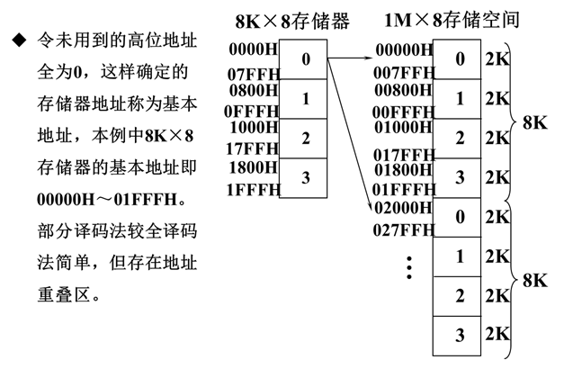

### 主存储器和 CPU 的连接

#### 主存和 CPU 之间的硬连接

主存与 CPU 的硬连接有 3 组连线：地址总线（AB）、数据总线（DB）和控制总线（CB）。此时，把主存看作一个黑盒子，存储器地址寄存器（MAR）和存储器数据寄存器（MDR）是主存和 CPU 之间的接口。MAR 可以接受来自程序计数器（PC）的指令地址或来自运算器的操作数地址，以确定要访问的单元。MDR 是向主存写入数据或从主存读出数据的缓冲部件。MAR 和 MDR 从功能上看属于主存，但在小微型机中常放在 CPU 内。

主存和 CPU 的硬连接：

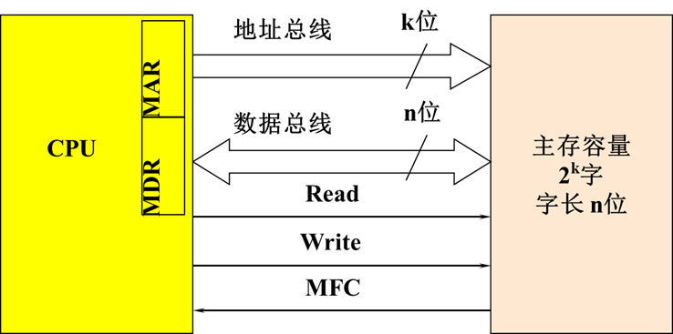

#### CPU 对主存的基本操作

前面所说的 CPU 与主存的硬连接是两个部件之间联系的物理基础。而两个部件之间还有软连接，即 CPU 向主存发出的读或写命令，这才是两个部件之间有效工作的关键。

CPU 对主存进行读写操作时，首先 CPU 在地址总线上给出地址信号，然后发出相应的读或写命令，并在数据总线上交换信息。

1.  读操作：

    读操作是指从 CPU 送来的地址所指定的存储单元中取出信息，再送给 CPU，其操作过程是：

    1.  地址 →MAR→AB CPU 将地址信号送至地址总线；
    2.  Read CPU 发读命令；
    3.  Wait for MFC 等待存储器工作完成信号；
    4.  M(MAR)→DB→MDR 读出信息经数据总线送至 CPU。

2.  写操作 &#x20;

    写操作是指将要写入的信息存入 CPU 所指定的存储单元中，其操作过程是：

    1.  地址 →MAR→AB CPU 将地址信号送至地址总线；
    2.  数据 →MDR→DB CPU 将要写入的数据送至数据总线；
    3.  Write CPU 发写命令；
    4.  Wait for MFC 等待存储器工作完成信号。

### 主存的校验

计算机在运行过程中，主存要与 CPU 频繁地交换数据。为了检测和校正在存储过程中的错误，主存中常设置有差错校验电路。

#### 主存的奇偶校验

最简单的主存检验方法是奇偶校验，在微机中通常采用奇校验，即每个存储单元中共存储 9 位信息（其中 8 位数据，1 位奇偶校验位），信息中“1”的个数总是奇数。

当向主存写入数据时，奇偶校验电路首先会对一个字节的数据计算出奇偶校验位的值，然后再把所有的 9 位值一起送到主存中去。

读出数据时，某一存储单元的 9 位数据被同时读出，当 9 位数据里“1”的个数为奇数时，表示读出的 9 位数据正确；当“1”的个数为偶数时，表示读出数据出错，向 CPU 发出不可屏蔽中断，使系统停机并显示奇偶检验出错的信息。

#### 错误检验与校正（ECC）

ECC 不仅能检测错误还能在不打扰计算机工作的情况下改正错误，这对于网络服务器这样不允许随便停机的关键任务是至关重要的。

ECC 主存用一组附加数据位来存储一个特殊码，被称为“校验和”。对于每个二进制字都有相应的 ECC 码。产生 ECC 码所需的位数取决于系统所用的二进制字长。当从主存中读取数据时，将取到的实际数据和它的 ECC 码快速比较。如果匹配，则实际数据被传给 CPU；如果不匹配，则 ECC 码的结构能够将出错的一位（或几位）鉴别出来，然后改正错误，再将数据传给 CPU。

注意：此时主存中的出错位并没有改变，如果又要读取这个数据，需要再一次校正错误。

### PC 系列微机的存储器接口

#### 8 位存储器接口

如果数据总线为 8 位（如微机系统中的 PC 总线），而主存按字节编址，则匹配关系比较简单。对于 8 位的微处理器，典型的时序安排是占用 4 个 CPU 时钟周期，称为 T1 ～ T4，构成一个总线周期。对于微型机来说，存储器就挂在总线上，故总线周期就等于存取周期，一个总线周期可读写 8 位。

#### 16 位存储器接口

对于 16 位的微处理器 8086（或 80286），在一个总线周期内最多可读写两个字节，即从偶地址开始的字（规则字）。同时读写这个偶地址单元和随后的奇地址单元，用低 8 位数据总线传送偶地址单元的数据，用高 8 位数据总线传送奇地址单元的数据。如果读写的是非规则字，即是从奇地址开始的字，则需要安排两个总线周期才能实现。

为了实现这样的传送，需要将存储器分为两个存储体。一个存储体的地址均为偶数，称为偶地址（低字节）存储体，它与低 8 位数据总线相连；另一个存储体的地址均为奇数，称为奇地址（高字节）存储体，与高 8 位数据总线相连。

8086 的存储器组织：

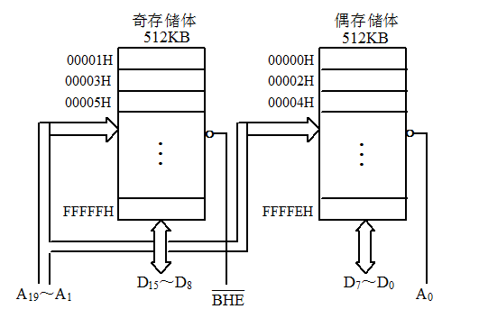

8086 和主存之间可以传送一个字节（8 位）数据，也可以传送一个字（16 位）数据。任何两个连续的字节都可以作为一个字来访问，地址值较低的字节是低位有效字节，地址值较高的字节是高位有效字节。

8086 微处理器的地址线 A19 ～ A1 同时送至两个存储体，BHE（高位存储体）和最低位地址线 A0 用来选择一个或两个存储体进行数据传送。

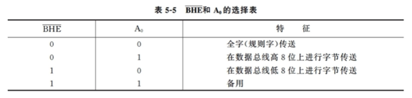

#### 32 位存储器接口 &#x20;

由于 80386/80486 微处理器要保持与 8086 等微处理器兼容，这就要求在进行存储器系统设计时必须满足单字节、双字节和四字节等不同访问。为了实现 8 位、16 位和 32 位数据的访问，80386/80486 微处理器设有 4 个引脚$ \bar{BE3}～ \bar{BE0} $，以控制不同数据的访问。

#### 64 位存储器接口

64 位存储器系统由 8 个存储体组成，每个存储体的存储空间为 512MB（Pentium）或 8GB（PentiumPro），存储体选择通过选择信号 $\bar{BE7}～ \bar{BE0}$ 实现。如果要传送一个 64 位数，那么 8 个存储体都被选中；如果要传送一个 32 位数，那么 4 个存储体被选中；若要传送一个 16 位数，则有 2 个存储体被选中；若传送的是 8 位数，只有一个存储体被选中。

## 提高主存读写速度的技术

近几年来主存技术一直在不断地发展，从最早使用的 DRAM 到后来的 FPM DRAM、EDO DRAM、SDRAM、DDR SDRAM 和 RDRAM，出现了各种主存控制与访问技术。它们的共同特点是使主存的读写速度有了很大的提高。

### 主存与 CPU 速度的匹配

主存的速度通常以纳秒（ns）表示，而 CPU 速度总是被表示为兆赫兹（MHz），最近一些更快更新的主存也用 MHz 来表示速度。

如果主存总线的速度与 CPU 总线速度相等，那么主存的性能将是最优的，然而通常主存的速度落后于 CPU 的速度。

### FPM DRAM

传统的 DRAM 是通过分页技术进行访问的，在存取数据时，需要分别输入一个行地址和一个列地址，这会耗费时间。FPMDRAM 通过保持行地址不变而只改变列地址，可以对给定行的所有数据进行更快的访问。

FPM DRAM 还支持突发模式访问，所谓突发模式是指对一个给定的访问在建立行和列地址之后，可以访问后面 3 个相邻的地址，而不需要额外的延迟和等待状态。一个突发访问通常限制为 4 次正常访问。

为了描述这个过程，经常以每次访问的周期数表示计时。一个标准 DRAM 的典型突发模式访问表示为 x-y-y-y，x 是第一次访问的时间（延迟加上周期数），y 表示后面每个连续访问所需的周期数。标准的 FPMDRAM 可获得 5-3-3-3 的突发模式周期。

FPM DRAM 内存条主要采用 72 线的 SIMM 封装，其存取速度一般在 60 ～ 100ns 左右。

### EDO DRAM

EDODRAM 是在 FPMDRAM 基础上加以改进的存储器控制技术。传统的 DRAM 和 FPM DRAM 在存取每一数据时，输入行地址和列地址后必须等待电路稳定，然后才能有效的读写数据，而下一个地址必须等待这次读写周期完成才能输出。而 EDO 输出数据在整个 CAS 周期都是有效的（包括预充电时间在内），EDO 不必等待当前的读写周期完成即可启动下一个读写周期，即可以在输出一个数据的过程中准备下一个数据的输出。EDODRAM 采用一种特殊的主存读出控制逻辑，在读写一个存储单元时，同时启动下一个（连续）存储单元的读写周期，从而节省了重选地址的时间，提高了读写速度。

EDODRAM 可获得 5-2-2-2 的突发模式周期，若进行 4 个主存传输，需要总共 11 个系统周期，而 FPMDRAM 的突发模式周期为 5-3-3-3，总共需要 14 个周期。与 FPMDRAM 相比，EDODRAM 的性能改善了 22％，而其制造成本与 FPMDRAM 相近。

FPM 和 EDO 两者的芯片制作技术其实是相同的，不同的是 EDO 所增加的机制必须在芯片组的支持下将发送的数据信号的处理时间缩短，以加快系统的整体执行效率。目前 EDODRAM 内存条主要采用 72 线的 SIMM 形式封装，也有少部分采用 168 线的 DIMM 封装，存取时间约为 50 ～ 70ns。

### SDRAM

SDRAM 是一种与主存总线运行同步的 DRAM。SDRAM 在同步脉冲的控制下工作，取消了主存等待时间，减少了数据传送的延迟时间，因而加快了系统速度。SDRAM 仍然是一种 DRAM，起始延迟仍然不变，但总的周期时间比 FPM 或 EDO 快得多。SDRAM 突发模式可达到 5-1-1-1，即进行 4 个主存传输，仅需 8 个周期，比 EDO 快将近 20%。

SDRAM 的基本原理是将 CPU 和 RAM 通过一个相同的时钟锁在一起，使得 RAM 和 CPU 能够共享一个时钟周期，以相同的速度同步工作。

DRAM 采用新的双存储体结构，内含两个交错的存储矩阵，允许两个主存页面同时打开，当 CPU 从一个存储矩阵访问数据的同时，在主存控制器作用下另一个存储矩阵已准备好读写数据。通过两个存储矩阵的紧密配合，存取效率得到成倍提高。

SDRAM 普遍采用 168 线的 DIMM 封装，速度通常以 MHz 来标定，目前 SDRAM 的工作频率已达 100MHz、133MHz，能与当前的 CPU 同步运行，可提高整机性能大约 5％～ 10％。由于 SDRAM 的优良特性，使它成为当前主存市场的主流。

### DDR SDRAM

DDRSDRAM 也可以说是 SDRAM 的升级版本，它与 SDRAM 的主要区别是：DDRSDRAM 不仅能在时钟脉冲的上升沿读出数据而且还能在下降沿读出数据，不需要提高时钟频率就能加倍提高 SDRAM 的速度。

DDR 内存条的物理大小和标准的 DIMM 一样，区别仅在于内存条的线数。标准的 SDRAM 有 168 线（2 个小缺口），而 DDRSDRAM 有 184 线（多出的 16 个线占用了空间，故只有 1 个小缺口）。

### DDR2、DDR3 、DDR4 和 DDR5 SDRAM

#### DDR2SDRAM

DDR2 SDRAM 拥有两倍于上一代 DDRSDRAM 的预读取能力（即：4bit 数据读预取）。换句话说，DDR2SDRAM 每个时钟能够以 4 倍于外部总线的速度读/写数据。

#### DDR3SDRAM

DDR3SDRAM 可以看作是 DDR2 的改进版，DDR3 的预取设计位数提升至 8bit，其 DRAM 内核的频率达到了接口频率的 1/8。

#### DDR4SDRAM

DDR4 仍沿用了 DDR3 的 8bit 数据预取，它最重要的使命是提高频率和带宽，标准规定最低是 DDR41600，即从 1600MHz 开始运行，这将是 DDR3 频率的两倍。

#### DDR5 SDRAM

4400MHz 对于 DDR5 来说可能只是起步，预计最终可以达到 6400MHz 左右，相比目前的 DDR4，频率提升了近一倍。DDR5 的变化不仅是频率的提高，因为允许加入内部 ECC 来制造 16Gb、32Gb 颗粒，单条容量也会大大提升。

DDRSDRAM 内存的发展趋势：

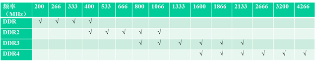

### Rambus DRAM

RambusDRAM 是继 SDRAM 之后的新型高速动态随机存储器。

使用 FPM/EDO 或 SDRAM 的传统主存系统称为宽通道系统，它们的主存通道和处理器的数据总线一样宽。RDRAM 却是一种窄通道系统，它一次只传输 16 位数据（加上 2 个可选的校验位），但速度却快得多。目前，RDRAM 的容量一般为 64Mb/72Mb 或 128Mb/144Mb，组织结构为 4M 或 8M×16 位、4M 或 8M×18 位（18 位的组织结构允许进行 ECC 检测）。

Rambus DRAM 引入了 RISC（精简指令集）的技术，依靠其极高的工作频率，通过减少每个周期的数据量来简化操作。RDRAM 的时钟频率可达到 400MHz，由于采用双沿传输，使原有的 400MHz 变为 800MHz。Rambus 结构的带宽视 Rambus 通路的个数而定，若是单通路，800MHz 的 RDRAM 带宽为 800MHz×16 位 ÷8=1.6GB/s，若是两个通路，则可提升为 3.2GB/s，若是 4 个通路的话，将达到 6.4GB/s。而 PC-133 的带宽为 133 MHz×64 位 ÷8=1.06GB/s，PC-266 则为 2.12GB/s。

由于是全新的设计，需要用 RIMM 插槽与芯片组配合。RDRAM 总线是一条经过总线上所有设备（RDRAM 芯片）和模块的连接线路，每个模块在相对的两端有输入和输出引脚，时钟信号需依次流过每个 RIMM 槽，然后再通过每个 RIMM 槽返回。因此，任何不含 RDRAM 芯片的 RIMM 插槽必须填入一个连接模块（Rambus 终结器）以保证路径是完整的。

此外，Rambus 主存还有一个特点，就是它的行地址与列地址的寻址总线是各自分离的独立总线，这就意味着行与列的选址几乎在同一时间内进行，从而进一步提高了工作效率；也正因为拥有这一优势，使得 Rambus 主存不仅可以弥补它在寻址时间上比传统的 SDRAM 较慢的缺点，而且在实际工作中所表现出来的性能更好。

目前，由 RDRAM 构成的系统存储器已经开始应用于现代微机之中，并可能成为服务器及其他高性能计算机的主流存储器系统。

## 多体交叉存储技术

目前，主存的存取速度已成为计算机系统的瓶颈，除去通过寻找高速元件来提高访问速度外，也可以采用多个存储器并行工作，并且用交叉访问技术来提高存储器的访问速度。

### 并行访问存储器

- 常规的主存是单体单字存储器，只包含一个存储体。在高速的计算机中，普遍采用并行主存系统，即在一个存取周期内可以并行读出多个字，以解决 CPU 与主存之间的速度匹配问题。
- 多个并行工作的存储器共用一套地址寄存器和译码电路，按同一地址并行地访问各自的对应单元。
- 例如：CPU 送出地址 A，则 n 个存储器中的所有 A 单元同时被选中。假设每个存储器的字长为 w 位，则同时访问 n×w 位称为单体多字系统。

单体多字并行存储系统：

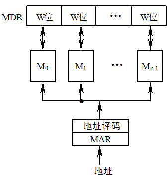

- 并行访问存储器按地址在一个存取周期内读出 n×w 位的指令或数据，使主存带宽提高 n 倍。
- 前提是：指令和数据在主存或者必须是连续存放的，若遇到转移指令，或操作数不能连续存放，起效果就不明显。
- 并行访问存储器的主要缺点是访问主存的冲突大。

### 交叉访问存储器

- 交叉访问存储器中有多个容量相同的存储模块（存储体），而且各存储模块具有各自独立的地址寄存器、读写电路和数据寄存器，这就是多体系统。各个存储体能并行工作，又能交叉工作。
- 存储器地址寄存器的低位部分经过译码选择不同的存储体，而高位部分则指向存储体内的存储字。

多体交叉访问存储器：

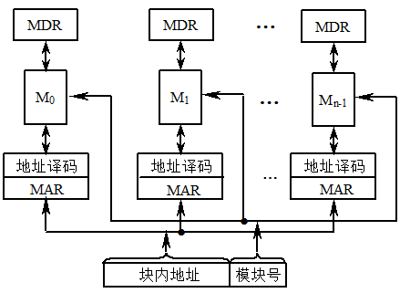

- 同时访问（并行访问）：所有模块同时启动一次存储周期，相对各自的数据寄存器并行地读出或写入信息；
- 交叉访问： M 个模块按一定的顺序轮流启动各自的访问周期，启动两个相邻模块的最小时间间隔等于单模块访问周期的 1/M。即互相错开一个存储体访问周期的 1/M，交叉进行工作。
- 同时访问多个存储模块能一次提供多个数据或多条指令。

模 4 交叉编址：

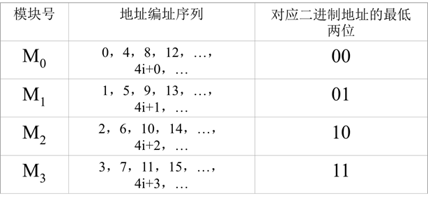

这种交叉存储器中，连续地址分布在相邻的存储体中，而同一存储体内的地址则不连续。这种编址方式又称为横向编址。

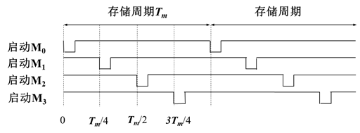

当出现数据相关和程序转移时，将破坏并行性，不能达到上述理想值。

注意：交叉访问存储器要求存储体的个数必须为 2 的幂。
