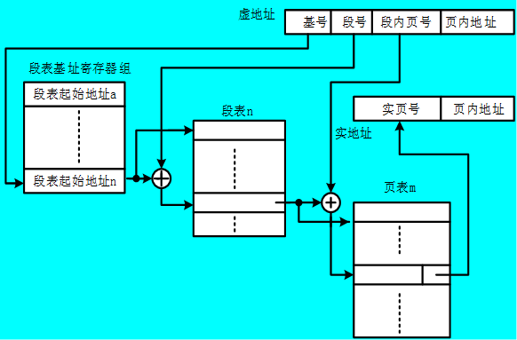

# 05 存储系统和结构 (7\~8)

## 高速缓冲存储器

- 主存速度的提高始终跟不上 CPU 的发展。据统计，CPU 的速度平均每年提高 60%，而组成主存的 DRAM 的速度平均每年只改进 7%。
- 由 SRAM 组成的高速缓冲存储器的运行速度则接近甚至等于 CPU 的速度。

### 高速缓存工作原理

#### 程序的局部性原理

- 程序的局部性有两个方面的含义：时间局部性和空间局部性。
- 时间局部性是指如果一个存储单元被访问，则该单元可能很快会被再次访问。这是因为程序存在着循环。
- 空间局部性是指如果一个存储单元被访问，则该单元邻近的单元也可能很快被访问。这是因为程序中大部分指令是顺序存储、顺序执行的，数据一般也是以向量、数组、树、表等形式簇聚地存储在一起的。
- 高速缓冲技术就是利用程序的局部性原理，把程序中正在使用的部分存放在一个高速的容量较小的 Cache 中，使 CPU 的访存操作大多数针对 Cache 进行，从而使程序的执行速度大大提高。

#### Cache 的基本结构

- Cache 和主存都被分成若干个大小相等的块，每块由若干字节组成。
- 由于 Cache 的容量远小于主存的容量，所以 Cache 中的块数要远少于主存中的块数，它保存的信息只是主存中最急需执行的若干块的副本。
- 用主存地址的块号字段访问 Cache 标记，并将取出的标记和主存地址的标记字段相比较。
- 若相等，说明访问 Cache 有效，称 Cache 命中；
- 若不相等，说明访问 Cache 无效，称 Cache 不命中或失效。

Cache 的基本结构：

### Cache 的读写操作

#### Cache 的读操作

- 当 CPU 发出读请求时，如果 Cache 命中，就直接对 Cache 进行读操作，与主存无关；
- 如果 Cache 不命中，则仍需访问主存，并把该块信息一次从主存调入 Cache 内。
- 若此时 Cache 已满，则须根据某种替换算法，用这个块替换掉 Cache 中原来的某块信息。

#### Cache 的写操作

- 由于 Cache 中保存的只是主存的部分副本，这些副本与主存中的内容能否保持一致，是 Cache 能否可靠工作的一个关键问题。
- 当 CPU 发出写请求时，如果 Cache 命中，有可能会遇到 Cache 与主存中的内容不一致的问题。处理的方法有：写直达法和写回法。
- 如果写 Cache 不命中，就直接把信息写入主存，并有两种处理方法：不按写分配法和按写分配法。

  •不按写分配法：只写入主存；

  •按写分配法：先写入主存，再从主存装入 cache

### 地址映象

地址映像：主存内容装入 cache 的规则。

#### 全相联映像

- 全相联映像就是让主存中任何一个块均可以映像装入到 Cache 中任何一个块的位置上。
- 全相联映像方式比较灵活，Cache 的块冲突概率最低、空间利用率最高，但是地址变换速度慢，而且成本高，实现起来比较困难。

全相联映像：

#### 直接映像

- 直接映像是指主存中的每一个块只能被放置到 Cache 中惟一的一个指定位置，若这个位置已有内容，则产生块冲突，原来的块将无条件地被替换出去。

  $$
  \mathrm{K}=\mathrm{I} \bmod 2^{\mathrm{c}} (k:cache块号, I: 主存块号, 2^{\mathrm{c}} :cache块数)
  $$

- 直接映像方式是最简单的地址映象方式，成本低，易实现，地址变换速度快，而且不涉及其它两种映像方式中的替换算法问题。
- 但这种方式不够灵活，Cache 的块冲突概率最高、空间利用率最低。

#### 组相联映像&#x20;

u 组相联映像将 Cache 分成大小相等的组（含多块）。u 主存中某组中的任何一块，均可直接映像装入 Cache 中对应组的任何一块位置上:

$$
J=I mod Q （J:cache组号，I:主存块号，Q:cache组数）
$$

uCache 只有一个组时，就是全相联映像；每个组只有一块时（即有 2c 个组），就是直接相联映像；u 组相联映像实际上是全相联映像和直接映像的折衷方案，所以其优点和缺点介于全相联和直接映像方式的优缺点之间。

组相联映像：

### 替换算法

#### 随机算法

随机法完全不管 Cache 块过去、现在及将来的使用情况，简单地根据一个随机数，选择一块替换掉。

#### 先进先出（FIFO）算法

- 按调入 Cache 的先后决定淘汰的顺序，即在需要更新时，将最先进入 Cache 的块作为被替换的块。
- 这种方法要求为每块做一记录，记下它们进入 Cache 的先后次序。这种方法容易实现，而且系统开销小。
- 缺点是可能会把一些需要经常使用的程序块（如循环程序）也作为最早进入 Cache 的块替换掉。

#### 近期最少使用（LRU）算法

- LRU 算法是把 CPU 近期最少使用的块作为被替换的块。
- 这种替换方法需要随时记录 Cache 中各块的使用情况，以便确定哪个块是近期最少使用的块。LRU 算法相对合理，但实现起来比较复杂，系统开销较大。
- 通常需要对每一块设置一个称为“年龄计数器”的硬件或软件计数器，用以记录其被使用的情况。

### 更新策略

写直达法

- CPU 在执行写操作时，必须把数据同时写入 cache 和主存；
- 当替换 cache 块时，就不必写回主存了；
- 该方法简单，能随时保持数据的正确性，但会增加不必要的主存写入。

写回法

- CPU 在执行写操作时，被写数据仅写入 cache，而不写入主存；
- 仅当替换时，才把修改过的 cache 块写回主存；
- 该方法操作速度快，但会因主存中的字块未及时更新而出错。

### PC 机中 cache 技术的实现

单一缓存和多级缓存

- 单一缓存是 cpu 与主存间只有一级缓存；
- 多级缓存则是 cpu 与主存间有多级缓存，目前大多 CPU 都有 3 级缓存，L1，L2，L3。

统一缓存和分开缓存

- 统一缓存指指令和数据共用同一 cache；
- 分开缓存则将指令和数据分开放在不同的 cache 中，一个叫指令 cache，另一个叫数据 cache。

## 虚拟存储器

虚拟存储器由主存储器和联机工作的辅助存储器（通常为磁盘存储器）共同组成，这两个存储器在硬件和系统软件的共同管理下工作，对于应用程序员，可以把它们看作是一个单一的存储器。

### 虚拟存储器的基本概念

- 虚拟存储器将主存或辅存的地址空间统一编址，形成一个庞大的存储空间。
- 在这个大空间里，用户可以自由编程，完全不必考虑程序在主存是否装得下以及这些程序将来在主存中的实际存放位置。
- 用户编程的地址称为虚地址或逻辑地址，实际的主存单元地址称为实地址或物理地址。
- 显然，虚地址要比实地址大得多。
- 在实际的物理存储层次上，所编程序和数据在操作系统管理下，先送入磁盘，然后操作系统将当前运行所需要的部分调入主存，供 CPU 使用，其余暂不运行部分留在磁盘中。
- 程序运行时，CPU 以虚地址来访问主存，由辅助硬件找出虚地址和实地址之间的对应关系，并判断这个虚地址指示的存储单元内容是否已装入主存。
- 如果已在主存中，则通过地址变换，CPU 可直接访问主存的实际单元；如果不在主存中，则把包含这个字的一页或一个程序段调入主存后再由 CPU 访问。
- 如果主存已满，则由替换算法从主存中将暂不运行的一块调回辅存，再从辅存调入新的一块到主存。

### 页式虚拟存储器

- 主存空间和虚存空间都划分成若干个大小相等的页。主存即实存的页称为实页，虚存的页称为虚页。
- 程序虚地址分为两个字段：虚页号和页内地址。
- 虚地址到实地址之间的变换是由页表来实现的。
- 页表是一张存放在主存中的虚页号和实页号的对照表，记录着程序的虚页调入主存时被安排在主存中的位置。
- 若计算机采用多道程序工作方式，则可为每个用户作业建立一个页表，硬件中设置一个页表基址寄存器，存放当前所运行程序的页表的起始地址。

- 页式虚拟存储器的每页长度是固定的，页表的建立很方便，新页的调入也容易实现。
- 但是由于程序不可能正好是页面的整倍数，最后一页的零头将无法利用而造成浪费。
- 同时，页不是逻辑上独立的实体，使程序的处理、保护和共享都比较麻烦。

### 段式虚拟存储器

- 段式虚拟存储器中的段是按照程序的逻辑结构划分的，各个段的长度因程序而异。
- 为了把程序虚地址变换成主存实地址，需要一个段表。
- 段表中每一行记录了某个段对应的若干信息，包括段号、装入位、段基地址和段长等。
- 由于段的大小可变，所以在段表中要给出各段的起始地址与段的长度。
- 段表实际上是程序的逻辑结构段与其在主存中所存放的位置之间的关系对照表。

- 由于段的分界与程序的自然分界相对应，所以具有逻辑独立性，易于程序的编译、管理、修改和保护，也便于多道程序共享。
- 但是，因为段的长度参差不齐，起点和终点不定，给主存空间分配带来了麻烦；容易在段间留下不能利用的零头，造成浪费。

### 段页式虚拟存储器

- 将程序按其逻辑结构分段，每段再划分为若干大小相等的页；主存空间也划分为若干同样大小的页。
- 虚存和实存之间以页为基本传送单位，每个程序对应一个段表，每段对应一个页表。
- 虚地址包含基号、段号、段内页号、页内地址 4 部分。
  - 通过基号从基址寄存器中读出段表起始地址；
  - 将段表起始地址与段号合成，得到段表行地址；
  - 然后从段表中取出该段的页表起始地址，与段内页号合成，得到页表内行地址；
  - 最后从页表中取出实页号，与页内地址拼接形成主存实地址。
- 段页式存储器综合了前两种结构的优点，但要经过两级查表才能完成地址转换，费时要多些。
- 段页式虚拟存储器将存储空间按逻辑模块分成段，每段又分成若干个页，访存通过一个段表和多个页表进行。
- 段的长度必须是页长的整数倍，段的起点必须是某一页的起点。

### 快表与慢表

- 为了将访问页表的时间降低到最低限度，许多计算机将页表分为快表和慢表两种。
- 将当前最常用的页表信息存放在一个小容量的高速存储器中，称为“快表”（TLB），当快表中查不到时，再从存放在主存中的页表中查找实页号。
- 与快表相对应，存放在主存中的页表称为“慢表”。快表只是慢表的一个副本，而且只存放了慢表中很少的一部分。
