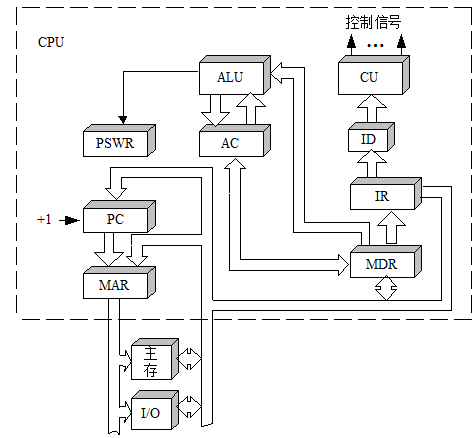
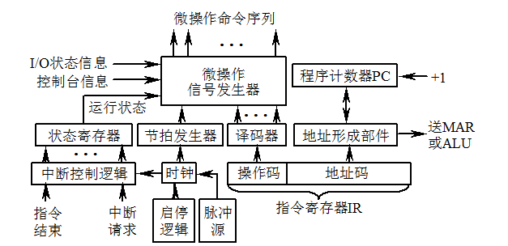
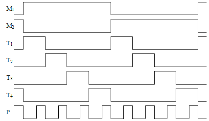
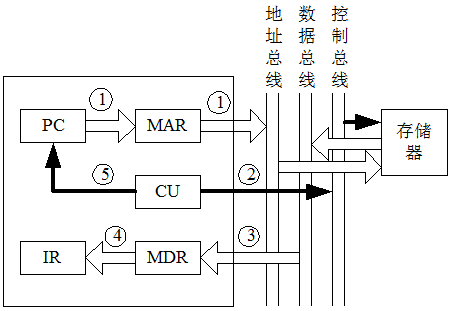
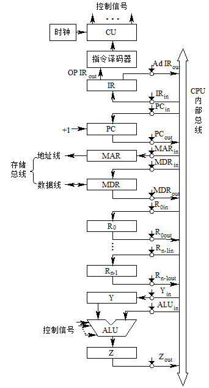

# 06 中央处理器 (1\~3)

中央处理器（CPU）是整个计算机的核心，它包括运算器和控制器。本章着重讨论 CPU 的功能和组成，控制器的工作原理和实现方法，微程序控制原理，基本控制单元的设计以及先进的 CPU 系统设计技术。

本章学习内容：

- 6.1 中央处理器的功能和组成
- 6.2 控制器的组成和实现方法
- 6.3 时序系统与控制方式
- 6.4 微程序控制原理
- 6.5 控制单元的设计
- 6.6 流水线技术
- 6.7 精简指令系统计算机 RISC

本章学习要求：

- 理解：CPU 的功能和主要寄存器
- 理解：控制器的基本组成
- 理解：时序系统中指令周期、机器周期的概念
- 了解：不同的控制方式（同步、异步、联合）
- 理解：指令执行的基本过程
- 掌握：取指周期的微操作序列（公共操作）
- 理解：微程序控制的基本概念
- 掌握：微指令编码法特点
- 理解：微程序控制器的组成和工作过程
- 理解：微程序入口地址和后继微地址的形成
- 了解：控制单元的设计
- 了解：流水线技术和 RISC 技术

## 中央处理器的功能和组成

CPU 对整个计算机系统的运行是极其重要的，这里将从 CPU 的功能、内部结构和主要技术参数入手，为后面详细讨论程序的执行过程打下基础。

### CPU 的功能

若用计算机来解决某个问题，首先要为这个问题编制解题程序，而程序又是指令的有序集合。按“存储程序”的概念，只要把程序装入主存储器后，即可由计算机自动地完成取指令和执行指令的任务。在程序运行过程中，在计算机的各部件之间流动的指令和数据形成了指令流和数据流。

需要注意的是，这里的指令流和数据流都是程序运行的动态概念，它不同于程序中静态的指令序列，也不同于存储器中数据的静态分配序列。指令流指的是 CPU 执行的指令序列，数据流指的是根据指令操作要求依次存取数据的序列。从程序运行的角度来看，CPU 的基本功能就是对指令流和数据流在时间与空间上实施正确的控制。

对于冯·诺依曼结构的计算机而言，数据流是根据指令流的操作而形成的，也就是说数据流是由指令流来驱动的。

### CPU 中的主要寄存器

#### 通用寄存器

通用寄存器可用来存放原始数据和运算结果，有的还可以作为变址寄存器、计数器、地址指针等。现代计算机中为了减少访问存储器的次数，提高运算速度，往往在 CPU 中设置大量的通用寄存器，少则几个，多则几十个，甚至上百个。通用寄存器一般由程序编址访问。

累加寄存器 Acc 也是一个通用寄存器，它用来暂时存放 ALU 运算的结果信息。例如，在执行一个加法运算前，先将一个操作数暂时存放在 Acc 中，再从主存中取出另一操作数，然后同 Acc 的内容相加，所得的结果送回 Acc 中。运算器中至少要有一个累加寄存器。

#### 专用寄存器

1.  程序计数器（PC）

    程序计数器又称指令计数器，用来存放正在执行的指令地址或接着要执行的下条指令地址。

    对于顺序执行的情况，PC 的内容应不断地增量（加“1”），以控制指令的顺序执行。这种加“1”的功能，有些机器是程序计数器本身具有的，也有些机器是借助运算器来实现的。

    在遇到需要改变程序执行顺序的情况时，将转移的目标地址送往 PC，即可实现程序的转移。有些情况下除改变 PC 的内容外，还需要保留改变之前的内容，以便返回时使用。

2.  指令寄存器（IR）

    指令寄存器用来存放从存储器中取出的指令。当指令从主存取出暂存于指令寄存器之后，在执行指令的过程中，指令寄存器的内容不允许发生变化，以保证实现指令的全部功能。

3.  存储器数据寄存器（MDR）

    存储器数据寄存器用来暂时存放由主存储器读出的一条指令或一个数据字；反之，当向主存存入一条指令或一个数据字时，也暂时将它们存放在存储器数据寄存器中。

4.  存储器地址寄存器（MAR）

    存储器地址寄存器用来保存当前 CPU 所访问的主存单元的地址。由于主存和 CPU 之间存在着操作速度上的差别，所以必须使用地址寄存器来保持地址信息，直到主存的读写操作完成为止。

    当 CPU 和主存进行信息交换，无论是 CPU 向主存存取数据时，还是 CPU 从主存中读出指令时，都要使用存储器地址寄存器和数据寄存器。

5.  程序状态字寄存器（PSWR）

    程序状态字寄存器用来存放程序状态字（PSW）。程序状态字的各位表征程序和机器运行的状态，是参与控制程序执行的重要依据之一。它主要包括两部分内容：一是状态标志，如进位标志（C）、结果为零标志（Z）等，大多数指令的执行将会影响到这些标志位；二是控制标志，如中断标志、陷阱标志等。程序状态字寄存器的位数往往等于机器字长，各类机器的程序状态字寄存器的位数和设置位置不尽相同。

### CPU 的组成

CPU 由运算器和控制器两大部分组成。

控制器的主要功能有：

1.  从主存中取出一条指令，并指出下一条指令在主存中的位置。
2.  对指令进行译码或测试，产生相应的操作控制信号，以便启动规定的动作。
3.  指挥并控制 CPU、主存和输入输出设备之间的数据流动方向。

运算器的主要功能有：

1.  执行所有的算术运算；
2.  执行所有的逻辑运算，并进行逻辑测试。

CPU 的模型：

### CPU 的主要技术参数

CPU 品质的高低直接决定了一个计算机系统的档次，而 CPU 的主要技术参数可以反映出 CPU 的大致性能。

#### 字长

CPU 的字长是指在单位时间内同时处理的二进制数据的位数。CPU 按照其处理信息的字长可以分为：8 位 CPU、16 位 CPU、32 位 CPU 以及 64 位 CPU 等。

#### 内部工作频率

内部工作频率又称为内频或主频，它是衡量 CPU 速度的重要参数。在其他性能指标相同时，CPU 的主频越高，CPU 的速度也就越快。内部时钟频率的倒数是时钟周期，这是 CPU 中最小的时间元素。每个动作至少需要一个时钟周期。

最初的 8086 和 8088 执行一条指令平均需要 12 个时钟周期；80286 和 80386 的速度提高，每条指令大约要 4.5 个时钟周期；80486 的速度进一步提高，每条指令大约 2 个时钟周期；Pentium 具有双指令流水线，并有其他一些改进，使得每个时钟周期执行 1 到 2 条指令；而 Pentiumpro、Pentium Ⅱ/Ⅲ 每个时钟周期可以执行 3 条或更多的指令。

#### 外部工作频率

外部工作频率，也叫前端总线频率或系统总线时钟频率，它是由主板为 CPU 提供的基准时钟频率。由于正常情况下，CPU 总线频率和主存总线频率相同，所以也是 CPU 与主存交换数据的频率。

在早期，CPU 的内频就等于外频。目前，CPU 的内频越来越高，相比之下主存的速度还很缓慢，如果外频设计得跟内频同步，则主存都将无法跟上 CPU 的速度。所以现在外频跟内频不再只是一比一的同步关系，从而出现了所谓的内部倍频技术，导致了“倍频”的出现。内频、外频和倍频三者之间的关系是：

$$
内频=外频×倍频
$$

#### 前端总线频率

前端总线通常用 FSB 表示，它是 CPU 和外界交换数据的最主要通道，主要连接主存、显卡等数据吞吐率高的部件，因此前端总线的数据传输能力对计算机整体性能作用很大。

在 Pentium4 出现之前，前端总线频率与外频是相同的，因此往往直接称前端总线频率为外频。随着计算机技术的发展，需要前端总线频率高于外频，因此采用了 QDR（QuadDate Rate）技术或者其他类似的技术，使得前端总线频率成为外频的 2 倍、4 倍甚至更高。

$$
数据带宽=总线频率×数据位宽÷8
$$

#### QPI 数据传输速率

快速通道互联（QPI）是取代 FSB 的基于包传输的高速点到点连接技术。

QPI 抛弃了 FSB 易混淆的单位 MHz，而使用 GT/s、MT/s，明确的表示总线实际的数据传输速率。

一个基本的 QPI 数据包是 80bit，需要四次传输完成每次整个数据包的传输，每次传输的 20 位数据中，有 16 位为有效数据，其余 4 位用于循环冗余校验。由于 QPI 是双向的，在发送的同时也可以接收另一端传输来的数据，这样，每个 QPI 总线总带宽=每秒传输次数（即 QPI 速率）× 每次传输的有效数据（即 16bit/8=2Byte）× 双向。

#### DMI 数据传输速率

DMI 是指 DirectMedia Interface（直接媒体接口）。DMI 采用点对点的连接方式，时钟频率为 100MHz。

相当于北桥芯片的功能整个都集成到了 CPU 内部，主板上只剩下一个名为 PCH（平台控制中枢），它的性质类似于过去的南桥，它与 CPU 之间不需要交换太多数据，因此连接总线采用 DMI 足够了，故 FSB 被 DMI 取代。

随着 PCI-E 总线的升级 DMI 的数据传输速率在不断提高，DMI2.0 的单通道传输速率达到 5GT/s，仍采用 8bit/10bit 编码； DMI3.0 的单通道传输速率达到 8GT/s，采用 128bit/130bit 编码，有效码率高达 98.46%，比 8/10 编码的 80%提高了很多。

#### 片内 Cache 的容量和速率 &#x20;

片内 Cache 又称 CPUCache，它的容量和工作速率对提高计算机的速度起着关键的作用。CPUCache 可以分为 L1Cache、L2Cache，部分高端 CPU 还具有 L3Cache。

L1 Cache，位于 CPU 内核的旁边，是与 CPU 结合最为紧密的 CPU 缓存。一般来说，一级缓存可以分为一级数据缓存（D-Cache）和一级指令缓存（I-Cache）。

L2 Cache 是影响 CPU 性能的关键因素之一，在 CPU 核心不变化的情况下，增加 L2Cache 的容量能使性能大幅度提高。

L3Cache 是为读取 L2Cache 后未命中的数据设计的—种缓存，在拥有 L3Cache 的 CPU 中，只有约 5%的数据需要从内存中调用，这进一步提高了 CPU 的效率。

#### 工作电压

工作电压指的是 CPU 正常工作所需的电压。早期 CPU 的工作电压一般为 5V，以致于 CPU 的发热量太大，使得寿命缩短。随着 CPU 的制造工艺与内频的提高，近年来各种 CPU 的工作电压逐步下降。

#### 地址总线宽度

地址总线宽度决定了 CPU 可以访问的最大的物理地址空间，简单地说就是 CPU 到底能够使用多大容量的主存。

#### 数据总线宽度

数据总线宽度则决定了 CPU 与外部 Cache、主存以及输入输出设备之间进行一次数据传输的信息量。

数据总线和地址总线互相独立，数据总线宽度指明了芯片的信息传递能力，而地址总线宽度说明了芯片可以处理多少主存单元。

#### TDP 功耗

TDP 是指热设计功耗（ThermalDesignPower）。TDP 的含义是当处理器达到最大负荷的时候，所释放出的热量，计量单位为瓦（W）。这是反应处理器热量释放的指标，是计算机的冷却系统必须有能力驱散的最大热量限度。

TDP 功耗可以大致反映出 CPU 的发热情况，而制约 CPU 发展的一个重要问题就是散热问题，显然发热量低的 CPU 设计有望达到更高的工作频率，目前的台式计算机 CPU，TDP 功耗超过 100W 基本是不可取的，比较理想的数值是低于 50W；而便携式计算机 CPU 的 TDP 功耗仅 15W。

#### 制造工艺

线宽是指芯片内电路与电路之间的距离，可以用线宽来描述制造工艺。线宽越小，意味着芯片上包括的晶体管数目越多。PentiumⅡ 的线宽是 0.35μm，晶体管数达到 7.5 兆个；PentiumⅢ 的线宽是 0.25μm，晶体管数达到 9.5 兆个；Pentium4 的线宽是 0.18μm，晶体管数达到 42 兆个。目前主流 CPU 线宽已 45nm、32nm、22nm 和 14nm，7nm 的制造工艺将是新一代 CPU 的发展目标。

## 控制器的组成和实现方法

控制器是计算机系统的指挥中心，它把运算器、存储器、输入输出设备等部件组成一个有机的整体，然后根据指令的要求指挥全机的工作。

### 控制器的基本组成

控制器的基本组成：

#### 指令部件

指令部件的主要任务是完成取指令并分析指令。指令部件包括：

1.  程序计数器
2.  指令寄存器
3.  指令译码器：暂存在指令寄存器中的指令只有在其操作码部分经过译码之后才能识别出这是一条什么样的指令，并产生相应的控制信号提供给微操作信号发生器。
4.  地址形成部件

根据指令的不同寻址方式，形成操作数的有效地址。

#### 时序部件

时序部件能产生一定的时序信号，以保证机器的各功能部件有节奏地进行信息传送、加工及信息存储。包括：

1.  脉冲源

    产生具有一定频率和宽度的时钟脉冲信号，为整个机器提供基准信号。

2.  启停控制逻辑

    启停控制逻辑的作用是根据计算机的需要，可靠地开放或封锁脉冲，控制时序信号的发生或停止，实现对整个机器的正确启动或停止。

3.  节拍信号发生器

    节拍信号发生器又称脉冲分配器。脉冲源产生的脉冲信号，经过节拍信号发生器后产生出各个机器周期中的节拍信号，用以控制计算机完成每一步微操作。

#### 微操作信号发生器

一条指令的取出和执行可以分解成很多最基本的操作，这种最基本的不可再分割的操作称为微操作。微操作信号发生器也称为控制单元（CU）。不同的机器指令具有不同的微操作序列。

#### 中断控制逻辑

中断控制逻辑是用来控制中断处理的硬件逻辑。有关中断的问题将在第 9 章中专门进行讨论。

### 控制器的硬件实现方法

控制器的核心是微操作信号发生器（控制单元 CU）。微操作控制信号是由指令部件提供的译码信号、时序部件提供的时序信号和被控制功能部件所反馈的状态及条件综合形成的。

控制单元的输入包括时序信号、机器指令操作码、各部件状态反馈信号等，输出的微操作控制信号又可以细分为 CPU 内的控制信号和送至主存或外设的控制信号。根据产生微操作控制信号的方式不同，控制器可分为组合逻辑型、存储逻辑型、组合逻辑与存储逻辑结合型 3 种，它们的根本区别在于控制单元的实现方法不同，而控制器中的其他部分基本上是大同小异的。

#### 组合逻辑型

采用组合逻辑技术来实现，其控制单元是由门电路组成的复杂树形网络。这种方法是分立元件时代的产物，以使用最少器件数和取得最高操作速度为设计目标。

最大优点是速度快。但是控制单元的结构不规整，使得设计、调试、维修较困难，难以实现设计自动化；一旦控制单元构成之后，要想增加新的控制功能是不可能的。因此，它受到微程序控制器的强烈冲击。目前仅有一些巨型机和 RISC 机为了追求高速度仍采用组合逻辑控制器。

#### 存储逻辑型

这种控制器称为微程序控制器，是采用存储逻辑来实现的，也就是把微操作信号代码化，使每条机器指令转化成为一段微程序并存入一个专门的存储器（控制存储器）中，微操作控制信号由微指令产生。

微程序控制器具有设计规整、调试、维修以及更改、扩充指令方便的优点，易于实现自动化设计，已成为当前控制器的主流。但是，由于它增加了一级控制存储器，所以指令的执行速度比组合逻辑控制器慢。

#### 组合逻辑和存储逻辑结合型

这种控制器称为 PLA（可编程逻辑阵列）控制器，是吸收前两种方法的设计思想来实现的。PLA 控制器实际上也是一种组合逻辑控制器，但它又与常规的组合逻辑控制器的硬联结构不同；它是可编程序的，某一微操作控制信号由 PLA 的某一输出函数产生。

PLA 控制器是组合逻辑技术和存储逻辑技术结合的产物，克服了两者的缺点，是一种较有前途的方法。

## 时序系统与控制方式

由于计算机高速地进行工作，每一个动作的时间是非常严格的，不能有任何差错。时序系统是控制器的心脏，其功能是为指令的执行提供各种定时信号。

### 时序系统

#### 指令周期和机器周期

指令周期是指从取指令、分析取数到执行完该指令所需的全部时间。由于各种指令的操作功能不同，有的简单，有的复杂，因此各种指令的指令周期不尽相同。

机器周期又称 CPU 周期。通常把一个指令周期划分为若干个机器周期，每个机器周期完成一个基本操作。一般机器的 CPU 周期有取指周期、取数周期、执行周期、中断周期等。所以有：

$$
指令周期＝i×机器周期
$$

不同的指令周期中所包含的机器周期数差别可能很大。一般情况下，一条指令所需的最短时间为两个机器周期：取指周期和执行周期。

通常，每个机器周期都有一个与之对应的周期状态触发器。机器运行在不同的机器周期时，其对应的周期状态触发器被置“1”。显然，在机器运行的任何时刻只能处于一种周期状态，因此，有一个且仅有一个触发器被置“1”。

#### 节拍

在一个机器周期内，要完成若干个微操作。因而应把一个机器周期分为若干个相等的时间段，每一个时间段对应一个电位信号，称为节拍电位信号。

节拍的宽度取决于 CPU 完成一次微操作的时间。节拍的选取一般有以下几种方法：

1.  统一节拍法

    以最复杂的机器周期为准定出节拍数，每一个节拍时间的长短也以最繁的微操作作为标准。这种方法采用统一的、具有相等时间间隔和相同数目的节拍，使得所有的机器周期长度都是相等的，因此称为定长 CPU 周期。

2.  分散节拍法

    按照机器周期的实际需要安排节拍数，需要多少节拍，就发出多少节拍，这样可以避免浪费，提高时间利用率。由于各机器周期长度不同，故称为不定长 CPU 周期。

3.  延长节拍法

    在照顾多数机器周期要求的情况下，选取适当的节拍数，作为基本节拍。如果在某个机器周期内统一的节拍数无法完成该周期的全部微操作，则可以延长一或两个节拍。

4.  时钟周期插入

    在一些微型机中，时序信号中不设置节拍，而直接使用时钟周期信号。一个机器周期中含有若干个时钟周期，时钟周期的数目取决于机器周期内完成微操作数目的多少及相应功能部件的速度。一个机器周期的基本时钟周期数确定之后，还可以不断插入等待时钟周期。如 8086 的一个总线周期（即机器周期）中包含四个基本时钟周期 T1 ～ T4，在 T3 和 T4 之间可以插入任意个等待时钟周期 TW，以等待速度较慢的存储部件或外部设备完成读或写操作。

#### 工作脉冲

在节拍中执行的有些微操作需要同步定时脉冲，如将稳定的运算结果打入寄存器，又如机器周期状态切换等。为此，在一个节拍内常常设置一个或几个工作脉冲，作为各种同步脉冲的来源。工作脉冲的宽度只占节拍电位宽度的      ，并处于节拍的末尾部分，以保证所有的触发器都能可靠、稳定地翻转。

在只设置机器周期和时钟周期的微型机中，一般不再设置工作脉冲，因为时钟周期既可以作为电位信号，其前、后沿又可以作为脉冲触发信号。

#### 多级时序系统

下图为小型机每个指令周期中常采用的机器周期、节拍、工作脉冲三级时序系统。图中每个机器周期 M 中包括四个节拍 T1 ～ T4，每个节拍内有一个脉冲 P。在机器周期间、节拍电位间、工作脉冲间既不允许有重叠交叉，也不允许有空隙，应该是一个接一个的准确连接。

三级时序系统：

### 控制方式

#### 同步控制方式

同步控制方式即固定时序控制方式，各项操作都由统一的时序信号控制，在每个机器周期中产生统一数目的节拍电位和工作脉冲。由于不同的指令，操作时间长短不一致。同步控制方式应以最复杂指令的操作时间作为统一的时间间隔标准。

这种控制方式设计简单，容易实现；但是对于许多简单指令来说会有较多的空闲时间，造成较大数量的时间浪费，从而影响了指令的执行速度。

在同步控制方式中，各指令所需的时序由控制器统一发出，所有微操作都与时钟同步，所以又称为集中控制方式或中央控制方式。

#### 异步控制方式

异步控制方式即可变时序控制方式，各项操作不采用统一的时序信号控制，而根据指令或部件的具体情况决定，需要多少时间，就占用多少时间。

这是一种“应答”方式，各操作之间的衔接是由“结束－起始”信号来实现的。由前一项操作已经完成的“结束”信号，或由下一项操作的“准备好”信号来作为下一项操作的起始信号，在未收到“结束”或“准备好”信号之前不开始新的操作。

异步控制采用不同时序，没有时间上的浪费，因而提高了机器的效率，但是控制比较复杂。

由于这种控制方式没有统一的时钟，而是由各功能部件本身产生各自的时序信号自我控制，故又称为分散控制方式或局部控制方式。

#### 联合控制方式

这是同步控制和异步控制相结合的方式。实际上现代计算机中几乎没有完全采用同步或完全采用异步的控制方式，大多数是采用联合控制方式。通常的设计思想是：在功能部件内部采用同步方式或以同步方式为主的控制方式，在功能部件之间采用异步方式。

### 指令运行的基本过程

#### 取指令阶段&#xA;

取指令阶段完成的任务是将现行指令从主存中取出来并送至指令寄存器中去。具体的操作如下：

1.  将程序计数器（PC）中的内容送至存储器地址寄存器（MAR），并送地址总线（AB）。

2.  由控制单元（CU）经控制总线（CB）向存储器发读命令。
3.  从主存中取出的指令通过数据总线（DB）送到存储器数据寄存器（MDR）。
4.  将 MDR 的内容送至指令寄存器（IR）中。
5.  将 PC 的内容递增，为取下一条指令做好准备。

以上这些操作对任何一条指令来说都是必须要执行的操作，所以称为公共操作。完成取指阶段任务的时间称为取指周期。

#### 分析取数阶段

取出指令后，指令译码器 ID 可识别和区分出不同的指令类型。此时计算机进入分析取数阶段，以获取操作数。由于各条指令功能不同，寻址方式也不同，所以分析取数阶段的操作是各不相同的。

完成分析阶段任务的时间又可以细分为间址周期、取数周期等。

#### 执行阶段

执行阶段完成指令规定的各种操作，形成稳定的运算结果，并将其存储起来。完成执行阶段任务的时间称为执行周期。

计算机的基本工作过程就是取指令、取数、执行指令，然后再取下一条指令……如此周而复始，直至遇到停机指令或外来的干预为止。

### 指令的微操作序列

控制器在实现一条指令的功能时，总要把每条指令分解成为一系列时间上先后有序的最基本、最简单的微操作，即微操作序列。微操作序列是与 CPU 的内部数据通路密切相关的，不同的数据通路就有不同的微操作序列。

假设规定各部件用大写字母表示，字母加下标 in 表示该部件的接收控制信号，实际上就是该部件的输入开门信号；字母加下标 out 表示该部件的发送控制信号，实际上就是该部件的输出开门信号。例如：$MAR_{in}$、$PC_{out}$等就是这类微操作信号。

CPU 的数据通路：

#### 加法指令$ADD@R_0,R_1$

这条指令完成的功能是把 R0 的内容作为地址送到主存以取得一个操作数，再与 R1 中的内容相加，最后将结果送回主存中。即实现：

$$
((R_0))＋(R_1)→(R_0)
$$

1.  取指周期

    取指周期完成的微操作序列是公共的操作，与具体指令无关。

    1.  $PC_{out}$和$MAR_{in}$有效，完成 PC 经 CPU 内部总线送至 MAR 的操作，记作(PC)→MAR；
    2.  通过控制总线（图中未画出）向主存发读命令，记作 Read；
    3.  存储器通过数据总线将 MAR 所指单元的内容（指令）送至 MDR，记作 M(MAR)→MDR；
    4.  MDRout 和 IRin 有效，将 MDR 的内容送至指令寄存器 IR，记作(MDR)→IR。至此，指令被从主存中取出，其操作码字段开始控制 CU。
    5.  使 PC 内容加 1，记作(PC)+1→PC。

2.  取数周期

    取数周期要完成取操作数的任务，被加数在主存中，加数已放在寄存器 R1 中。

    1.  $P_{0out}$和$MAR_{in}$有效，完成将被加数地址送至 MAR 的操作，记作(R0)→MAR；
    2.  向主存发读命令，记作 Read；
    3.  存储器通过数据总线将 MAR 所指单元的内容（数据）送至 MDR，同时$MDR_{out}$和$Y_{in}$有效，记作 M(MAR)→MDR→Y；

3.  执行周期

    执行周期完成加法运算的任务，并将结果写回主存。

    1.  $R1_{out}$和$ALU_{in}$有效，同时 CU 向 ALU 发“ADD”控制信号，使 R1 的内容和 Y 的内容相加，结果送寄存器 Z，记作(R1)+Y→Z；
    2.  $Z_{out}$和$MDR_{in}$有效，将运算结果送寄存器 MDR，记作(Z)→MDR。
    3.  向主存发写命令，记作 Write。

#### 转移指令 JCA

这是一条条件转移指令，若上次运算结果有进位（C=1），就转移；若上次运算结果无进位（C=0），就顺序执行下一条指令。设 A 为位移量，转移地址等于 PC 的内容加位移量。相应的微操作序列如下：

1.  取指周期

    与上条指令的微操作序列完全相同。

2.  执行周期

    如果有进位（C=1），则完成(PC)+A→PC 的操作，否则跳过以下几步。

    1.  $PC_{out}$和$Y_{in}$有效，记作(PC)→Y（C=1）；
    2.  Ad IRout 和 ALUin 有效，同时 CU 向 ALU 发“ADD”控制信号，使 IR 寄存器中的地址码字段 A 和 Y 的内容相加，结果送寄存器 Z，记作 Ad(IR)+Y→Z（C=1）；
    3.  Zout 和 PCin 有效，将运算结果送寄存器 PC，记作(Z)→PC（C=1）。
