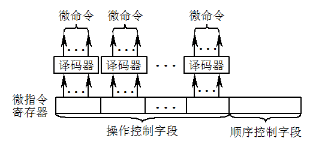
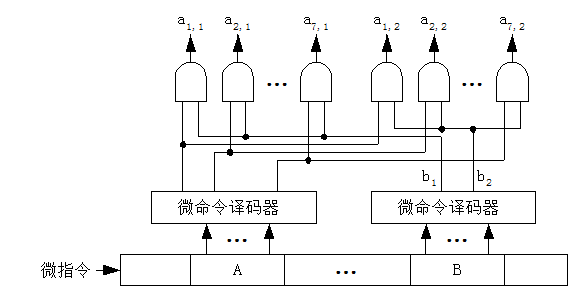
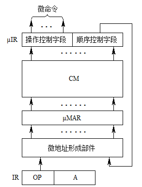
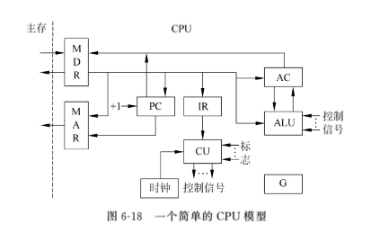
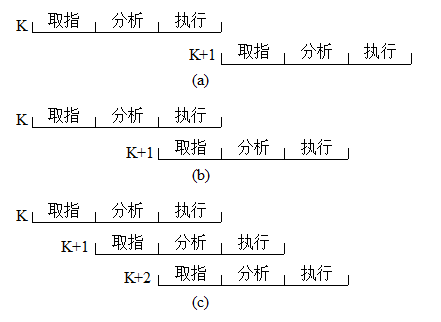

# 06 中央处理器 (4\~6)

## 微程序控制原理

微程序设计技术的实质是将程序设计技术和存储技术相结合，即用程序设计的思想方法来组织操作控制逻辑，将微操作控制信号按一定规则进行信息编码（代码化），形成控制字（微指令），再把这些微指令按时间先后排列起来构成微程序，存放在一个只读的控制存储器中。

### 微程序控制的基本概念

#### 微程序设计的提出与发展

微程序设计的概念和原理是由 M.V.Wilkes 教授提出来的：一条机器指令可以分解为许多基本的微命令序列。并且首先把这种思想用于计算机控制器的设计。但是由于当时还不具备制造专门存放微程序的控制存储器的技术，所以在十几年时间内实际上并未真正使用。直到 1964 年，IBM 公司在 IBM360 系列机上成功地采用了微程序设计技术，解决了指令系统的兼容问题。20 世纪 70 年代以来，由于 VLSI 技术的发展，推动了微程序设计技术的发展和应用，目前，大多数计算机都采用微程序设计技术。

#### 基本术语

1.  微命令和微操作

    一条机器指令可以分解成一个微操作序列，这些微操作是计算机中最基本的、不可再分解的操作。在微程序控制的计算机中，将控制部件向执行部件发出的各种控制命令叫做微命令，它是构成控制序列的最小单位。例如：打开或关闭某个控制门的电位信号、某个寄存器的打入脉冲等。因此，微命令是控制计算机各部件完成某个基本微操作的命令。

    微命令和微操作是一一对应的。微命令是微操作的控制信号，微操作是微命令的操作过程。

    微命令有兼容性和互斥性之分。兼容性微命令是指那些可以同时产生，共同完成某一些微操作的微命令；而互斥性微命令是指在机器中不允许同时出现的微命令。兼容和互斥都是相对的，一个微命令可以和一些微命令兼容，和另一些微命令互斥。对于单独一个微命令，谈论其兼容和互斥都是没有意义的。

2.  微指令、微地址

    微指令是指控制存储器中的一个单元的内容，即控制字，是若干个微命令的集合。存放控制字的控制存储器的单元地址就称为微地址。

    一条微指令通常包含两部分：

    1.  操作控制字段，又称微操作码字段，用以产生某一步操作所需的各微操作控制信号；
    2.  顺序控制字段，又称微地址码字段，用以控制产生下一条要执行的微指令地址。
        微指令有垂直型和水平型之分。垂直型微指令接近于机器指令的格式，每条微指令只能完成一个基本微操作；水平型微指令则具有良好的并行性，每条微指令可以完成较多的基本微操作。

3.  微周期

    从控制存储器中读取一条微指令并执行相应的微命令所需的全部时间称为微周期。

4.  微程序

    一系列微指令的有序集合就是微程序。每一条机器指令都对应一个微程序。

> 注意：微程序和程序是两个不同的概念。微程序是由微指令组成的，用于描述机器指令，微程序实际上是机器指令的实时解释器，是由计算机的设计者事先编制好并存放在控制存储器中的，一般不提供给用户。对于程序员来说，计算机系统中微程序一级的结构和功能是透明的，无须知道。而程序最终由机器指令组成，是由软件设计人员事先编制好并存放在主存或辅存中的。所以说，微程序控制的计算机涉及到两个层次：一个是机器语言或汇编语言程序员所看到的传统机器层，包括：机器指令、工作程序、主存储器；另一个是机器设计者看到的微程序层，包括：微指令、微程序和控制存储器。

### 微指令编码法

微指令可以分成操作控制字段和顺序控制字段两大部分。这里所说的微指令编码法指的就是操作控制字段的编码方法。各类计算机从各自的特点出发，设计了各种各样的微指令编码法。例如：大型机强调速度，要求译码过程尽量快；微、小型机则更多地注意经济性，要求更大限度地缩短微指令字长；而中型机介于这两者之间，兼顾速度和价格，要求在保证一定速度的情况下，能尽量缩短微指令字长。

#### 直接控制法（不译码法）

操作控制字段中的各位分别可以直接控制计算机，无须进行译码。在这种形式的微指令字中，操作控制字段的每一个独立的二进制位代表一个微命令，该位为“1”表示这个微命令有效，为“0”则表示这个微命令无效。每个微命令对应并控制数据通路中的一个微操作。

这种方法结构简单，并行性强，操作速度快，但是微指令字太长。若微命令的总数为 N 个，则微指令字的操作控制字段就要有 N 位。在某些计算机中，微命令的总数可能会多达三、四百个，甚至更多，这使微指令的长度达到难以接受的地步。另外，在 N 个微命令中，有许多是互斥的，不允许并行操作，将它们安排在一条微指令中是毫无意义的，只会使信息的利用率下降。所以这种方法在复杂的系统中很少单独采用，往往与其他编码方法混合起来使用。

#### 最短编码法

直接控制法使微指令字过长，而最短编码法则走向另一个极端，使得微指令字最短。这种方法将所有的微命令统一编码，每条微指令只定义一个微命令。若微命令的总数为 N，操作控制字段的长度为 L，则最短编码法应满足下列关系式：

$$
L≥log_2N
$$

最短编码法的微指令字长最短，但要通过一个微命令译码器译码以后才能得到需要的微命令。微命令数目越多，译码器就越复杂。这种方法在同一时刻只能产生一个微命令，不能充分利用机器硬件所具有的并行性，使得机器指令对应的微程序变得很长，而且对于某些要求在同一时刻同时动作的组合性微操作将无法实现。因此，这种方法也只能与其他方法混合使用。

#### 字段编码法

这是前述两种编码法的一个折衷的方法，既具有两者的优点，又克服了它们的缺点。这种方法将操作控制字段分为若干个小段，每段内采用最短编码法，段与段之间采用直接控制法。

1.  字段直接编码法

    各字段都可以独立地定义本字段的微命令，而和其他字段无关，因此又称为显式编码或单重定义编码方法。这种方法缩短了微指令字，因此得到了广泛的应用。

    字段直接编码法：

    

2.  字段间接编码法

    字段间接编码法是在字段直接编码法的基础上，用来进一步缩短微指令字长的方法。间接编码的含义是，一个字段的某些编码不能独立地定义某些微命令，而需要与其他字段的编码来联合定义，因此又称为隐式编码或多重定义编码方法。

    

字段编码法中操作控制字段的分段原则：

1.  把互斥性的微命令分在同一段内，兼容性的微命令分在不同段内。这样不仅有助于提高信息的利用率，缩短微指令字长，而且有助于充分利用硬件所具有的并行性，加快执行的速度。
2.  应与数据通路结构相适应。
3.  每个小段中包含的信息位不能太多，否则将增加译码线路的复杂性和译码时间。
4.  一般每个小段还要留出一个状态，表示本字段不发出任何微命令。因此当某字段的长度为三位时，最多只能表示七个互斥的微命令，通常用 000 表示不操作。

### 微程序控制器的组成和工作过程

#### 微程序控制器的基本组成

下图给出了一个微程序控制器基本结构的简化框图，在图中主要画出了微程序控制器比组合逻辑控制器多出的部件，包括以下几个部分：控制存储器、微指令寄存器、微地址形成部件、微地址寄存器等。

微程序控制器的基本结构：

1.  控制存储器（CM）

    这是微程序控制器的核心部件，用来存放微程序。

2.  微指令寄存器（mIR）

    用来存放从 CM 中取出的微指令。

3.  微地址形成部件

    用来产生初始微地址和后继微地址。

4.  微地址寄存器（mMAR）

    接受微地址形成部件送来的微地址，为在 CM 中读取微指令做准备。

#### 微程序控制器的工作过程

1.  执行取指令公共操作。取指令的公共操作通常由一个取指微程序来完成，这个取指微程序也可能仅由一条微指令组成。具体的执行是：在机器开始运行时，自动将取指微程序的入口微地址送 mMAR，并从 CM 中读出相应的微指令送入 mIR。微指令的操作控制字段产生有关的微命令，用来控制计算机实现取机器指令的公共操作。取指微程序的入口地址一般为 CM 的 0 号单元，当取指微程序执行完后，从主存中取出的机器指令就已存入指令寄存器 IR 中了。
2.  由机器指令的操作码字段通过微地址形成部件产生该机器指令所对应的微程序的入口地址，并送入 mMAR。
3.  从 CM 中逐条取出对应的微指令并执行之。
4.  执行完对应于一条机器指令的一个微程序后又回到取指微程序的入口地址，继续第 ① 步，以完成取下一条机器指令的公共操作。

以上是一条机器指令的执行过程，如此周而复始，直到整个程序执行完毕为止。

#### 机器指令对应的微程序 &#x20;

通常，一条机器指令对应一个微程序。由于任何一条机器指令的取指令操作都是相同的，因此将取指令操作的微命令统一编成一个微程序，这个微程序只负责将指令从主存单元中取出送至指令寄存器中。此外，也可以编出对应间址周期的微程序和中断周期的微程序。这样，控制存储器中的微程序个数应为机器指令数再加上对应取指、间址和中断周期等公用的微程序数。

### 微程序入口地址的形成

当公用的取指微程序从主存中取出机器指令之后，由机器指令的操作码字段指出各个微程序的入口地址（初始微地址）。这是一种多分支（或多路转移）的情况。由机器指令的操作码转换成初始微地址的方式主要有 3 种。

#### 一级功能转换

如果机器指令操作码字段的位数和位置固定，可以直接使操作码与入口地址码的部分位相对应。

#### 二级功能转换

当同类机器指令的操作码字段的位数和位置固定，而不同类机器指令的操作码的位数和位置不固定时，就不能再采用一级功能转换的方法。所谓二级功能转换是指第一次先按指令类型标志转移，以区分出指令属于哪一类，如：是单操作数指令，还是双操作数指令等。因为每一类机器指令中操作码字段的位数和位置是固定的，所以第二次即可按操作码区分出具体是哪条指令，以便找出相应微程序的入口微地址。

#### 通过 PLA 电路实现功能转换 &#x20;

当机器指令的操作码位数和位置都不固定时，可以采用 PLA 电路将每条机器指令的操作码翻译成对应的微程序入口地址。这种方法对于变长度、变位置的操作码显得更有效，而且转换速度较快。

### 后继微地址的形成

#### 增量方式（顺序－转移型微地址）

顺序执行时后继微地址就是现行微地址加上一个增量（通常为“1”）；转移或转子时，由微指令的顺序控制字段产生转移微地址。因此，在微程序控制器中应当有一个微程序计数器（mPC）。为了降低成本，一般情况下都是将微地址寄存器 mMAR 改为具有计数功能的寄存器，以代替 mPC。

增量方式的优点是简单，易于掌握，编制微程序容易，每条机器指令所对应的一段微程序一般安排在 CM 的连续单元中；其缺点是这种方式不能实现两路以上的并行微程序转移，因而不利于提高微程序的执行速度。

#### 断定方式

断定方式的后继微地址可由微程序设计者指定，或者根据微指令所规定的测试结果直接决定后继微地址的全部或部分值。

这是一种直接给定与测试断定相结合的方式，其顺序控制字段一般由两部分组成：非测试段和测试段。

测试段如果只有一位，则微地址将产生两个分支；若有两位，则最多可产生四个分支；依次类推；测试段为 n 位最多可产生$2^n$个分支。

### 微程序设计

1.  水平型微指令及水平型微程序设计

    一次能定义并能并行执行多个微命令的微指令。它的并行操作能力强，效率高，灵活性强，执行一条机器指令所需微指令的数目少，执行时间短；但微指令字较长，增加了控存的横向容量，同时微指令和机器指令的差别很大，设计者只有熟悉了数据通路，才有可能编制出理想的微程序，一般用户不易掌握。由于水平型微程序设计是面对微处理器内部逻辑控制的描述，所以把这种微程序设计方法称为硬方法

2.  垂直型微指令及垂直型微程序设计

    一次只能执行一个微命令的微指令。它的并行操作能力差，一般只能实现一个微操作，控制一两个信息传送通路，效率低，执行一条机器指令所需的微指令数目多，执行时间长；但是微指令与机器指令很相似，所以容易掌握和利用，编程比较简单，不必过多地了解数据通路的细节，且微指令字较短。由于垂直型微程序设计是面向算法的描述，所以把这种微程序设计方法称为软方法。

3.  混合型微指令

    综合前述两者特点的微指令称为混合型微指令，它具有不太长的微指令字，又具有一定的并行控制能力，可高效地去实现机器的指令系统。

## 控制单元的设计

前面几节讨论了控制器的基本功能和 CPU 的总体结构，为了加深对这些内容的理解，这一节将以一个简单的 CPU 为例来讨论控制器中控制单元的设计。为了突出重点，减少篇幅，我们选择的 CPU 模型比较简单，指令系统中仅具有最常见的基本指令和寻址方式，在逻辑结构、时序安排、操作过程安排等方面尽量规整、简单，使初学者比较容易掌握，以帮助大家建立整机概念。

### 简单的 CPU 模型

控制单元的主要功能是根据需要发出各种不同的微操作控制信号。微操作控制信号是与 CPU 的数据通路密切相关的。

图 6-18 中 MAR 和 MDR 分别直接与地址总线和数据总线相连。考虑到从存储器取出的指令或有效地址都先送至 MDR 再送至 IR，故这里省去 IR 送至 MAR 的数据通路，凡是需从 IR 送至 MAR 的操作均由 MDR 送至 MAR 代替。

#### 非访存指令

这类指令在执行周期不访问存储器。

1.  清除累加器指令 CLA
2.  累加器取反指令 COM
3.  累加器加 1 指令 INC
4.  算术右移一位指令 SHR
5.  循环左移一位指令 CSL
6.  停机指令 STP

#### 访存指令

这类指令在执行周期需访问存储器。

1.  加法指令 ADD
2.  减法指令 SUB
3.  与指令 AND
4.  取数指令 LDA
5.  存数指令 STA

#### 转移类指令

转移指令在执行周期也不访问存储器。

1.  无条件转移指令 JMP
2.  零转移指令 JZ
3.  负转移指令 JN
4.  进位转移指令 JC

### 组合逻辑控制单元设计

#### 微操作的节拍安排

假设机器采用同步控制，每个机器周期包括 3 个节拍，安排微操作节拍时应注意：

1.  有些微操作的次序是不容改变的，故安排微操作节拍时必须注意微操作的先后顺序。
2.  凡是被控制对象不同的微操作，若能在一个节拍内执行，应尽可能安排在同一个节拍内，以节省时间。
3.  如果有些微操作所占的时间不长，应该将它们安排在一个节拍内完成，并且允许这些微操作有先后次序。

下面将详细介绍。

1.  取指周期微操作的节拍安排

    取指周期的操作是公操作，其完成的任务已在前面进行过描述，在此不再重复，这些操作可以安排在 3 个节拍中完成。

    T0 (PC)→MAR，Read

    T1 M(MAR)→MDR，(PC)+1→PC

    T2 (MDR)→IR

    考虑到指令译码时间较短，可将指令译码 OP(IR)→ID 也安排在 T2 节拍内。

2.  间址周期微操作的节拍安排

    间址周期完成取操作数有效地址的任务，具体操作如下：

    1.  将指令的地址码部分（形式地址）送至存储器地址寄存器，记作(MDR)→MAR；
    2.  向主存发读命令，启动主存读操作，记作 Read；
    3.  将 MAR 所指的主存单元中的内容（有效地址）经数据总线读至 MDR，记作 M(MAR)→MDR；
    4.  将有效地址送至存储器地址寄存器 MAR，记作(MDR)→MAR。此操作在有些机器中可省略。

#### 组合逻辑设计步骤

1.  列出微操作命令的操作时间表
2.  进行微操作信号综合

    在列出微操作时间表之后，即可对它们进行综合分析、归类，根据微操作时间表可以写出各微操作控制信号的逻辑表达式。

3.  画出微操作命令的逻辑图

    根据逻辑表达式可画出对应每一个微操作信号的逻辑电路图，并用逻辑门电路实现之。

### 微程序控制单元设计

微程序设计控制单元的主要任务是编写对应各条机器指令的微程序，具体步骤是首先写出对应机器指令的全部微操作节拍安排，然后确定微指令格式，最后编写出每条微指令的二进制代码。

微程序控制单元的设计步骤：

1.  确定微程序控制方式

    根据计算机系统的性能指标（主要是速度）确定微程序控制方式。

2.  拟定微命令系统

    初步拟定微命令系统，并同时进行微指令格式的设计，包括微指令字段的划分、编码方式的选择、初始微地址和后继微地址的形成等等。

3.  编制微程序

    对微命令系统、微指令格式进行反复的核对和审查，并进行适当的修改；对重复和多余的微指令进行合并和精简，直至编制出全部机器指令的微程序为止。

4.  微程序代码化

    将修改完善的微程序转换成二进制代码，这一过程称为代码化或代真。

5.  写入控制存储器

    最后将一串串二进制代码按地址写入控制存储器的对应单元。

## 流水线技术

对于指令的执行，可有几种控制方式：顺序方式、重叠方式、先行控制及流水线控制方式。顺序方式指的是各条机器指令之间顺序串行的执行，即执行完一条指令后，方可取出下一条指令来执行。这种方式控制简单，但速度慢，机器各部件的利用率低。为了加快指令的执行速度，充分利用计算机系统的硬件资源，提高机器的吞吐率，计算机中常采用重叠方式、先行控制方式，以及流水线控制方式。

### 重叠控制

通常，一条指令的执行过程可以分为 3 个阶段：取指、分析、执行。假定每个阶段所需的时间为 t，采用顺序方式执行 n 条指令所需的时间为

$$
T=3nt
$$

最早出现的重叠是“取指 K+1”和“执行 K”在时间上的重叠，称为一次重叠，这将使处理机速度有所提高，所需执行时间减少为

$$
T=3×t+(n-1)×2t =(2×n+1)t
$$

如果进一步增加重叠，使“取指 K+2”、“分析 K+1”和“执行 K”重叠起来，称为二次重叠，则处理机速度还可以进一步提高，所需执行时间减少为

$$
T=3×t+(n-1)t=(2+n)t
$$

### 先行控制原理

先行控制是重叠控制的一种改进方式。在重叠控制中，“执行 K”和“分析 K+1”重叠，如果所有指令的“分析”与“执行”的时间均相等，则重叠的流程是非常流畅的，无任何阻碍，机器的指令分析部件和执行部件功能充分地发挥，机器的速度也能显著地提高。但是，现代计算机的指令系统很复杂，各种类型指令难于做到“分析”与“执行”时间始终相等。此时，各个阶段的控制部件就有可能出现间断等待的问题。这样，指令的分析部件和执行部件都不能连续地、流畅地工作，从而使机器的整体速度受到影响。

### 流水工作原理

流水处理技术是在重叠、先行控制方式的基础上发展起来的，它基于重叠的原理，但却是在更高程度上的重叠。

#### 流水线

流水线是将一个较复杂的处理过程分成 m 个复杂程度相当、处理时间大致相等的子过程，每个子过程由一个独立的功能部件来完成，处理对象在各子过程连成的线路上连续流动。在同一时间，m 个部件同时进行不同的操作，完成对不同子过程的处理。

这种方式类似于现代工厂的生产流水线，在那里每隔一段时间（Δt）从流水线上流出一个产品，而生产这个产品的总时间要比 Δt 大得多。由于流水线上各部件并行工作，同时对多条指令进行解释执行，机器的吞吐率将大大提高。例如，将一条指令的执行过程分成取指令、指令译码、取操作数和执行四个子过程，分别由四个功能部件来完成，每个子过程所需时间为 Δt。

#### 流水线分类

1.  按处理级别分类

    流水线按处理级别可分为操作部件级、指令级和处理机级三种。操作部件级流水线是将复杂的算逻运算组成流水线工作方式。指令级流水线则是将指令的整个执行过程分成多个子过程。处理机级流水线又称为宏流水线，这种流水线由两个或两个以上处理机通过存储器串行连接起来，每个处理机对同一数据流的不同部分分别进行处理。各个处理机的输出结果存放在与下一个处理机所共享的存储器中。每个处理机完成某一专门任务。

2.  按功能分类

    流水线按功能可分成单功能流水线和多功能流水线两种。单功能流水线只能实现一种固定的功能。多功能流水线则可有多种连接方式来实现多种功能。

3.  按工作方式分类

    静态流水线在同一时间内只能以一种方式工作。它可以是单功能的，也可以是多功能的。当是多功能流水线，且从一种功能方式变为另一种功能方式时，必须先排空流水线，然后为另一种功能设置初始条件后方可使用。显然，不希望这种功能的转换频繁发生，否则将严重影响流水线的处理效率。

    动态流水线则允许在同一时间内将不同的功能段连接成不同的功能子集，以完成不同的功能。显然，动态流水线必是多功能流水线，而单功能流水线必是静态的。

4.  按流水线结构分类

    流水线按结构分为线性流水线和非线性流水线两种。在线性流水线中，从输入到输出，每个功能段只允许经过一次，不存在反馈回路。一般的流水线均属这一类。非线性流水线除有串行连接通路外，还有反馈回路，在流水过程中，某些功能段要反复多次使用。非线性流水线常用于递归或组成多功能流水线。

#### 指令流水线的相关性

对于指令流水线，相邻或相近的两条指令可能会因为存在某种关联，后一条指令不能按照原指定的时钟周期运行，使流水线断流。指令流水线的相关性包括结构相关、数据相关、控制相关。

1.  结构相关

    同一时刻争夺同一资源而形成的冲突称为结构相关，也称资源相关。

2.  数据相关

    后续指令要使用前面指令的操作结果，而这一结果尚未产生或未送到指定的位置，造成后续指令无法运行的称为数据相关。

    数据相关可分为 RAW（写后读）、WAR（读后写）和 WAW（写后写）3 种类型。

3.  控制相关

    控制相关主要是由转移指令引起的，又称为指令相关。
