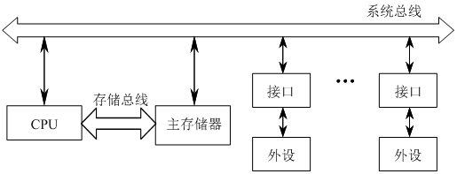
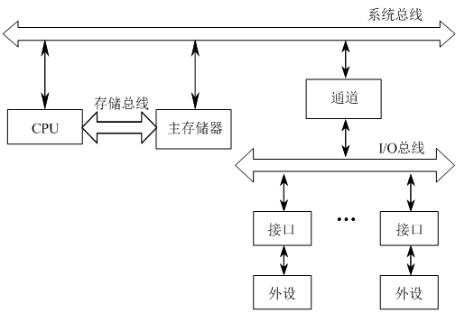
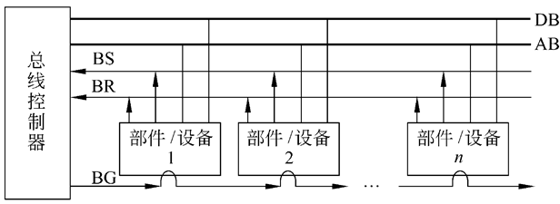
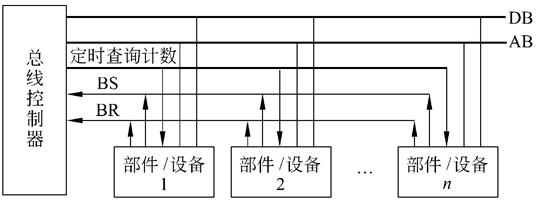
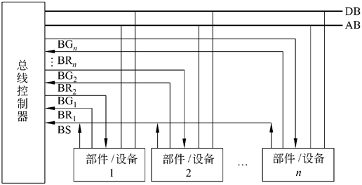

# 07 总线 (1\~2)

大多数计算机系统中，无论是计算机内部各部分之间，还是计算机与外部设备之间，数据传送都是通过总线（Bus）进行的。可以说，总线是计算机及其系统的重要组成部分。本章介绍总线的有关概念、总线仲裁方法、总线操作定时与常见总线标准。

本章学习内容：

- 7.1 总线概述
- 7.2 总线仲裁
- 7.3 总线定时控制
- 7.4 总线标准

本章学习要求：

- 理解：总线的基本概念
- 了解：总线的分类
- 掌握：总线的性能指标
- 理解：总线集中仲裁方式
- 了解：总线定时控制方式
- 了解：系统总线标准
- 了解：外部总线标准

总线是一组能为多个部件分时共享的公共信息传送线路。共享是指总线上可以挂接多个部件，各个部件之间相互交换的信息都可以通过这组公共线路传送；分时是指同一时刻总线上只能传送一个部件发送的信息。

## 总线概述

### 总线的基本概念

总线采用分时共享技术，当总线空闲（所有部件都以高阻状态连接在总线上）时，如果有一个部件要与目的部件通信，则发起通信的部件驱动总线，发出地址和数据。其他以高阻状态连接在总线上的部件如果收到与自己相符的地址信息后，即接收总线上的数据。发送部件完成通信后，将总线让出（输出变为高阻态）。

#### 三态门和总线电路

所谓高阻状态又称为浮空状态，输出呈高阻状态即相当于输出开路（隔断），输出端对地的电阻无限大，与外界断开联系。具备高阻状态的门电路称为三态门，即具有 3 种逻辑状态（逻辑“0”、逻辑“1”和高阻状态）的门电路。三态门除了正常的输入端和输出端之外，还有一个控制端 G（或 G）。

#### 总线事务

通常把在总线上一对设备之间的一次信息交换过程称为一个“总线事务”，把发出总线事务请求的部件称为主设备，与主设备进行信息交换的对象称为从设备。例如 CPU 要求读取存储器中某单元的数据，则 CPU 是主设备，而存储器是从设备。总线事务类型通常根据它的操作性质来定义，典型的总线事务类型有“存储器读”、“存储器写”、“I/O 读”、“I/O 写”、“中断响应”等，一次总线事务简单来说包括两个阶段：地址阶段和数据阶段。

#### 总线使用权 &#x20;

主设备发出总线请求并获得总线使用权后，就立即开始向从设备进行一次信息传送。这种以主设备为参考点，向从设备发送信息或接收从设备送来的信息的工作关系，称为主从关系。主设备负责控制和支配总线，向从设备发出命令来指定数据传送方式与数据传送地址信息。各设备之间的主从关系不是固定不变的，只有获得总线使用权的设备才是主设备，如 CPU 等。但主存总是从设备，因为它不会主动提出要与谁交换信息的要求。

### 总线的分类

#### 按功能层次分类

1.  片内总线

    芯片内部的总线，它是 CPU 芯片内部寄存器与寄存器之间、寄存器与 ALU 之间的公共连接线。

2.  系统总线

    计算机系统内各功能部件（CPU、主存、I/O 接口）之间相互连接的总线，系统总线也称为内总线，是构成计算机的主要组成部分。

3.  通信总线（外总线）

    用于计算机系统之间或计算机系统与其他系统（远程通信设备、测试设备之间信息传送的总线。

#### 按数据线的多少分类

1.  并行总线

    含有多条双向数据线的总线，可以实现一个数据的多位同时传输。具有数据传输率高的优点，但当数据线较长时，数据各位到达接收端时的延迟可能不一致，会造成传输错误。

2.  串行总线

    只含有一条双向数据线或两条单向数据线的总线，可以实现一个数据的各位按照一定的速度和顺序依次传输。由于按位串行传输数据对数据线传输特性的要求不高，在长距离连线情况下仍可以有效地传送数据。

### 总线的组成及性能指标

#### 总线结构

在单机系统中，从系统总线角度出发，总线的基本结构有：

1.  单总线结构：只有一条系统总线，所有部件通过系统总线接入。
2.  双总线结构：在单总线的基础上增加一条专用于 CPU 和主存之间的数据传送通路。
3.  三总线结构：在双总线的基础上再增加一条 I/O 总线。

双总线结构：

三总线结构：

#### 总线特性

- 物理特性
- 功能特性
- 电气特性
- 时间特性

#### 总线的性能指标

1.  总线宽度

    总线宽度指的是总线的线数，它决定了总线所占的物理空间和成本。对总线宽度最直接的影响是地址线和数据线的数量，地址线的宽度指明了总线能直接访问存储器的地址空间范围，数据线的宽度指明了访问一次存储器或外设时能够交换的数据位数。

2.  总线带宽

    总线带宽定义为总线的最大数据传输率，即每秒传输的字节数。总线的带宽公式为：

    $$
    B=W×F/N
    $$

    其中，W 为数据总线宽度，通常以字节为单位；F 为总线的时钟频率；N 为完成一次数据传送所用的时钟周期数。

3.  总线负载

    总线负载指连接在总线上的最大设备数量。大多数总线的负载能力是有限的。

4.  总线复用

    总线分时复用是指在不同时段利用总线上同一个信号线传送不同信号。采用这种方式的目的是减少总线数量，提高总线的利用率。

5.  总线猝发传输

    猝发（突发）式数据传输是一种总线传输方式，即在一个总线周期中可以传输存储地址连续的多个数据。

## 总线仲裁

总线是由多个部件和设备所共享的，连接到总线上的功能模块有主动和被动两种形态，CPU 可以做主方也可以做从方，而存取器模块只能用作从方。为了保证同一时刻只有一个申请者使用总线，总线控制机构中设置有总线判优和仲裁控制逻辑，即按照一定的优先次序来决定哪个部件首先使用总线，只有获得总线使用权的部件，才能开始数据传送。总线判优按其仲裁控制机构的设置可分为集中式控制和分布式控制两种。

### 集中仲裁方式

#### 链式查询方式

链式查询方式的总线控制器使用三根控制线与所有部件和设备相连，这三根控制线是：

- 总线请求（BR）
- 总线忙（BS）
- 总线批准（BG）

链式查询方式：

链式查询的优点是只用很少几根线就能按一定的优先次序来实现总线控制，并很容易扩充。缺点是对查询链的故障很敏感，如果第 i 个部件中的查询链电路有故障，那么第 i 个以后的部件都不能工作。另外，因为查询的优先级是固定的，所以若优先级较高的部件出现频繁的总线请求时，优先级较低的部件就可能会难以得到响应。

#### 计数器定时查询方式 &#x20;

总线上的每个部件可以通过公共的 BR 线发出请求，总线控制器收到请求之后，在 BS 为“0”的情况下，让计数器开始计数，定时地查询各个部件以确定是谁发出的请求。当查询线上的计数值与发出请求的部件号一致时，该部件就使 BS 线置“1”，获得了总线使用权，并中止计数查询，直至该部件完成数据传送之后，撤消 BS 信号。

计数器定时查询方式：

这种计数可以从“0”开始，也可以从中止点开始。如果从“0”开始，各部件的优先次序和链式查询方式相同，优先级的次序是固定的。如果从中止点开始，即为循环优先级，各个部件使用总线的级别将相等。计数器的初始值还可以由程序来设置，这就可以方便地改变优先次序，增加系统的灵活性。

#### 独立请求方式

在这种方式中，每一个共享总线的部件均有一对控制线：总线请求 BRi 和总线批准 BGi。当某个部件请求使用总线时，便发出 BRi，总线控制器中有一排队电路，根据一定的优先次序决定首先响应哪个部件的请求 BRi，然后给该部件送回批准信号 BGi。

独立请求方式的优点是响应时间快，然而这是以增加控制线数和硬件电路为代价的。此方式对优先次序的控制也是相当灵活的，它可以预先固定，也可以通过程序来改变优先次序。

独立请求方式：

### 分布仲裁方式

分布仲裁方式不需要中央仲裁器，即总线控制逻辑分散在连接于总线上的各个部件或设备中。连接到总线上的主方可以启动一个总线周期，而从方只能响应主方的请求。每次总线操作，只能有一个主方占用总线使用权，但同一时间里可以有一个或多个从方。对多个主设备提出的占用总线请求，一般采用优先级、冲突检测或公平策略等方法进行仲裁。
