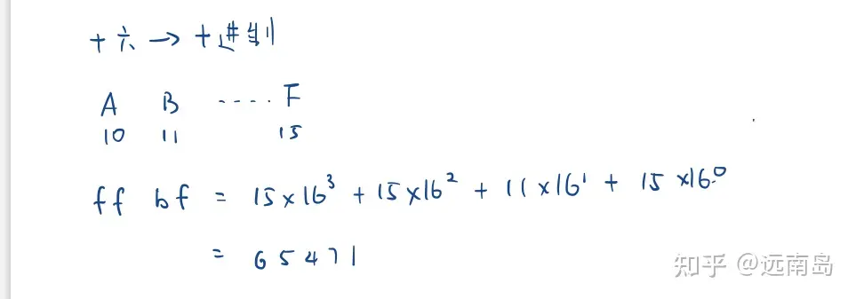
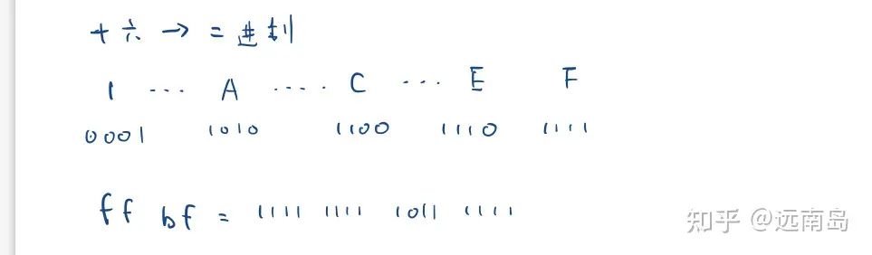
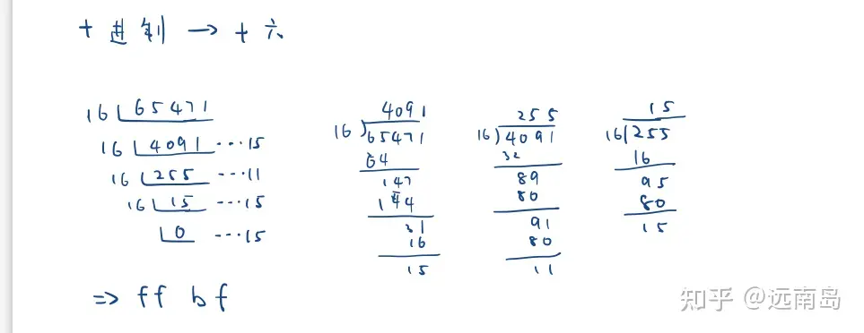
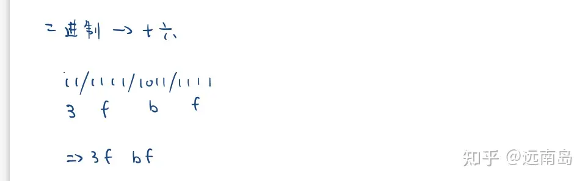

# 零散知识点

## 第一章

### 程序运行时间的比值

程序运行时间的比值可以通过下列公式计算：

$$
运行时间比 = \frac{CPI × 指令数}{主频}
$$

## 第二章

### 3 种汉字编码的关系

$$
汉字国标码=汉字区位码(十六进制)+2020H
$$

$$
汉字机内码=汉字国标码+8080H
$$

$$
汉字机内码=汉字区位码(十六进制)+A0AOH
$$

通常，汉字的国标码和机内码都用十六进制数表示，而汉字区位码用十进制数表示，所以在 3 种汉字编码的转换时，千万不要忘记先将十进制的区位码变成十六进制之后，再利用上述关系式进行转换。

### **点阵字形**占存

**24x24 点阵字形**存储容量：每个 8 字节，故需要$24\times24\times8$。

### 十进制数串

<https://zhuanlan.zhihu.com/p/109856235>

#### 非压缩的十进制数串

符号位的处理方式有两种：前分隔式和后嵌入式

一个数字用一个字节存储，实际只有低四位有意义。

- 前分隔式：符号位单独占用一个字节，位于数值位之前。

  正号：2BH；负号：2DH

- 后嵌入式：符号位不单独占用字节，而是嵌入最低数值位中。

  正：最低数值位不变（0\~9 编码：30\~39H）；

  负：把负号变成 40H，与最低数值位相加（0\~9 编码：70\~79H）

#### 压缩的十进制数串

一个字节存放两位十进制数，通常用 8421BCD 码。

符号位单独占半个字节，存放在最低数值位之后。

正号：CH，负号：DH。

- 例：某二进制数一 11101010B 转换为十进制数串，分别表示成压缩与非压缩两种格式。

  题解：转换为十进制数为：-234

  压缩格式：0010 0011 0100 1101 ，十六进制为 234DH，两个字节。

  非压缩格式：

  - 前分隔式：

    符号位：2DH，表示为：00101101；

    2：对应 ASCII 码：32，表示为：00110010；3：对应 ASCII 码：33，表示为：00110011；4：对应 ASCII 码：34，表示为：00110100.

    故前分隔式为：00101101 00110010 00110011 00110100， &#x20;

    十六进制为：2D 32 33 34H，共四个字节

  - 后嵌入式：

    00110010 00110011 01110100，十六进制为 32 33 74H，共三个字节。

### n 位二进制定点整数表示的最大值

$2^{n-1}-1$

### 补码大小判断

若$[X]_补>[Y]_补$，则$|X|>|Y|$

### 海明码

海明码是一种纠错能力较强的编码。它是由美国数学家理查德·海明（Richard Hamming）在 20 世纪中期提出的一种错误检测和纠正编码方法。

海明码通过在数据位中增加冗余位来实现纠错能力。冗余位的位置被选择在数据位中的 2 的幂次位置上，例如第 1 位、第 2 位、第 4 位、第 8 位等。这些冗余位用于存储校验信息，以便在传输过程中检测和纠正错误。

设校验位的位数为 k 数据位的位数为 n，应满足下述关系：$2^k≥n+k+1$

通过海明码的校验和纠正机制，可以检测出并纠正一定数量的位错误。这使得海明码在数据传输或存储中具有较强的容错性能，能够有效地检测和纠正传输中的错误，提高数据的可靠性。

### 计算机系统中采用补码运算的目的

简化计算机的设计。

### 十六进制的各种转换

<https://zhuanlan.zhihu.com/p/401589260>

#### 十六转十进制

就用乘法，每一位乘以 $16^0$,$16^1$,$16^2$... 然后加在一起。

举个例子，ff bf 是几？答：65471

#### 十六转二进制

更简单了，只需把每一位，变成二进制的四位数，然后拼在一起。

看个例子就懂了，ff bf 是二进制的几？答：1111 1111 1011 1111

#### 十进制转十六

稍微复杂些，用短除法。每次除以 16，把余数从下到上拼起来，就得到了 16 进制的数。

来一起试试，65471 是十六进制的几？答：ff bf

#### 二进制转十六

又容易了，只需切成 4 个 4 个的小段，把每段对应的字母/数字拼在一起，就可以了。

比如这个例子，11 1111 1011 1111 是几？答：3f bf

> 1 位 16 进制数可以用 4 位 2 进制数表示，非常简单且简洁，这就是为什么计算机领域广泛使用 16 进制

### **-1**与 1 的**真值、原码、反码、补码**

| 值  | 真值      | 原码     | 反码     | 补码     |
| --- | --------- | -------- | -------- | -------- |
| -1  | -00000001 | 10000001 | 11111110 | 11111111 |
| 1   | 00000001  | 00000001 | 00000001 | 00000001 |

## 第三章

### 地址运算类指令

地址运算类指令可能有一个操作数，也可能有两个操作数。

### 寻址方式

用来支持浮动程序设计的寻址方式是相对寻址。

### 堆栈特征

将子程序返回地址放在堆栈中时，子程序允许嵌套和递归。

### 字节与 PC

一条指令按字节编址，意味着每个字节的地址相邻。当读取一条指令后，PC（程序计数器）的值自动加的大小取决于每个字节的位数。

### 寻址方式

寻址方式的指令执行速度由快至慢为：立即寻址、直接寻址、间接寻址

为了缩短指令中某个地址码的位数，同时使指令的执行时间又相对短，有效的寻址方式为寄存器寻址。

寄存器间接寻址方式中，操作数处在内存/主存单元

### 程序控制类指令的功能

程序控制类指令的功能是：改变程序执行的顺序

### 指令系统中采用不同寻址方式的目的

指令系统中采用不同寻址方式的目的主要是：缩短指令长度，扩大寻址空间，提高编程灵活性

### 指令执行时长

执行时间最长的是 SS 型。

## 第四章

### 定点运算器

在定点运算器中，无论采用双符号位还是单符号位，必须有溢出判断电路，它一般用异或门来实现

### 补码加减法

操作数用补码表示，连同符号位直接相加，减某数的机器负数代替，结果的符号在运算中形成

### 规格化数

若浮点数用补码表示，若运算结果的数符与尾数最高有效数位相异，则运算结果是规格化数

### 定点运算溢出

在定点运算中产生溢出的原因是：运算的结果超过了机器的表示范围

### 加法器运算速度

在串行进位的并行加法器中，影响加法器运算速度的关键因素是进位传递延迟

### 计算机中的累加器

计算机中的累加器没有加法器功能，有寄存器功能

推荐阅读：

<https://zhuanlan.zhihu.com/p/260316637>

#### 寄存器

寄存器，是集成电路中非常重要的一种存储单元，通常由触发器组成。在集成电路设计中，寄存器可分为电路内部使用的寄存器和充当内外部接口的寄存器这两类。 &#x20;

内部寄存器不能被外部电路或软件访问，只是为内部电路的实现存储功能或满足电路的时序要求。而接口寄存器可以同时被内部电路和外部电路或软件访问，CPU 中的寄存器就是其中一种，作为软硬件的接口，为广泛的通用编程用户所熟知。 &#x20;

寄存器的用途：

- 可将寄存器内的数据执行算术及逻辑运算。 &#x20;
- 存于寄存器内的地址可用来指向内存的某个位置，即寻址。 &#x20;
- 可以用来读写数据到电脑的周边设备。 &#x20;

#### 累加器

在中央处理器中，累加器 (accumulator) 是一种寄存器，用来储存计算产生的中间结果。如果没有像累加器这样的寄存器，那么在每次计算 (加法，乘法，移位等等) 后就必须要把结果写回到 内存，也许马上就得读回来。然而存取主存的速度是比从算术逻辑单元到有直接路径的累加器存取更慢。 &#x20;

累加器的作用：

- 在运算器中，累加器是专门存放算术或逻辑运算的一个操作数和运算结果的寄存器。能进行加、减、读出、移位、循环移位和求补等操作。是运算器的主要部分。 &#x20;
- 在中央处理器 CPU 中，累加器(accumulator)是一种暂存器，它用来储存计算所产生的中间结果。如果没有像累加器这样的暂存器，那么在每次计算(加法，乘法，移位等等)后就必须要把结果写回到内存，然后再读回来。然而存取主内存的速度是比从数学逻辑单元(ALU)到有直接路径的累加器存取更慢。 &#x20;
- 在汇编语言程序中，累加器 —— AX 是一个非常重要的寄存器，但在程序中用它来保存临时数据时，最后将其转存到其它寄存器或内存单元中，以防止在其它指令的执行过程中使其中的数据被修改，从而得到不正确的结果，为程序的调试带来不必要的麻烦。 &#x20;

#### 暂存器

暂存器是用来暂存由数据总线或通用寄存的东西。它是中央处理器内的其中组成部分。 暂存器是有限存贮容量的高速存贮部件，它们可用来暂存指令、 数据和位址 。 &#x20;

暂存器结构组成：

- 在中央处理器的控制部件中，包含的暂存器有指令暂存器 (IR)和程式计数器 (PC)。在中央处理器的算术及逻辑部件中，包含的暂存器有累加器 (ACC)。 &#x20;
- 在电脑架构里，处理器中的暂存器是少量且速度快的电脑记忆体 ，借由提供快速共同地存取数值来加速电脑程式的执行——典型地说就是在已知时间点所作的之计算中间的数值。 &#x20;

#### 寄存器、累加器、暂存器有什么区别？

寄存器是 CPU 内部存储单元，即寄存器是 CPU 的组成部份。寄存器是有限存贮容量的高速存贮部件，它们可用来暂存指令、数据和位址等。在 CPU 内部，累加器 (accumulator) 是一种寄存器，所有数学运算必须通过它进行传递和运算。

### 下溢

下溢指的是：运算结果的绝对值小于机器所能表示的最小绝对值

### 运算器

运算器不仅可以完成数据信息的算术和逻辑运算，还可以作为数据信息的传递通路。
